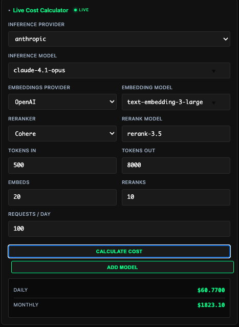
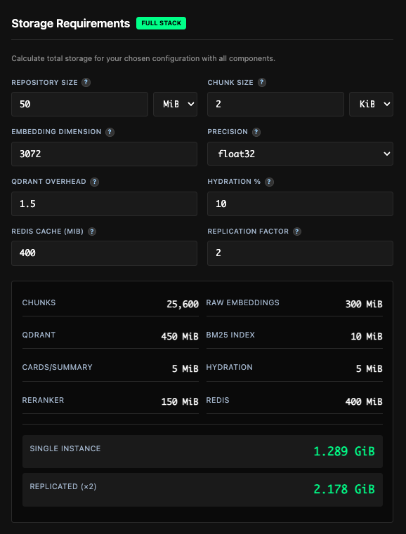
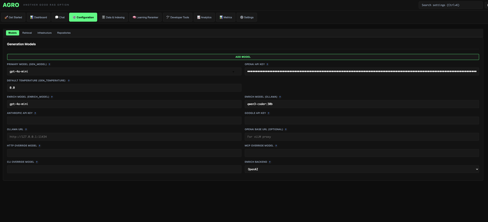
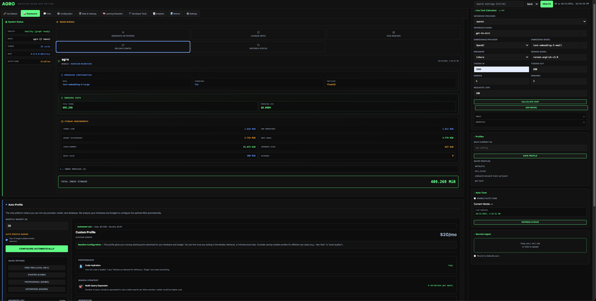
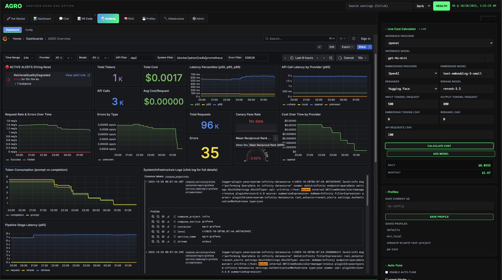
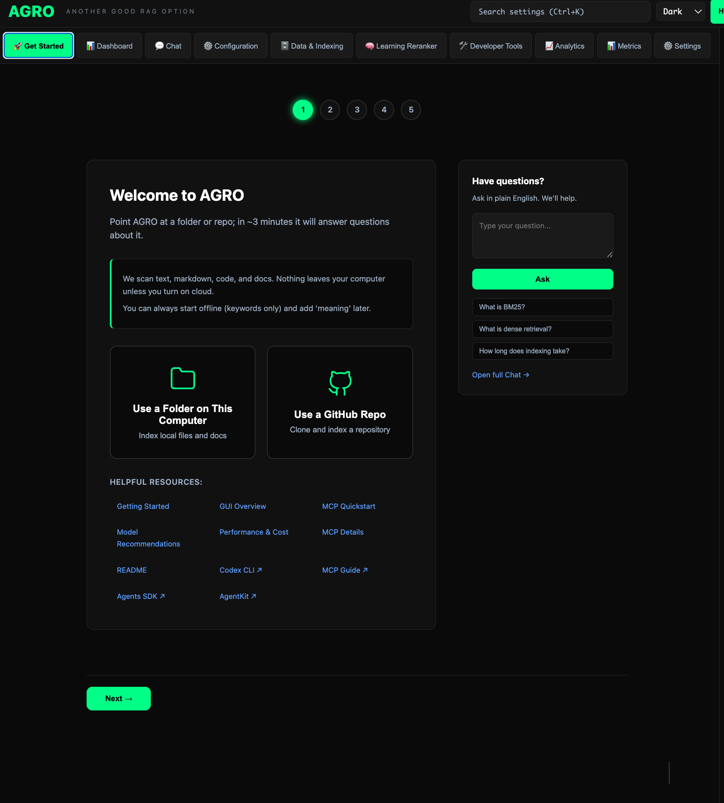
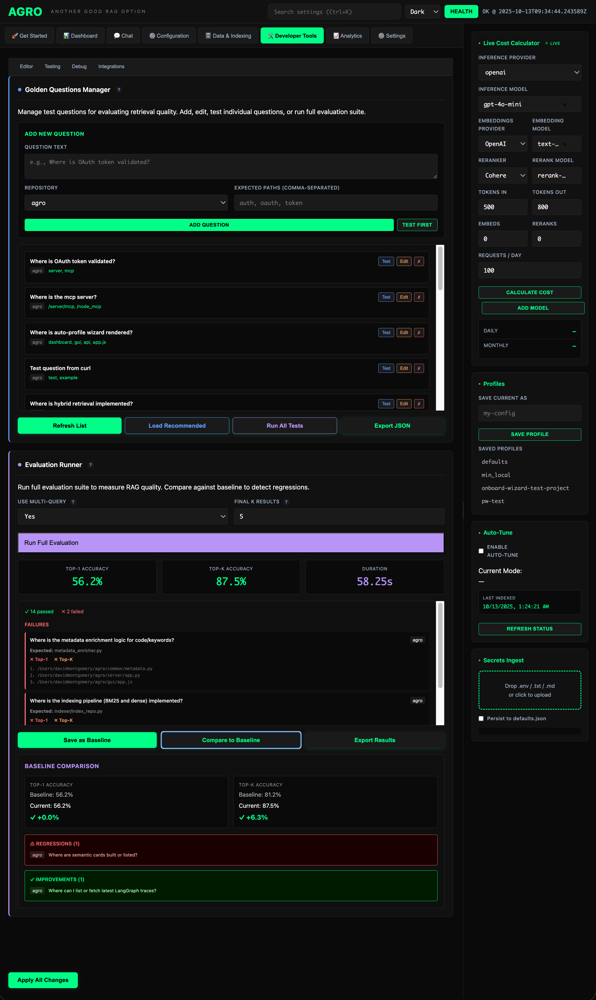
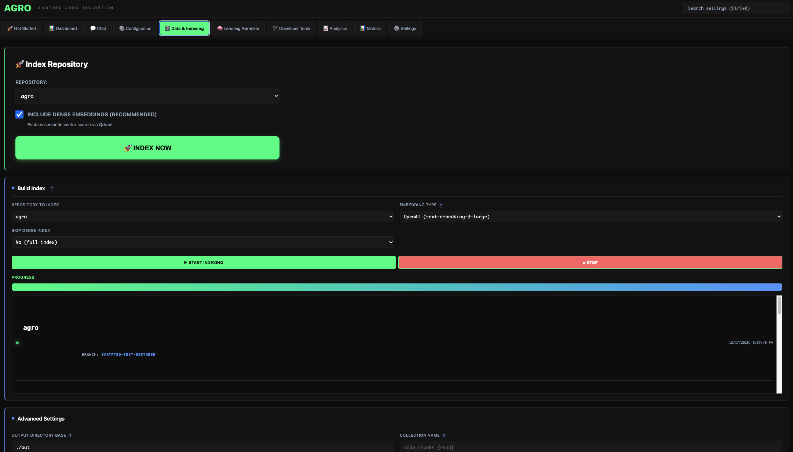
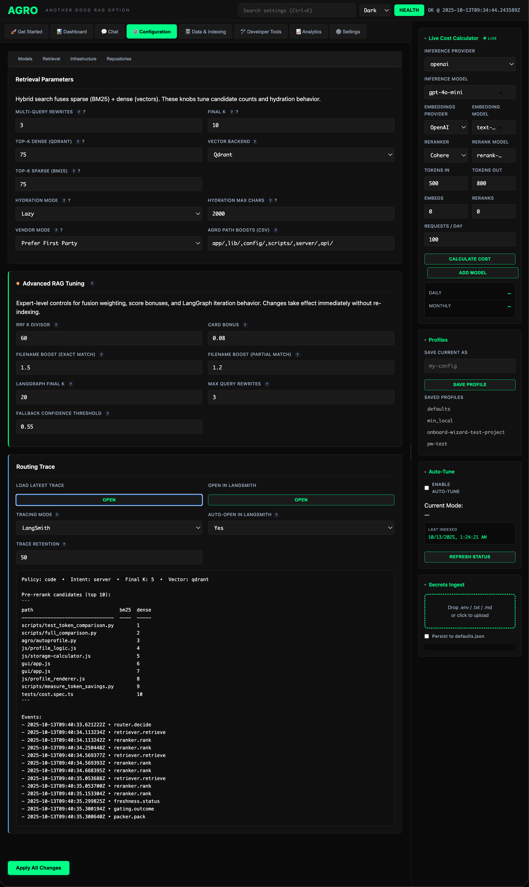

# AGRO is a local‑first RAG Engine Workspace for codebases.


#### It provides a rich GUI (also a decent TUI), easy setup with an Onboarding Wizard, a built-in Self-Learning Transformer model (it's literally always getting better and faster), Evals w/ Regression Analysis, Multi-Query, Hybrid-Search, Local Hydration, Traceability (Langsmith and OpenAI Agents SDK), Embedded-Grafana dash w/ alerts, Multiple Transports, Chat Interface, and Modular-everything.
And it even has a VSCode instance embedded in the GUI (you don't have to turn it on just wanted to see if I could do it ; )

### (Really) Quick Start
```bash
git clone https://github.com/DMontgomery40/agro.git
cd agro
Make dev

# Starts: Infra, MCP, API, UV, and GUI


# GUI at http://127.0.0.1:8012/
```

## **Fully-local model support, or any SOTA API Model, mix, match, and set profiles based on task**
<table>
<tr>
<td width="50%" valign="top">

#### Profile: `Docs-search` (Fast, local-first, low-cost)
```yaml
gen_model: gpt-4o-mini
embedding: BGE-small-en-v1.5  #local
vectors: 384-d 
precision: int4
rerank_model: BAAI/bge-reranker-v2-m3
retrieval: BM25    # Sparse-only
local_hydration: 2%
multiquery: 2
top_k: 3
```

</td>
<td width="50%" valign="top">

#### Profile: `Plan_Refactor` (High-quality, full-stack)
```yaml
gen_model: gpt-5-high-latest                
embedding: text-embedding-3-large 
vectors: 3072-d
precision: float32
rerank_model: cohere/rerank-3.5
retrieval: BM25+Redis+Qdrant
multiquery: 10 
top_k: 20
max_semantic_cards: 50
conf_top1: 0.80  # Confidence gating
conf_avg5: 0.52
```

</td>
</tr>
</table>

## And crucially, the ability to estimate the impact of that 'refactor' profile, *before* you run it
<div align="center">
  <a href="assets/cost_est.png" target="_blank">
    
  </a>
  <a href="assets/stor.png" target="_blank">
    
  </a>
</div>

<br>

## MCP servers and API endpoints


### (Python and Node.js) supporting HTTP, SSE, STDIO, and WebSocket transports
  - ***Per-transport configuration:*** choose different models and search backends for each mode

<a href="assets/onboarding_carosel/mcp_transport_changing_model_per_transport.png" target="_blank">
  
</a>

### Robust API with optional OAuth 2.0
**Full Documentation:**
- **Interactive API Docs:** http://127.0.0.1:8012/docs (Swagger UI)
- **Complete API Reference:** [docs/API_REFERENCE.md](docs/API_REFERENCE.md)

## Highlights
- **Custom-Trained Search Transformer** — A full transformer-based language model that lives inside AGRO, continuously learning from your usage patterns (clicks, feedback) 
  and training specifically on YOUR codebase. Complete ML pipeline: 
  `mine triplets → train → evaluate → promote - repeat` 
- Repo isolation and citations as guardrails — not “best effort”.
- ***Massive*** reduction in token use with Claude Code / Codex; Rate Limits extended greatly or potentially no longer an issue at all
- Greatly increased accuracy in the code that CC/Codex deliver
- More in docs on how to set rules of CC/Codex so that they take full advantage of it

## Dashboard




## Documentation
- Start here: [Docs Index](docs/README_INDEX.md)
- **Complete API Reference**: [API_REFERENCE.md](docs/API_REFERENCE.md) ← All endpoints with examples
- **Learning Reranker**: [LEARNING_RERANKER.md](docs/LEARNING_RERANKER.md) ← Improve search with feedback
- Quickstart for Codex/Claude (MCP): [QUICKSTART_MCP.md](docs/QUICKSTART_MCP.md)
- Settings UI & API: [API_GUI.md](docs/API_GUI.md)
- Evals & cost: [PERFORMANCE_AND_COST.md](docs/PERFORMANCE_AND_COST.md)
- Tracing: [LANGSMITH_SETUP.md](docs/LANGSMITH_SETUP.md)
- CLI chat: [CLI_CHAT.md](docs/CLI_CHAT.md)
- Models: [MODEL_RECOMMENDATIONS.md](docs/MODEL_RECOMMENDATIONS.md), [GEN_MODEL_COMPARISON.md](docs/GEN_MODEL_COMPARISON.md)

Onboarding wizard screenshots: see the [Docs Index](docs/README.md) for links to the 5‑step carousel.

---

Notes for integrators
- MCP tools are declared in server/mcp/server.py:1-24.
- Retrieval entry points live in retrieval/hybrid_search.py:1-22.
- Indexer entry is indexer/index_repo.py:1-28.
- HTTP MCP server is in server/mcp/http.py:1-23.

## Architecture
```
┌────────────────────────────────────────────────────────────────────────────────┐
│  AI Agents (Codex/Claude)   CLI Chat (local)                 CLI Chat (stream) │
└────────────┬───────────────────────┬──────────────┬───────────────────────────┘
             │ MCP stdio            │ MCP HTTP     │ HTTP (SSE)                
             ▼                       ▼              ▼                           
┌─────────────────────┐     ┌─────────────────────┐     ┌─────────────────────┐ 
│   mcp_server.py     │     │  mcp_server_http.py │     │     server/app.py    │ 
│   (stdio mode)      │     │  (HTTP mode)        │     │  (FastAPI /answer*) │ 
└──────────┬──────────┘     └──────────┬──────────┘     └──────────┬──────────┘ 
           │                            │                           │            
           └──────────────┬─────────────┴──────────────┬────────────┘            
                          ▼                            ▼                         
                ┌──────────────────┐          ┌──────────────────┐               
                │  langgraph_app   │ ◄────────┤  hybrid_search   │               
                │   (LangGraph)    │          │   (Retrieval)    │               
                └─────────┬────────┘          └─────────┬────────┘               
                          │                             │                          
          ┌───────────────┴──────────────┐    ┌─────────┴────────┐               
          ▼                              ▼    ▼                  ▼               
   ┌──────────────┐               ┌──────────────┐       ┌──────────────┐        
   │   Qdrant     │               │    BM25S     │       │ Local Chunks │        
   │  (vectors)   │               │  (sparse)    │       │    (.jsonl)  │        
   └──────────────┘               └──────────────┘       └──────────────┘        
                          ▲                                                         
                          │                                                         
                  ┌───────┴────────┐                                                
                  │  index_repo.py │                                                
                  │  (indexing)    │                                                
                  └────────────────┘                                                

* /answer* = includes /answer (JSON) and /answer_stream (SSE)
```

### Key Components
| Component | Purpose | File |
|-----------|---------|------|
| **MCP Server (stdio)** | Tool server for local agents | `server/mcp/server.py` |
| **MCP Server (HTTP)** | Tool server for remote agents | `server/mcp/http.py` |
| **FastAPI** | HTTP REST API and GUI (`/health`, `/search`, `/answer`, `/api/*`) | `server/app.py` |
| **LangGraph** | Iterative retrieval pipeline with Redis checkpoints | `server/langgraph_app.py` |
| **Hybrid Search** | BM25 + dense + rerank with repo routing | `retrieval/hybrid_search.py` |
| **Indexer** | Chunks code, builds BM25, embeds, upserts Qdrant | `indexer/index_repo.py` |
| **CLI Chat** | Interactive terminal chat with memory | `python -m cli.chat_cli` |
| **Eval Harness** | Golden tests with regression tracking | `eval_loop.py` |
| **Cards Builder** | Summarizes chunks and builds card-level BM25 index | `indexer/build_cards.py` |
| **Reranker** | Cross-encoder reranking with feedback collection and model training | `retrieval/rerank.py`, `gui/js/reranker.js` |
| **Embedding Cache** | Caches embeddings to avoid recomputation | `retrieval/embed_cache.py` |
| **AST Chunker** | Language-aware code chunking | `retrieval/ast_chunker.py` |
| **Filtering** | File and directory exclusion rules | `common/filtering.py` |
| **Config Loader** | Repository paths and settings management | `common/config_loader.py` |
| **Tracing** | Capture retrieval and generation traces | `server/tracing.py` |
| **Generation** | OpenAI API wrapper with fallbacks | `server/env_model.py` |

---

## Setup from Scratch


### Phase 1: Infrastructure
Note: This repo already includes `infra/docker-compose.yml` with relative volumes.
Prefer using `bash scripts/up.sh` or `cd infra && docker compose up -d` rather than
hand-writing a compose file.

```bash

# Create directory structure
mkdir -p /path/to/agro/{infra,data/qdrant,data/redis}

# Create docker-compose.yml
cat > /path/to/agro/infra/docker-compose.yml <<'YAML'
version: "3.8"
services:
  qdrant:
    image: qdrant/qdrant:v1.15.5
    container_name: qdrant
    restart: unless-stopped
    ports:
      - "6333:6333"
      - "6334:6334"
    environment:
      - QDRANT__STORAGE__USE_MMAP=false
      - QDRANT__STORAGE__ON_DISK_PERSISTENCE=true
    volumes:
      - /path/to/agro/data/qdrant:/qdrant/storage
  redis:
    image: redis/redis-stack:7.2.0-v10
    container_name: rag-redis
    restart: unless-stopped
    ports:
      - "6379:6379"
    environment:
      - REDIS_ARGS=--appendonly yes
    volumes:
      - /path/to/agro/data/redis:/data
YAML

# Start services
cd /path/to/agro/infra
docker compose up -d

# Verify
curl -s http://127.0.0.1:6333/collections  # Should return {"result":...}
docker exec rag-redis redis-cli ping       # Should return PONG
```

### Phase 2: Python Environment
```bash
cd /path/to/agro

# Create venv (if not exists)
python3 -m venv .venv
. .venv/bin/activate

# Install dependencies
pip install -r requirements-rag.txt
pip install -r requirements.txt

# For CLI chat (optional but recommended)
pip install rich

# Verify critical imports
python -c "import langgraph, qdrant_client, bm25s, sentence_transformers; print('✓ OK')"
```

### Phase 3: Environment Variables
Note: Prefer setting these in the GUI (Misc tab → Apply All Changes). Only use a manual `.env` when scripting or debugging.

Create `.env` file:

```bash
cat > .env <<'EOF'

# Infrastructure
QDRANT_URL=http://127.0.0.1:6333
REDIS_URL=redis://127.0.0.1:6379/0

# RAG Configuration
REPO=agro                     # Default repo for operations
MQ_REWRITES=4                   # Multi-query expansion count

# Reranker (default: Cohere with local fallback)
RERANK_BACKEND=cohere           # cohere | hf | local
COHERE_API_KEY=                 # Set this to enable Cohere rerank
COHERE_RERANK_MODEL=rerank-3.5  # or rerank-2.5

# Generation (default: local Qwen 3 via Ollama)
OLLAMA_URL=http://127.0.0.1:11434/api
GEN_MODEL=qwen3-coder:30b       # or qwen2.5-coder:7b for lower RAM

# Optional: OpenAI for generation (alternative to Ollama)


# OPENAI_API_KEY=sk-proj-...


# GEN_MODEL=gpt-4o-mini


# Optional: Embeddings provider
EMBEDDING_TYPE=openai           # openai | local | voyage | gemini
OPENAI_API_KEY=                 # Required for OpenAI embeddings
VOYAGE_API_KEY=                 # Required for Voyage embeddings

# Optional: Netlify multi-site deploys for MCP tool
NETLIFY_DOMAINS=site-a.com,site-b.com

# Optional: MCP integrations
NETLIFY_API_KEY=                # For netlify_deploy tool

# LangChain (optional)
LANGCHAIN_TRACING_V2=false
LANGCHAIN_PROJECT=rag-service
EOF

chmod 600 .env  # Protect secrets
```

### Phase 4: Configure RAG Ignore
**This step is critical** - it prevents indexing noise, vendor code, and build artifacts.

The system has three layers of filtering:

#### 1. Built-in Filtering (`filtering.py`)
Automatically excludes common directories and file types:
- Directories: `node_modules/`, `vendor/`, `dist/`, `build/`, `.git/`, etc.
- File extensions: Only indexes code files (`.py`, `.js`, `.ts`, `.rb`, `.go`, etc.)

#### 2. Project-Specific Excludes (`data/exclude_globs.txt`)
Edit this file to add glob patterns for your repos:

```bash
cd /path/to/agro
cat data/exclude_globs.txt

# Add your patterns:
echo "**/my-vendor-dir/**" >> data/exclude_globs.txt
echo "**/*.generated.ts" >> data/exclude_globs.txt
echo "**/migrations/**" >> data/exclude_globs.txt
```

**Common patterns to exclude:**
```bash

# Virtual environments (CRITICAL - prevents indexing Python dependencies)
**/.venv/**
**/venv/**
**/env/**
**/.virtualenv/**
**/virtualenv/**
**/.pyenv/**

# Build artifacts
**/dist/**
**/build/**
**/.next/**
**/.turbo/**
**/.svelte-kit/**

# Generated code
**/*.generated.*
**/*.min.js
**/*.min.css
**/*.bundle.js
**/*.map

# Test files and data
**/test/**
**/tests/**
**/*.spec.ts
**/*.spec.js
**/*.test.ts
**/*.test.js
**/fixtures/**
**/mocks/**
**/__mocks__/**
**/test-data/**

# Large data files
**/*.json.gz
**/*.png
**/*.jpg
**/*.jpeg
**/*.gif
**/*.svg

# Vendor/dependencies (if not caught by built-in)
**/third_party/**
**/external/**
**/node_modules/**
**/vendor/**
**/Pods/**

# Lockfiles (rarely useful for RAG)
**/package-lock.json
**/yarn.lock
**/pnpm-lock.yaml
**/poetry.lock

# Migrations and install scripts
**/migrations/**
**/install/**
```

#### 3. Auto-Generate Keywords (Optional)
<a href="assets/onboarding_carosel/auto-generate-keywords.png" target="_blank">
  
</a>

The `scripts/` folder contains tools to analyze your codebase and generate optimal configurations:

```bash
cd /path/to/agro/scripts

# Analyze a repo to find important keywords
python analyze_keywords.py /path/to/your/agro

# Enhanced version with more insights
python analyze_keywords_v2.py /path/to/your/agro

# Output shows:


# - Most common file types


# - Directory structure


# - Suggested keywords for hybrid_search.py


# - Recommended path boosts
```

**After configuring exclude patterns:**

```bash

# Re-index affected repos
REPO=agro python indexer/index_repo.py
REPO=agro python indexer/index_repo.py

# Verify collections
curl -s http://127.0.0.1:6333/collections | jq '.result.collections[].name'
```

### Phase 5: Index Repositories
```bash
. .venv/bin/activate

# Index first repo (replace with your repo name)
REPO=agro python index_repo.py

# This will:


#   - Scan /path/to/your/agro (configured in index_repo.py)


#   - Chunk code files (Python, JS, TS, Ruby, Go, etc.)


#   - Build BM25 index


#   - Generate embeddings (OpenAI text-embedding-3-large by default)


#   - Upsert to Qdrant collection: code_chunks_agro


#   - Save chunks to: out/agro/chunks.jsonl


# Index second repo
REPO=agro python index_repo.py

# Same process, separate collection: code_chunks_agro


# Verify collections exist
curl -s http://127.0.0.1:6333/collections | jq '.result.collections[].name'

# Should show: code_chunks_agro, code_chunks_agro
```

**Configure repo paths:**

Edit the beginning of `index_repo.py` to set your repo locations:

```python
REPOS = {
    'agro': '/path/to/your/first-repo',
    'agro': '/path/to/your/second-repo',
}
```

---

## CLI Chat Interface
**Recommended for interactive use** - Terminal chat with conversation memory and rich formatting.

### Quick Start
```bash

cd agro/scripts
./up.sh

# installs requirement.txt, creates venv, and starts tui
cd agro && python3 cli_chat.py 

# if you've already got venv up and pulled requirements.txt, this works as well
```

### Features
- **Conversation Memory**: Redis-backed, persists across sessions
- **Rich Terminal UI**: Markdown rendering, color-coded confidence scores
- **Citation Display**: Shows file paths and rerank scores
- **Repo Switching**: `/repo agro` to switch between repos mid-conversation
- **Multiple Sessions**: Use different `THREAD_ID` values for parallel conversations, or to 

### Commands
| Command | Description |
|---------|-------------|
| `your question` | Ask directly |
| `/repo <name>` | Switch repository (e.g., `/repo agro`) |
| `/clear` | (new thread) |
| `/help` | Show available commands |
| `/theme` | tokyonights is my favorite |
| `/trace` | Langsmith most recent trace |
| `/save` | Pick up convo later |
| `/exit`, `/quit` | Exit chat |


See **[docs/CLI_CHAT.md](docs/CLI_CHAT.md)** for detailed usage.

---

## MCP Integration
The MCP (Model Context Protocol) server exposes RAG tools that AI agents can call directly.

### Server Modes
The system supports **three MCP modes**:

#### 1. **stdio Mode** (Default - for local agents)
- File: `mcp_server.py`
- Protocol: JSON-RPC over stdin/stdout
- Use for: Codex CLI, Claude Code (desktop app)

#### 2. **HTTP Mode** (for remote agents/platforms)
- File: `mcp_server_http.py`
- Protocol: HTTP at `/mcp` endpoint
- Use for: Remote evals, cloud platforms, web agents

#### 3. **HTTPS Mode** (HTTP + reverse proxy)
- Setup: Caddy/Nginx in front of HTTP mode
- Tunneling: ngrok or Cloudflare Tunnel support (coming soon)
- Use for: Production deployments, secure remote access

See **[docs/REMOTE_MCP.md](docs/REMOTE_MCP.md)** for HTTP/HTTPS setup.

### Tools Available
The MCP server exposes 4 tools:

#### 1. `rag_answer(repo, question)`
Full LangGraph pipeline (retrieval → generation)

**Returns:**
```json
{
  "answer": "[repo: agro]\nOAuth tokens are validated in...",
  "citations": [
    "auth/oauth.py:42-67",
    "middleware/token.py:89-120"
  ],
  "repo": "agro",
  "confidence": 0.78
}
```

#### 2. `rag_search(repo, question, top_k=10)`
Retrieval-only (no generation, faster for debugging)

**Returns:**
```json
{
  "results": [
    {
      "file_path": "controllers/api_controller.rb",
      "start_line": 45,
      "end_line": 89,
      "language": "ruby",
      "rerank_score": 0.82,
      "repo": "agro"
    }
  ],
  "repo": "agro",
  "count": 5
}
```

#### 3. `netlify_deploy(domain)`
Trigger Netlify builds (requires `NETLIFY_API_KEY`)

**Arguments:**
- `domain`: Site to deploy (e.g., `"site-a.com"`, or `"both"` to deploy all in `NETLIFY_DOMAINS`)

**Returns:**
```json
{
  "results": [
    {
      "domain": "site-a.com",
      "status": "triggered",
      "site_id": "abc123",
      "build_id": "def456"
    }
  ]
}
```

#### 4. `web_get(url, max_bytes=20000)`
HTTP GET for allowlisted documentation domains

**Allowlisted hosts:**
- `openai.com`
- `platform.openai.com`
- `github.com`
- `openai.github.io`

**Returns:**
```json
{
  "url": "https://github.com/openai/codex",
  "status": 200,
  "length": 12345,
  "clipped": true,
  "content_preview": "..."
}
```

### Connecting to Claude Code
Claude Code supports MCP servers natively via JSON configuration.

#### Step 1: Locate Config File
- **macOS**: `~/Library/Application Support/Claude/claude_desktop_config.json`
- **Linux**: `~/.config/Claude/claude_desktop_config.json`
- **Windows**: `%APPDATA%\Claude\claude_desktop_config.json`

#### Step 2: Add Server Config
Edit the config file (create if it doesn't exist):

```json
{
  "mcpServers": {
    "rag-service": {
      "command": "/path/to/agro/.venv/bin/python",
      "args": ["/path/to/agro/mcp_server.py"],
      "env": {
        "OPENAI_API_KEY": "sk-proj-...",
        "OLLAMA_URL": "http://127.0.0.1:11434/api",
        "GEN_MODEL": "qwen3-coder:30b",
        "QDRANT_URL": "http://127.0.0.1:6333",
        "REDIS_URL": "redis://127.0.0.1:6379/0"
      }
    }
  }
}
```

**Important:**
- Use **absolute paths** (no `~`)
- Include API keys if using OpenAI embeddings
- Include Ollama config if using local generation
- Restart Claude Code after editing

#### Step 3: Test in Claude Code
1. Open Claude Code
2. Start a new conversation
3. Look for MCP tools indicator
4. Test by asking:
   ```
   Use rag_search to find code related to "authentication" in agro
   ```

Claude Code will call the tool and display results.

### Connecting to Codex
Codex CLI has built-in MCP support via `codex mcp` commands.

#### Step 1: Install Codex CLI
```bash

# Via Homebrew (macOS)
brew install openai/tap/codex

# Via npm (all platforms)
npm install -g @openai/codex

# Verify
codex --version
```

#### Step 2: Register MCP Server
```bash
codex mcp add rag-service -- \
  /path/to/agro/.venv/bin/python \
  /path/to/agro/mcp_server.py
```

This adds the server to `~/.codex/config.toml`.

#### Step 3: Verify Registration
```bash
codex mcp list

# Should show:


# Name         Command                                    Args


# rag-service  /path/to/.venv/bin/python                  /path/to/mcp_server.py
```

#### Step 4: Test in Codex
```bash
codex
```

Then try:
```
User: Use rag_search to find code about "API endpoints" in agro

User: Use rag_answer to explain how authentication works in agro
```

### MCP Example Usage
**Example 1: Debug retrieval**
```
User: Use rag.search to see what code comes up for "webhook handling" in agro,
      show me the top 5 results
```

**Example 2: Get full answer**
```
User: Use rag.answer to explain how we validate OAuth tokens in agro
```

**Example 3: Trigger deployment**
```
User: Use netlify_deploy to rebuild site-a.com
```

**Example 4: Fetch documentation**
```
User: Use web_get to fetch https://platform.openai.com/docs/models
```

### MCP Server Management
```bash

# List all MCP servers
codex mcp list

# Remove a server
codex mcp remove rag-service

# Re-add with updated path
codex mcp add rag-service -- /path/to/python /path/to/mcp_server.py

# Test manually (stdio mode)
echo '{"jsonrpc":"2.0","id":1,"method":"tools/list","params":{}}' | \
  .venv/bin/python mcp_server.py
```

---

## Evaluation & Testing


### In GUI
<a href="assets/evals.png" target="_blank">
  
</a>

**GUI Controls:**
- **Run Full Evaluation** - Tests all golden questions, shows top-1 and top-K accuracy
- **Save as Baseline** - Saves current results for regression tracking
- **Compare to Baseline** - Shows regressions (questions that broke) and improvements vs saved baseline
- **Export Results** - Downloads eval results as JSON

**Supporting Features:**
- **Generate Keywords** - Auto-generates search keywords from codebase (LLM or heuristic mode)
- **Build Cards** - Creates semantic code cards (high-level summaries) for better high-level retrieval
- **Refresh Cards** - Reloads existing cards from disk

### Quick Eval Run
```bash
. .venv/bin/activate

# Run all golden tests once
python eval_loop.py

# Output:


# ===========================


# EVAL RESULTS


# ===========================


# Total questions: 10


# Top-1 accuracy:  70.0% (7/10)


# Top-5 accuracy:  90.0% (9/10)


# Duration:        12.4s
```

### Creating Golden Tests
<a href="assets/onboarding_carosel/golden-tests-gui.png" target="_blank">
  
</a>

Golden tests are in `golden.json`:

```json
[
  {
    "q": "Where is OAuth token validated?",
    "repo": "agro",
    "expect_paths": ["auth", "oauth", "token", "validation"]
  },
  {
    "q": "How do we handle webhook retries?",
    "repo": "agro",
    "expect_paths": ["webhook", "retry", "queue", "handler"]
  }
]
```

**Substring matching**: Any result containing these strings counts as a hit.

### Advanced Eval Features


#### Save Baseline
```bash
python eval_loop.py --baseline

# ✓ Baseline saved to eval_baseline.json
```

#### Compare vs Baseline (Regression Detection)
```bash
python eval_loop.py --compare

# Shows which questions regressed after code changes
```

#### Watch Mode (Continuous Eval)
```bash
python eval_loop.py --watch

# Auto-runs eval when files change


# Useful during active development
```

#### JSON Output (for CI/CD)
```bash
python eval_loop.py --json > results.json
```

---

## Daily Workflows


### Morning Startup
```bash

# Use the helper script (starts infra + MCP)
cd /path/to/agro
bash scripts/up.sh

# Or manually:
cd /path/to/agro/infra
docker compose up -d

# Start CLI chat
. .venv/bin/activate
export REPO=agro THREAD_ID=work-$(date +%Y%m%d)
python -m cli.chat_cli
```

### After Code Changes (Re-index)
```bash
. .venv/bin/activate

# Re-index affected repo
REPO=agro python index_repo.py

# Run eval to check for regressions
python eval_loop.py --compare
```

**When to re-index:**
- After merging PRs
- When adding/removing files
- After significant refactors
- Daily/nightly via cron (optional)

### Cross-Branch Indexing (Shared)
Use a single shared index that works across branches to avoid stale/missing results:

```bash

# One-time build (BM25-only; fast; no APIs)
. .venv/bin/activate
REPO=agro OUT_DIR_BASE=./out.noindex-shared EMBEDDING_TYPE=local SKIP_DENSE=1 \
  python index_repo.py

# Ensure environment for tools and MCP
source scripts/select_index.sh shared  # sets OUT_DIR_BASE & COLLECTION_NAME

# Bring infra + MCP up with shared profile
bash scripts/up.sh && bash scripts/status.sh
```

GUI path (accessibility):
- Open the GUI at `/` (FastAPI serve) → Tab “Infrastructure”.
- Set `Active Repository`, `Out Dir Base=./out.noindex-shared`, and optionally `Collection Name`.
- Click “Apply All Changes” to persist to `.env` and `repos.json`.

### Debugging a Bad Answer
```bash

# 1. Use rag_search to see what was retrieved
python -c "
from retrieval.hybrid_search import search_routed_multi
results = search_routed_multi('your question', repo_override='agro', final_k=10)
for r in results[:5]:
    print(f\"{r['rerank_score']:.3f} {r['file_path']}:{r['start_line']}\")
"

# 2. Check if expected file is in index
grep "path/to/file.py" out/agro/chunks.jsonl

# 3. If missing, check if data/exclude_globs.txt is excluding it
cat data/exclude_globs.txt
```

---

## Troubleshooting


### Infrastructure Issues
**Qdrant connection refused:**
```bash

# Check status
docker ps | grep qdrant

# Restart
docker restart qdrant

# Verify
curl -s http://127.0.0.1:6333/collections
```

**Redis connection fails:**
```bash

# Test
docker exec rag-redis redis-cli ping  # Should return PONG

# Restart
docker restart rag-redis
```

**Collections missing:**
```bash

# List collections
curl -s http://127.0.0.1:6333/collections | jq

# Re-index if missing
REPO=agro python index_repo.py
```

### Indexing Issues
**Files not being indexed:**
1. Check `data/exclude_globs.txt` patterns:
   ```bash
   cat data/exclude_globs.txt
   ```

2. Verify file extension is supported:
   ```bash
   grep "LANG_MAP" ast_chunker.py
   # Supported: .py, .js, .ts, .tsx, .rb, .go, .java, .cpp, .c, etc.
   ```

3. Check if directory is being pruned:
   ```bash
   grep "PRUNE_DIRS" filtering.py
   ```

**OpenAI rate limits (429 errors):**
- Indexing uses batched embeddings (64 per request)
- Wait between repos if hitting limits
- Consider using local embeddings (see Model Selection)

### MCP Issues
**Codex doesn't see tools:**
```bash

# Check registration
codex mcp list

# Re-register
codex mcp add rag-service -- /path/to/python /path/to/mcp_server.py

# Test manually
echo '{"jsonrpc":"2.0","id":1,"method":"tools/list","params":{}}' | \
  .venv/bin/python mcp_server.py
```

**Claude Code doesn't see tools:**
1. Check config file:
   ```bash
   cat ~/Library/Application\ Support/Claude/claude_desktop_config.json
   ```
2. Verify absolute paths (no `~`)
3. Restart Claude Code completely

**"Graph not initialized" error:**
```bash

# Test Redis connection
docker exec rag-redis redis-cli ping

# Test graph initialization
python -c "from server.langgraph_app import build_graph; build_graph(); print('✓ OK')"
```

**MCP rag_search returns no results (count: 0):**
1. Verify the index exists under the shared profile:
   ```bash
   ls -lh out.noindex-shared/agro/chunks.jsonl
   ```
2. Ensure the environment MCP sees includes the shared index path:
   - EITHER run `source scripts/select_index.sh shared` before starting MCP
   - OR set in GUI → Infrastructure tab → `Out Dir Base=./out.noindex-shared` → “Apply All Changes”
3. Restart MCP: `bash scripts/up.sh` (this now sources the shared profile automatically).
4. Retest search quickly:
   ```bash
   . .venv/bin/activate && OUT_DIR_BASE=./out.noindex-shared \
     python - <<'PY'
   from retrieval.hybrid_search import search_routed_multi
   print(len(search_routed_multi('Where is OAuth validated', repo_override='agro', m=2, final_k=5)))
   PY
   ```
5. If empty and chunks missing, re-index:
   ```bash
   . .venv/bin/activate && REPO=agro OUT_DIR_BASE=./out.noindex-shared EMBEDDING_TYPE=local SKIP_DENSE=1 \
     python index_repo.py
   ```

### Retrieval Quality Issues
**Low accuracy / wrong results:**

1. **Check index freshness:**
   ```bash
   ls -lh out/agro/chunks.jsonl out/agro/chunks.jsonl
   # If old, re-index
   ```

2. **Run eval:**
   ```bash
   python eval_loop.py
   ```

3. **Inspect retrieved docs:**
   ```bash
   python -c "
   from retrieval.hybrid_search import search_routed_multi
   docs = search_routed_multi('your query', repo_override='agro', final_k=10)
   for d in docs[:5]:
       print(f\"{d['rerank_score']:.3f} {d['file_path']}\")
   "
   ```

4. **Adjust parameters** (see [Advanced Configuration](#advanced-configuration) section)

---

## Model Selection
The RAG service defaults to:
- **Generation (Apple Silicon)**: MLX with Qwen3-Coder-30B-A3B-Instruct-4bit (`ENRICH_BACKEND=mlx`)
  - **Why MLX**: Uses Metal GPU acceleration optimized for Apple Silicon unified memory architecture
  - **vs Ollama**: Better memory efficiency on Apple Silicon, though both use GPU (not ANE)
- **Generation (Fallback/Other Platforms)**: Ollama with Qwen 3 (`GEN_MODEL=qwen3-coder:30b`)
- **Embeddings**: OpenAI `text-embedding-3-large` (auto-fallback to local BGE if unavailable)
- **Reranking**: Local cross-encoder (set `RERANK_BACKEND=cohere` + `COHERE_API_KEY` to use Cohere rerank-3.5)

### Quick Alternatives
| Goal | Embedding | Generation | Cost |
|------|-----------|------------|------|
| **Apple Silicon (M1-M4)** | nomic-embed-text | MLX + Qwen3-30B-A3B-4bit | Free |
| **Best Performance** | Voyage voyage-3-large | MLX + Qwen3-30B (Mac) | $ |
| **Lowest Cost** | Google Gemini (free) | Gemini 2.5 Flash | Free |
| **Fully Local** | nomic-embed-text | Qwen2.5-Coder 7B | Free |
| **Privacy First** | BGE-M3 (local) | DeepSeek-Coder | Free |

### Self-Hosted Setup
**For Mac (M1/M2/M3/M4) - RECOMMENDED:**
```bash

# Install MLX (Metal-optimized for Apple Silicon GPU)
pip install mlx mlx-lm

# Download Qwen3 model (one-time, ~17GB)
python -c "from mlx_lm import load; load('mlx-community/Qwen3-Coder-30B-A3B-Instruct-4bit')"

# Update .env to use MLX
echo "ENRICH_BACKEND=mlx" >> .env
echo "GEN_MODEL=mlx-community/Qwen3-Coder-30B-A3B-Instruct-4bit" >> .env

# Alternative: Ollama (also GPU-based, similar performance)


# brew install ollama


# ollama pull qwen3-coder:30b  # 32GB+ RAM required
```

**For NVIDIA GPU (16GB+ VRAM):**
- Use Ollama or vLLM
- Models: Qwen2.5-Coder 32B, DeepSeek-Coder V2

### Detailed Guides
See **[docs/MODEL_RECOMMENDATIONS.md](docs/MODEL_RECOMMENDATIONS.md)** for:
- Current pricing (as of Oct 2025)
- Hardware requirements
- Performance benchmarks
- Migration guides
- Complete model comparison

**Note**: Model rankings change frequently. Always check current benchmarks:
- [MTEB Leaderboard](https://huggingface.co/spaces/mteb/leaderboard) - Embedding models
- [OpenLLM Leaderboard](https://huggingface.co/spaces/HuggingFaceH4/open_llm_leaderboard) - Generation models

---

## Advanced Configuration
<a href="assets/onboarding_carosel/advanced_config.png" target="_blank">
  
</a>

### Environment Variables Reference
| Variable | Default | Description |
|----------|---------|-------------|
| `OPENAI_API_KEY` | — | For OpenAI embeddings/generation |
| `OLLAMA_URL` | `http://127.0.0.1:11434/api` | Ollama API endpoint |
| `GEN_MODEL` | `qwen3-coder:30b` | Generation model |
| `QDRANT_URL` | `http://127.0.0.1:6333` | Qdrant server |
| `REDIS_URL` | `redis://127.0.0.1:6379/0` | Redis connection |
| `REPO` | `agro` | Active repo name |
| `MQ_REWRITES` | `4` | Multi-query expansion count |
| `RERANK_BACKEND` | `cohere` | `cohere` \| `hf` \| `local` |
| `COHERE_API_KEY` | — | For Cohere reranking |
| `EMBEDDING_TYPE` | `openai` | `openai` \| `voyage` \| `local` \| `gemini` |
| `NETLIFY_API_KEY` | — | For netlify_deploy tool |

### Tuning Retrieval
Edit `hybrid_search.py` to adjust:
- Layer bonuses (boost specific file types)
- Path bonuses (boost specific directories)
- Candidate counts (`topk_dense`, `topk_sparse`)

Edit `langgraph_app.py` to adjust:
- Confidence thresholds
- Multi-query rewrite count

### Adding New Languages
Edit `ast_chunker.py`:

```python
LANG_MAP = {
    ".py": "python",
    ".rb": "ruby",
    ".go": "go",
    ".rs": "rust",  # ← Add Rust
    # ... add more
}

FUNC_NODES = {
    "rust": {"fn_item", "impl_item"},  # ← Define AST nodes
    # ...
}
```

Then re-index.

---

## File Reference


### Core Files
| File | Purpose |
|------|---------|
| `mcp_server.py` | **MCP stdio server for local agents** |
| `mcp_server_http.py` | **MCP HTTP server for remote agents** |
| `cli/chat_cli.py` | **Interactive CLI chat with memory** |
| `server/app.py` | FastAPI HTTP server |
| `langgraph_app.py` | LangGraph retrieval pipeline |
| `hybrid_search.py` | Hybrid search (BM25 + dense + rerank) |
| `index_repo.py` | Indexing script |
| `eval_loop.py` | Eval harness with regression tracking |

### Configuration
| File | Purpose |
|------|---------|
| `.env` | Environment variables (API keys, URLs) |
| `golden.json` | Golden test questions |
| `data/exclude_globs.txt` | **RAG ignore patterns (glob format)** |
| `common/filtering.py` | Built-in directory/extension filters |

### Scripts
| File | Purpose |
|------|---------|
| `scripts/up.sh` | **Start infra + MCP (recommended)** |
| `scripts/down.sh` | Stop all services |
| `scripts/status.sh` | Check service status |
| `scripts/analyze_keywords.py` | **Generate keywords for your repos** |
| `scripts/analyze_keywords_v2.py` | Enhanced keyword analysis |

---

## Quick Command Reference
```bash

# === Infrastructure ===
bash scripts/up.sh                      # Start everything (recommended)
bash scripts/status.sh                  # Check status
bash scripts/down.sh                    # Stop everything

# === Indexing ===
. .venv/bin/activate
REPO=agro python index_repo.py
REPO=agro python index_repo.py

# === CLI Chat (Recommended) ===
export REPO=agro THREAD_ID=work-session
python -m cli.chat_cli

# === API Server (Optional) ===
uvicorn serve_rag:app --host 127.0.0.1 --port 8012

# === Eval ===
python eval_loop.py                     # Run tests
python eval_loop.py --baseline          # Save baseline
python eval_loop.py --compare           # Check regressions
python eval_loop.py --watch             # Watch mode

# === MCP ===
codex mcp list                          # List servers
codex mcp add rag-service -- .venv/bin/python mcp_server.py
echo '{"jsonrpc":"2.0","id":1,"method":"tools/list","params":{}}' | \
  .venv/bin/python mcp_server.py        # Test manually

# === Keyword Generation ===
cd scripts
python analyze_keywords.py /path/to/agro
python analyze_keywords_v2.py /path/to/agro
```

---

## Claude Code Alone vs Claude Code + RAG
**RAG saves 91% tokens = 11x more queries before hitting your Claude rate limits.**

**Tested:** Oct 8, 2025 | **Claude:** Sonnet 4.5 on $200/mo Pro

| Approach | Tokens/Query | Queries/Week (Before Rate Limit) | Latency | Quality |
|----------|--------------|----------------------------------|---------|---------|
| **Claude Code Alone** | 12,700 | 100 (Sonnet) / 23 (Opus) | 5-10s | Excellent |
| **Claude Code + RAG** | 1,141 | **1,110 (Sonnet) / 263 (Opus)** | 2.9s | Excellent |
| **DIFFERENCE** | **-91%** | **+1,010% / +1,043%** | **2-3x faster** | Same |

**Why this matters:**
- ✅ **11x more queries** before hitting weekly rate limits
- ✅ **2-3x faster** (no file reading overhead)
- ✅ **Same quality** (excellent answers from both)
- ✅ **Never get rate limited** on heavy coding days (with Opus especially)

**The problem:** Claude Pro has weekly rate limits (~1.27M tokens/week for Sonnet, ~300K for Opus). Without RAG, you can hit those limits in a single day with Opus.

**The solution:** RAG reduces tokens by 91%, so you can code all week without hitting limits.

**📊 [See complete analysis](docs/PERFORMANCE_AND_COST.md)** | **[Contributing benchmarks](docs/CONTRIBUTING.md)**

---

## Additional Documentation
📂 **See [docs/README_INDEX.md](docs/README_INDEX.md) for complete documentation index**

- **[Learning Reranker System](docs/LEARNING_RERANKER.md)** - Improve search quality with user feedback and training
- **[Performance & Cost Analysis](docs/PERFORMANCE_AND_COST.md)** - Real measurements & ROI calculator
- **[MCP Integration Guide](docs/MCP_README.md)** - Complete MCP documentation
- **[MCP Quick Start](docs/QUICKSTART_MCP.md)** - Fast reference
- **[Remote MCP Setup](docs/REMOTE_MCP.md)** - HTTP/HTTPS/tunneling
- **[CLI Chat Guide](docs/CLI_CHAT.md)** - Interactive terminal chat
- **[Model Recommendations](docs/MODEL_RECOMMENDATIONS.md)** - Current pricing & benchmarks
- **[Model Comparison](docs/GEN_MODEL_COMPARISON.md)** - Qwen vs OpenAI

---

**Version:** 2.1.0

---

## Support & References
- **MCP Specification:** https://modelcontextprotocol.io/
- **Codex CLI:** https://github.com/openai/codex
- **LangGraph:** https://python.langchain.com/docs/langgraph
- **Qdrant:** https://qdrant.tech/documentation/
- **MTEB Leaderboard:** https://huggingface.co/spaces/mteb/leaderboard

## RAG for Code — Comparative Matrix
*Legend:* ✅ = present/native · 🟨 = partial / configurable / undocumented · ❌ = absent

| Feature ↓ · Tool → | **AGRO (rag-service)** | **Sourcegraph Cody** | **GitHub Copilot Ent.** | **Cursor** | **Codeium / Windsurf** | **Tabnine** | **Continue.dev (OSS)** | **LlamaIndex – Code (OSS)** | **Claude Code** | **JetBrains AI Assistant** |
|---|---:|---:|---:|---:|---:|---:|---:|---:|---:|---:|
| **OSS code available** | 🟨 | ❌ | ❌ | ❌ | ❌ | ❌ | ✅ | ✅ | ❌ | ❌ |
| **Commercial plan exists** | ❌ | ✅ | ✅ | ✅ | ✅ | ✅ | 🟨 | 🟨 | ✅ | ✅ |
| **Dense embeddings** | ✅ | ❌ | 🟨 | ✅ | ✅ | ✅ | ✅ | ✅ | 🟨 | ✅ |
| **Hybrid (sparse + dense)** | ✅ | ❌ | 🟨 | 🟨 | 🟨 | 🟨 | 🟨 | 🟨 | 🟨 | 🟨 |
| **AST / code-graph chunking** | ✅ | ✅ | ❌ | ❌ | ❌ | ❌ | 🟨 | ✅ | ❌ | ✅ |
| **Reranker present** | ✅ | 🟨 | 🟨 | 🟨 | 🟨 | 🟨 | ✅ | ✅ | 🟨 | 🟨 |
| **Incremental / streaming re-index** | ✅ | 🟨 | 🟨 | ✅ | ✅ | ✅ | 🟨 | 🟨 | 🟨 | 🟨 |
| **Symbol graph / LSP integration** | ❌ | ✅ | 🟨 | 🟨 | 🟨 | 🟨 | 🟨 | 🟨 | ❌ | ✅ |
| **Multi-language** | ✅ | ✅ | ✅ | ✅ | ✅ | ✅ | ✅ | ✅ | ✅ | ✅ |
| **Cross-file reasoning** | ✅ | ✅ | ✅ | ✅ | ✅ | ✅ | ✅ | 🟨 | ✅ | ✅ |
| **Citations include path+line** | ✅ | ✅ | 🟨 | 🟨 | 🟨 | 🟨 | 🟨 | 🟨 | 🟨 | 🟨 |
| **Vector DB explicitly noted** | ✅ | ❌ | 🟨 | ✅ | 🟨 | ✅ | 🟨 | ✅ | ❌ | 🟨 |
| **IDE / CLI available** | ✅ | ✅ | ✅ | ✅ | ✅ | ✅ | ✅ | 🟨 | ✅ | ✅ |
| **MCP / API connectors** | ✅ | ✅ | 🟨 | ✅ | ✅ | 🟨 | ✅ | ❌ | ✅ | ✅ |
| **GitHub / CI hooks** | 🟨 | ✅ | ✅ | 🟨 | ✅ | 🟨 | ✅ | 🟨 | 🟨 | 🟨 |
| **Local-first option** | ✅ | ✅ | ❌ | 🟨 | ✅ | ✅ | ✅ | ✅ | 🟨 | ❌ |
| **Telemetry / data controls** | 🟨 | 🟨 | ✅ | ✅ | ✅ | ✅ | ✅ | ✅ | 🟨 | ✅ |
| **Auth / SSO** | 🟨 | ✅ | ✅ | 🟨 | ✅ | ✅ | ❌ | ❌ | ✅ | ✅ |
| **Eval harness present** | ✅ | 🟨 | 🟨 | ❌ | 🟨 | 🟨 | 🟨 | ✅ | ❌ | ❌ |
| **Active maintenance (≤12 mo)** | ✅ | ✅ | ✅ | ✅ | ✅ | ✅ | ✅ | ✅ | ✅ | ✅ |

#### It provides a rich GUI (also a decent TUI), easy setup with an Onboarding Wizard, Evals w/ Regression Analysis, Multi-Query, Hybrid-Search, Local Hydration, Traceability (Langsmith and OpenAI Agents SDK), Multiple Transports, Chat Interface, and Modular-everything.
And it even has a VSCode instance embedded in the GUI (you don't have to turn it on just wanted to see if I could do it ; )

# 3. If missing, check if .ragignore is excluding it
cat data/exclude_globs.txt
```

---
