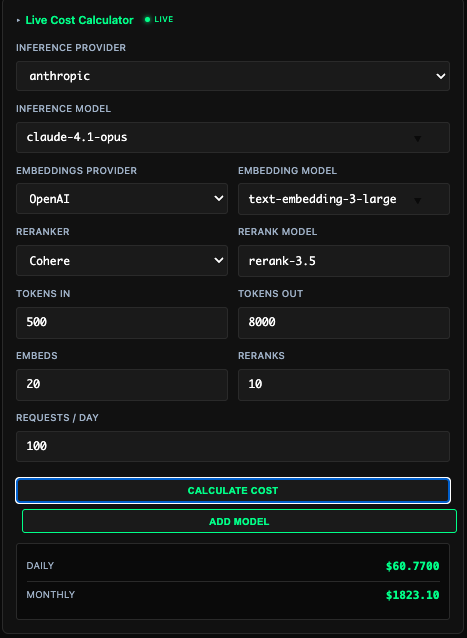
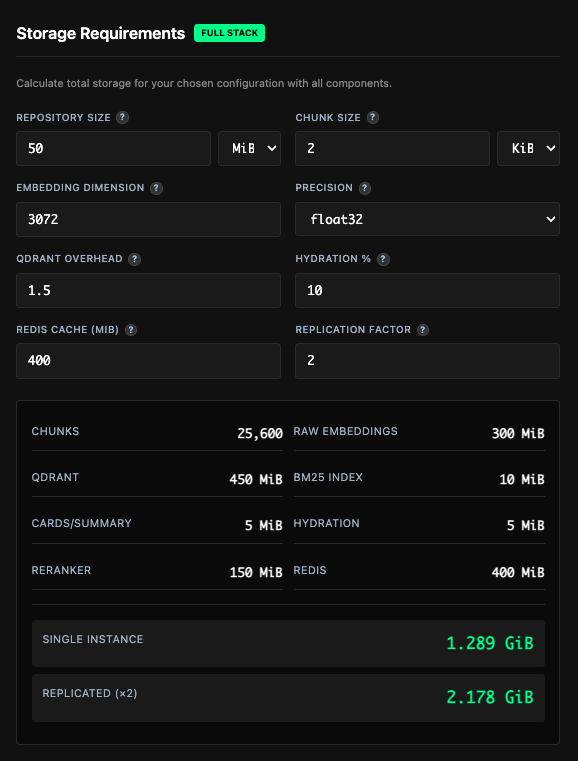
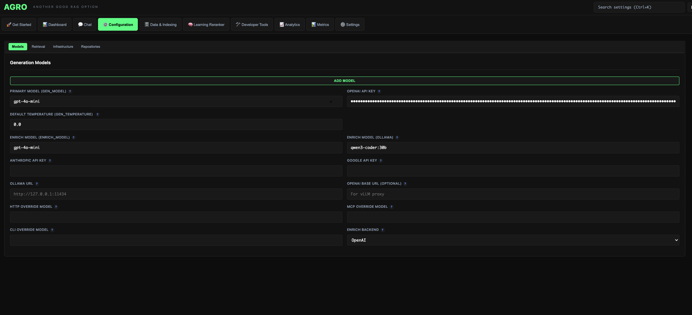
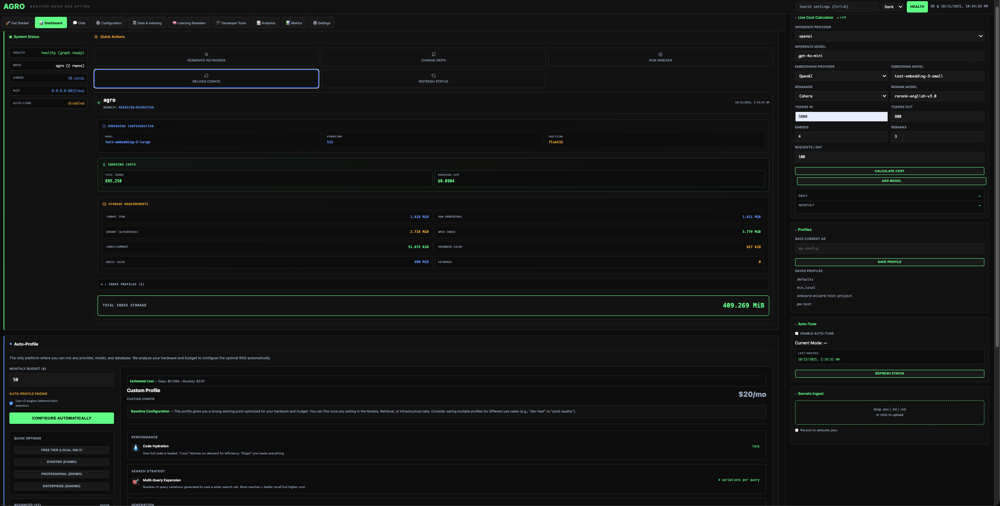
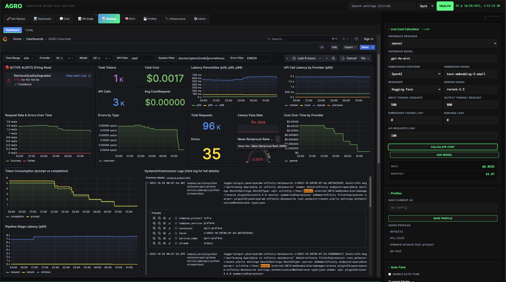
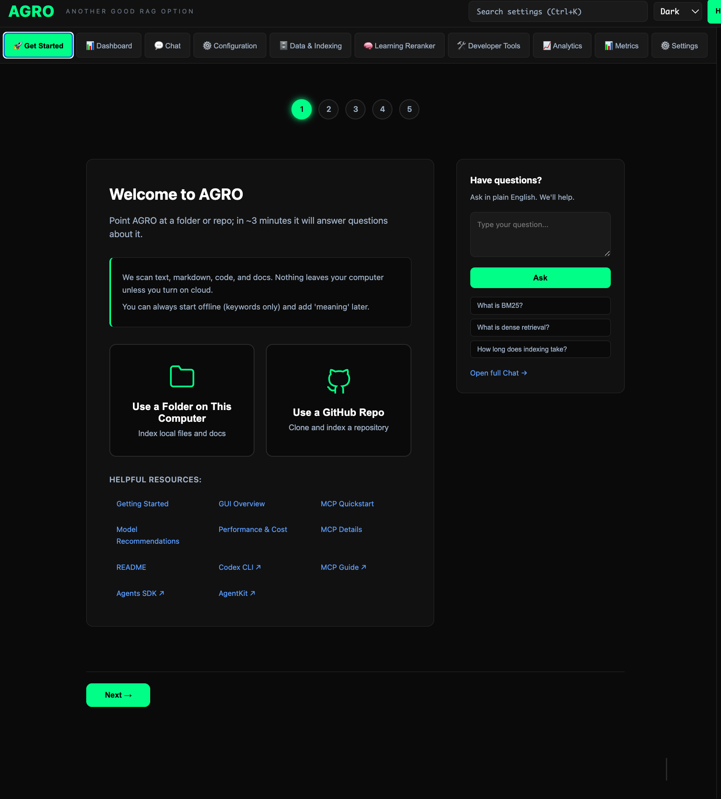
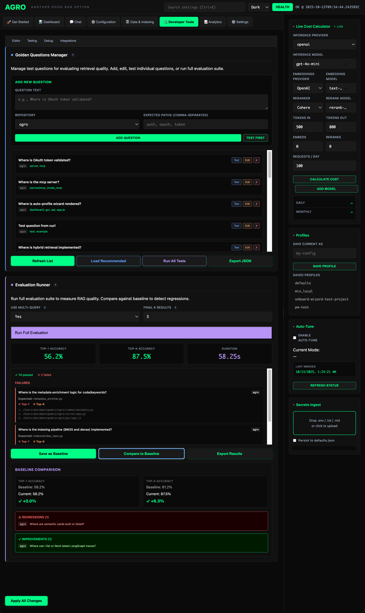
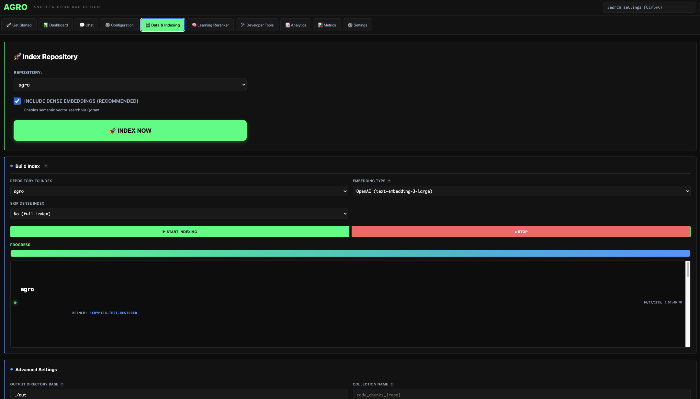
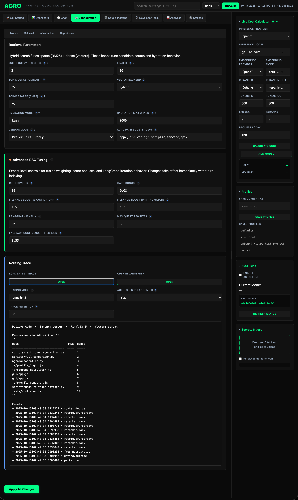

# AGRO is a local‑first RAG Engine Workspace for codebases.


#### It provides a rich GUI (also a decent TUI), easy setup with an Onboarding Wizard, a built-in Self-Learning Transformer model (it's literally always getting better and faster), Evals w/ Regression Analysis, Multi-Query, Hybrid-Search, Local Hydration, Traceability (Langsmith and OpenAI Agents SDK), Embedded-Grafana dash w/ alerts, Multiple Transports, Chat Interface, and Modular-everything.
And it even has a VSCode instance embedded in the GUI (you don't have to turn it on just wanted to see if I could do it ; )

### (Really) Quick Start
```bash
git clone https://github.com/DMontgomery40/agro.git
cd agro
Make dev. # Starts: Qdrant/Redis, MCPs, API, GUI, etc.
cd scripts/.setup.sh #CLI walkthrough to set repos, etc.

# GUI at http://127.0.0.1:8012/
```

## 📖 Documentation

**[Full Documentation Site](https://dmontgomery40.github.io/agro-rag-engine/)** - Complete guides for setup, API, MCP integration, and more

## **Fully-local model support, or any SOTA API Model, mix, match, and set profiles based on task**
<table>
<tr>
<td width="50%" valign="top">

#### Profile: `Docs-search` (Fast, local-first, low-cost)
```yaml
gen_model: gpt-4o-mini
embedding: BGE-small-en-v1.5  #local
vectors: 384-d 
precision: int4
rerank_model: BAAI/bge-reranker-v2-m3
retrieval: BM25    # Sparse-only
local_hydration: 2%
multiquery: 2
top_k: 3
```

</td>
<td width="50%" valign="top">

#### Profile: `Plan_Refactor` (High-quality, full-stack)
```yaml
gen_model: gpt-5-high-latest                
embedding: text-embedding-3-large 
vectors: 3072-d
precision: float32
rerank_model: cohere/rerank-3.5
retrieval: BM25+Redis+Qdrant
multiquery: 10 
top_k: 20
max_semantic_cards: 50
conf_top1: 0.80  # Confidence gating
conf_avg5: 0.52
```

</td>
</tr>
</table>

## And crucially, the ability to estimate the impact of that 'refactor' profile, *before* you run it
<div align="center">
  <a href="assets/cost_est.png" target="_blank">
    
  </a>
  <a href="assets/stor.png" target="_blank">
    
  </a>
</div>

<br>

## MCP servers and API endpoints


### (Python and Node.js) supporting HTTP, SSE, STDIO, and WebSocket transports
  - ***Per-transport configuration:*** choose different models and search backends for each mode

<a href="assets/onboarding_carosel/mcp_transport_changing_model_per_transport.png" target="_blank">
  
</a>

### Robust API with optional OAuth 2.0
**Full Documentation:**
- **Interactive API Docs:** http://127.0.0.1:8012/docs (Swagger UI)
- **Complete API Reference:** [docs/API_REFERENCE.md](docs/API_REFERENCE.md)

## Highlights
- **Custom-Trained Search Transformer** — A full transformer-based language model that lives inside AGRO, continuously learning from your usage patterns (clicks, feedback) 
  and training specifically on YOUR codebase. Complete ML pipeline: 
  `mine triplets → train → evaluate → promote - repeat` 
- Repo isolation and citations as guardrails — not “best effort”.
- ***Massive*** reduction in token use with Claude Code / Codex; Rate Limits extended greatly or potentially no longer an issue at all
- Greatly increased accuracy in the code that CC/Codex deliver
- More in docs on how to set rules of CC/Codex so that they take full advantage of it

## Dashboard


## Built-In Grafana Dashboard


---

## What AGRO Is (and isn’t)

AGRO is a **workspace for using RAG on real codebases**, not a toy demo. I built it because I wanted a system where:
- I can point it at any repo (or ten repos), index once, and then live in a tight “ask → inspect citations → fix → re‑ask” loop.
- Every knob is explainable in‑app (tooltips + linked papers), so you don’t need to guess what a setting does.
- Retrieval quality is measurable and improves over time.

AGRO does **hybrid search** (BM25 + dense vectors + reranking), routes by repo, and can **train its own reranker** from usage feedback. It also exposes all of this over **MCP**, so tools like Codex and Claude Code can call retrieval and answer functions directly.

## Repository Layout

High‑level map of the codebase:

| Folder | What lives there |
|--------|------------------|
| `server/` | FastAPI app, routers, services, MCP servers |
| `web/` | Primary GUI (React/Vite) |
| `retrieval/` | Hybrid search, embeddings, AST chunking, rerankers |
| `indexer/` | Indexing pipeline (chunk → BM25 → embeddings → Qdrant) |
| `reranker/` | Learning reranker training + config |
| `infra/` | Docker compose for Qdrant/Redis/Grafana/Prometheus |
| `scripts/` | `up.sh`, `dev_up.sh`, indexing helpers |
| `mkdocs/` | MkDocs docs source and theme config |

If you’re trying to understand “how an answer happens”, start with:
`indexer/index_repo.py` → `retrieval/hybrid_search.py` → `server/langgraph_app.py`.

## Using AGRO on Your Codebase

### 1) Start services

The development launcher brings up infra + API + GUI + MCP:

```bash
make dev
# or: bash scripts/dev_up.sh
```

### 2) Register repositories

Use the onboarding wizard in the GUI, or the CLI helper:

```bash
make setup repo=/abs/path/to/your/repo name=my-repo
```

Repo locations are stored in `repos.json`. You can manage multiple repos and switch between them in the UI or CLI.

### 3) Set ignore globs (important)

Before indexing, define what *not* to index (vendor dirs, build outputs, huge binaries).  
Edit `data/exclude_globs.txt` or do it in the GUI Infrastructure tab.

### 4) Index

```bash
make index REPO=my-repo
# or: REPO=my-repo python index_repo.py
```

Indexing produces:
- sparse BM25 index
- dense vectors in Qdrant
- local `.jsonl` chunk store under `out/`

### Optional: auto‑generate keywords / boosts

The onboarding wizard can analyze a repo and suggest keyword sets and path boosts:

<a href="assets/onboarding_carosel/auto-generate-keywords.png" target="_blank">
  
</a>

## Asking Questions

You can query AGRO three ways:

- **GUI**: `http://127.0.0.1:8012/` → Search / Chat tabs.
- **CLI chat**:
  ```bash
  . .venv/bin/activate
  REPO=my-repo python -m cli.chat_cli
  ```
- **HTTP API**:
  ```bash
  curl 'http://127.0.0.1:8012/answer?q=How+does+indexing+work%3F&repo=my-repo'
  ```

Every answer includes citations with rerank scores, so you can jump straight to the code.

## Evaluation (quality checks + regressions)

AGRO ships with a golden‑test harness and a GUI for running evals.

<a href="assets/evals.png" target="_blank">
  
</a>

Golden tests are editable in the UI:

<a href="assets/onboarding_carosel/golden-tests-gui.png" target="_blank">
  
</a>

CLI equivalents:

```bash
. .venv/bin/activate
python eval/eval_loop.py            # run eval
python eval/eval_loop.py --baseline # save baseline
python eval/eval_loop.py --compare  # regressions vs baseline
```

## Configuration & Profiles

All settings live in `agro_config.json` and are validated/propagated via Pydantic models.  
Use the GUI Settings tabs to change them; profiles let you save different “modes” (fast/local vs deep/expensive).

`.env` is **secrets only** (API keys, URLs). Don’t add config keys there.

## MCP for Agentic Tools

AGRO exposes retrieval and answer tools over MCP:
- stdio for local agents
- HTTP/SSE for remote agents

That lets Codex/Claude Code call:
`rag_search(...)` for retrieval, and `rag_answer(...)` for full RAG.

Setup guides:
- MkDocs: `mkdocs/docs/features/mcp.md`
- Legacy docs: `docs/QUICKSTART_MCP.md`, `docs/REMOTE_MCP.md`

## Tuning, Tracing, Monitoring

Retrieval is deliberately tunable (BM25/dense weights, multi‑query, reranker selection, confidence gating).  
Tracing is built‑in so you can see *why* a particular answer was produced.

<a href="assets/tune_and_trace.png" target="_blank">
  
</a>

Grafana + Prometheus are bundled for system and quality metrics, with alerting on any metric you care about.

## Contributing / Branch Flow

Normal flow is `development` → `staging` → `main`.  
PRs should target `development`, then get promoted upward.

If you want to add a new setting, follow the config contract:
1. Add to `agro_config.json`
2. Register in Pydantic models under `server/models/`
3. Add to `server/services/config_registry.py` and `config_store.py`
4. Surface in the GUI (accessibility requirement)

## License

MIT. Do whatever you want with it, but please keep the citations honest when you’re using AGRO to answer questions about AGRO.

