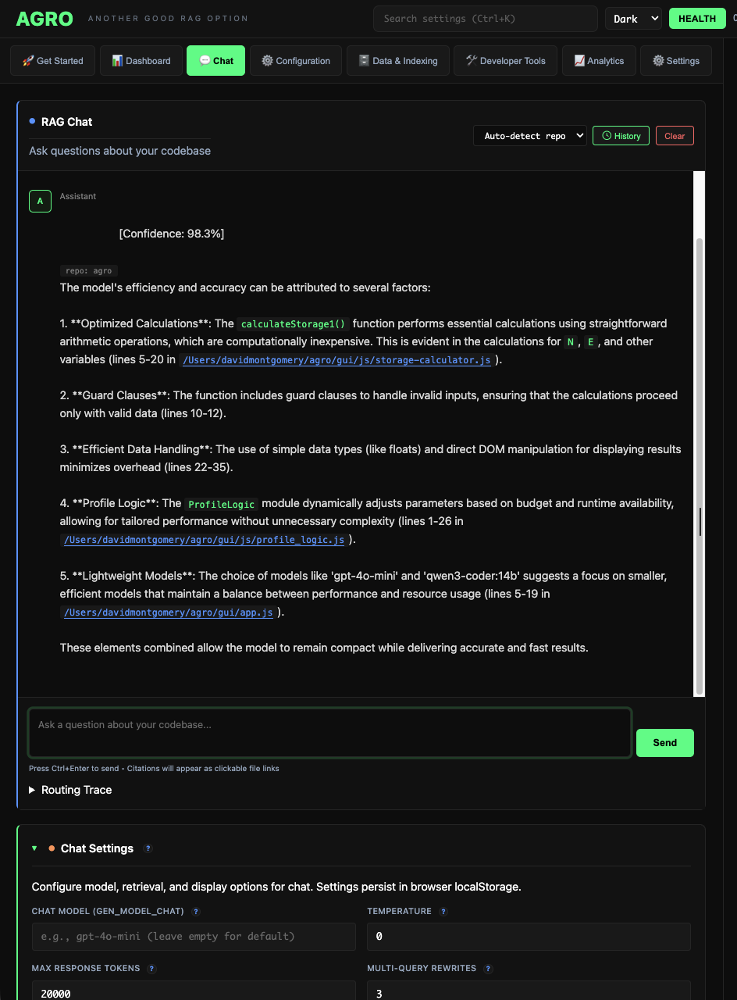

# Settings GUI API (Local-Only)

All feature flags, settings, variables, and parameters are controlled in the GUI. Do not edit code to change configuration. If a knob doesn’t fit a category, it belongs in the GUI “Misc” tab.

This contract powers the local admin GUI. All routes are localhost-only and unauthenticated.


### Chat Tab (GUI Chat, not terminal)

The Chat tab embeds a full chat experience inside the GUI (not a terminal). It shows citations, repo selector, history controls, and a Send button.



## Endpoints

1) GET `/api/gui/config`

Returns full settings schema, scopes, and current effective values.

Response:
```
{
  "schema": {
    "categories": ["retrieval","reranker","generation","embeddings","repos","indexing","hydration","eval","integration","advanced"],
    "settings": [
      {
        "key": "FINAL_K",
        "type": "integer",
        "category": "retrieval",
        "description": "Final top-K after fusion + rerank",
        "validation": {"min": 1, "max": 200},
        "impact": ["latency"],
        "scope": ["global","repo"],
        "default": 10
      },
      ...
    ]
  },
  "values": {
    "_global": {"FINAL_K": 10, ...},
    "by_repo": {"agro": {"FINAL_K": 20, ...}},
    "by_channel": {"HTTP": {"GEN_MODEL_HTTP": null}, "MCP": {...}, "CLI": {...}}
  },
  "requires_reindex": false
}
```

2) PATCH `/api/gui/config`

Applies changes live; writes `ui/runtime_overrides.json`. Returns updated snapshot and any reindex flags.

Request:
```
{
  "changes": [
    {"key": "FINAL_K", "scope": "repo", "repo": "agro", "value": 25},
    {"key": "GEN_MODEL_HTTP", "scope": "channel", "channel": "HTTP", "value": "gpt-4o-mini"}
  ]
}
```

Response:
```
{
  "applied": true,
  "requires_reindex": true,
  "reindex_reasons": ["repo_paths_changed"],
  "values": { ... }
}
```

3) GET `/api/repos`

Returns `repos.json` (effective) with computed fields.

Response:
```
{
  "default_repo": "agro",
  "repos": [
    {
      "name": "agro",
      "enabled": true,
      "priority_weight": 10,
      "path": [".", "/Users/.../agro"],
      "keywords": ["rag","retrieval",...],
      "path_boosts": ["hybrid_search.py", ...],
      "layer_bonuses": {"server": {"server":0.10, "integration":0.05}}
    }
  ]
}
```

4) POST `/api/repos`

Add/edit repos and repo-scoped fields.

Request (examples):
```
{ "op": "set", "repo": "agro", "field": "enabled", "value": true }
{ "op": "add_keyword", "repo": "agro", "value": "auth" }
{ "op": "remove_path_boost", "repo": "agro", "value": "legacy/" }
{ "op": "set_layer_bonus", "repo": "agro", "intent": "server", "layer": "ui", "value": 0.08 }
{ "op": "add_repo_path", "repo": "agro", "value": "/abs/path" }
```

Response:
```
{ "ok": true, "requires_reindex": true, "reindex_reasons": ["repo_paths_changed"], "repos": {...}}
```

5) POST `/api/reindex?repo=<name>`

Triggers reindex for a repo. Long-running; return job-id and stream logs via `/api/reindex/logs?id=...`.

6) GET `/api/gui/search_settings?q=...`

Searches settings and related docs. Merges local fuzzy matches from `ui/ALL_KNOBS.yaml` with MCP RAG hits.

Response:
```
{
  "local": [{"key":"FINAL_K","score":0.91,"path":"retrieval"}, ...],
  "rag": [
    {"file_path":"serve_rag.py","start_line":1,"end_line":26,"snippet":"..."},
    ...
  ]
}
```

## Notes

- All routes bind to 127.0.0.1; CORS open to `http://127.0.0.1:*` for the SPA.
- Writes are transactional with preflight validation and a diff preview.
- `requires_reindex` is true when `repos[].path`, `EMBEDDING_TYPE`, or card-building knobs change.

See also
- Tracing & tuning (LangSmith): [LANGSMITH_SETUP.md](LANGSMITH_SETUP.md)
- Performance & cost: [PERFORMANCE_AND_COST.md](PERFORMANCE_AND_COST.md)
