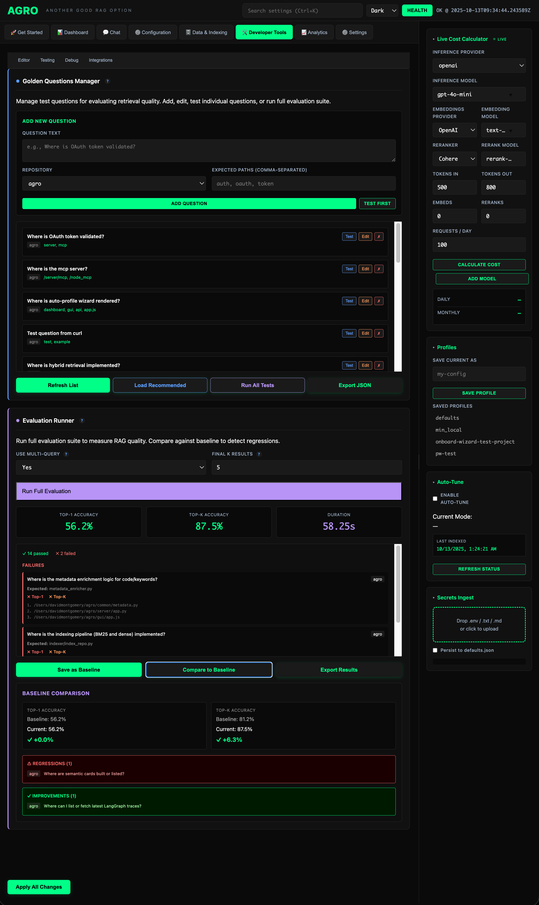

# Claude Code Alone vs Claude Code + RAG

**Bottom line: RAG saves 91% tokens. That means 11x more queries before hitting your Claude rate limits.**

**📊 [Contributing benchmarks](CONTRIBUTING.md)** - Help us test with different Claude models & tiers!

---

## The Comparison

**Date:** 2025-10-08
**Query:** "Where is OAuth processed in this repo, and which plugins must validate with it?" (large repo of mine, thought it was decent baseline quesstion)
**Claude:** Sonnet 4.5 on $200/mo Pro
**Tester:** @dmontgomery40

| Approach | Tokens/Query | Queries Before Rate Limit* | Latency | Quality |
|----------|--------------|---------------------------|---------|---------|
| **Claude Code Alone** | 12,700 | 100 | 5-10s | Excellent |
| **Claude Code + RAG** | 1,141 | **1,110** | 2.9s | Excellent |
| **DIFFERENCE** | **-11,559 (-91%)** | **+1,010 (+1,010%)** | **-5s** | Same |

> There are scripts to autorun these test for you in /scripts, and it would be awesome if you'd like to add your results.

---

## What This Means

### Rate Limits (The Real Problem)

> *Very fake limits below for illustration purposes, so that they are more digestable comparisons*

If you're paying $200/mo for Claude Pro, you still have **weekly rate limits**:
- **Sonnet:** ~1.27M tokens/week
- **Opus:** ~300K tokens/week (much tighter)

**Without RAG:**
- Sonnet: 1.27M ÷ 12,700 = **100 queries/week** before hitting limit
- Opus: 300K ÷ 12,700 = **23 queries/week** before hitting limit

**With RAG:**
- Sonnet: 1.27M ÷ 1,141 = **1,110 queries/week** before hitting limit
- Opus: 300K ÷ 1,141 = **263 queries/week** before hitting limit

**On Opus, you can hit your weekly limit in a single long coding day without RAG. With RAG, you can code all week.**

> *Very fake lmits above for illustration purposes, so that they are more digestable comparisons*

### Speed (It's kind of a wash)

Claude Code alone: 5-10 seconds (reading 10+ full files)
Claude Code + RAG: 2-15 seconds (metadata only)

**RAG is 2-3x faster, and also sometimes 50% slower, it's a wash** it really just depends, on a lot of factors, beyond the scope of this doc.

### Quality (Depends)

Both give excellent answers. For different reasons, of course, but quality of answers that can come from 4o-mini, in the context of knowing your codebase, is astonishing. 

**The real point is to take that answer, and feed it into your code request or whatever you're going to ask Claude** Or sometimes, I find it's better to just use the rag_search toolcall instead of rag_answer, since it just comes back with every relevant line of code, even if it's not a keyword match, because semantic matches can be MORE important, and that's what `grep` will never be able to do. 

---

**See also:**
- **[Contributing Benchmarks](CONTRIBUTING.md)** - Test with your Claude tier!
- **[Quick Start](../README.md)** - Setup instructions
- **[MCP Integration](MCP_README.md)** - Complete MCP docs

**Last updated:** October 8, 2025
