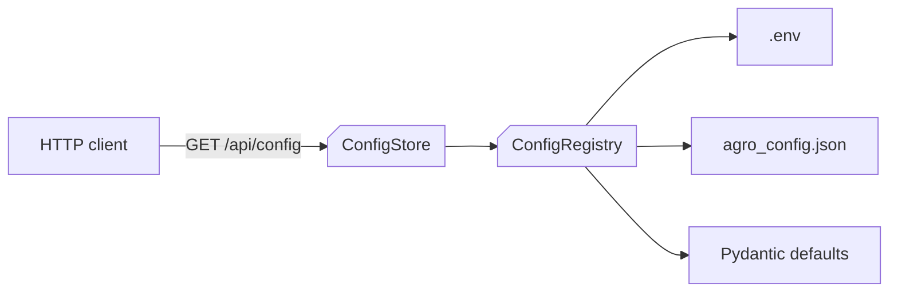
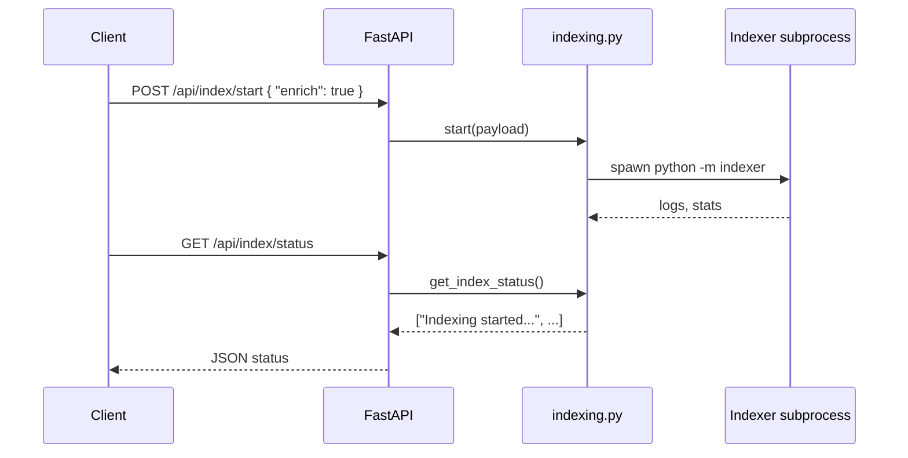

# HTTP API

AGRO exposes a small HTTP API for search, RAG answers, chat, configuration, and indexing. Everything is FastAPI under the hood, so you get OpenAPI docs at `/docs` if you’re running the server.

This page focuses on the *behavior* of the endpoints and how they interact with the service layer, especially configuration and indexing.

!!! note
    The OpenAPI schema is generated from `server.asgi:create_app`. For a full, always‑up‑to‑date view of request/response models, hit `/openapi.json` or see [API Documentation & OpenAPI Spec](openapi.md).


## Configuration & Settings Endpoints

AGRO has a central configuration registry that merges three sources with clear precedence:

1. `.env` file – secrets and infrastructure overrides
2. `agro_config.json` – tunable RAG parameters, model config, UI behavior
3. Pydantic defaults – safe fallbacks baked into the code

The HTTP API exposes this through a small set of endpoints that talk to the `server/services/config_registry.py` and `server/services/config_store.py` service layer.



### GET `/api/config`

Return the *effective* configuration that the backend is currently using.

- Reads via `server/services/config_store.get_config()`
- Ultimately backed by `ConfigRegistry` (`get_config_registry()`)
- Values are already merged according to precedence rules

Response (simplified):

```json
{
  "config": {
    "REPO": "agro",
    "FINAL_K": 12,
    "EDITOR_ENABLED": true,
    "OPENAI_API_KEY": "***",
    "ANTHROPIC_API_KEY": "***"
  },
  "source": {
    "REPO": "env",
    "FINAL_K": "agro_config.json",
    "EDITOR_ENABLED": "default"
  }
}
```

!!! note "Secrets are masked"
    `config_store.py` maintains a `SECRET_FIELDS` set (e.g. `OPENAI_API_KEY`, `ANTHROPIC_API_KEY`, `MCP_API_KEY`, etc.). These are always redacted in API responses so you can safely inspect config from the UI or CLI.


### POST `/api/config`

Update tunable configuration on disk.

- Writes to `agro_config.json` via `config_store.save_config()`
- Uses an atomic write helper (`_atomic_write_text`) to avoid partial writes, with a Docker‑aware fallback for macOS volume mounts
- Validates against the Pydantic `AgroConfigRoot` model before committing

Request body (partial example):

```json
{
  "FINAL_K": 15,
  "KEYWORDS_MAX_PER_REPO": 80,
  "EDITOR_ENABLED": false
}
```

Response:

```json
{
  "ok": true,
  "config": { "FINAL_K": 15, "KEYWORDS_MAX_PER_REPO": 80, "EDITOR_ENABLED": false }
}
```

!!! warning
    Environment variables still win. If you set `FINAL_K` in `.env`, changing it via this endpoint won’t have any effect until you remove or change the env var.


### GET `/api/editor/settings`

Expose the current settings for the built‑in code editor / viewer.

Backed by `server/services/editor.read_settings()`:

- Prefers the config registry (`.env` / `agro_config.json`)
- Falls back to a legacy `out/editor/settings.json` file if present

Typical response:

```json
{
  "port": 4440,
  "enabled": true,
  "embed_enabled": true,
  "bind": "local",
  "image": "codercom/code-server:latest"
}
```

These map directly to keys like `EDITOR_PORT`, `EDITOR_ENABLED`, `EDITOR_EMBED_ENABLED`, `EDITOR_BIND`, etc. in the registry.


## Indexing Endpoints

Indexing is orchestrated by `server/services/indexing.py`. The HTTP endpoints are thin wrappers around this service.

At a high level:

- Indexing runs in a background thread spawned by the API handler
- Status and metadata are kept in module‑level globals (`_INDEX_STATUS`, `_INDEX_METADATA`)
- The indexer process is launched with a carefully constructed environment so it sees the same repo root and Python environment as the server



### POST `/api/index/start`

Kick off an indexing run for the current repository.

The service implementation (`indexing.start`) does:

```py title="server/services/indexing.py" linenums="1" hl_lines="15-28"
from server.services.config_registry import get_config_registry
from common.paths import repo_root

_config_registry = get_config_registry()

_INDEX_STATUS: List[str] = []
_INDEX_METADATA: Dict[str, Any] = {}


def start(payload: Dict[str, Any] | None = None) -> Dict[str, Any]:
    global _INDEX_STATUS, _INDEX_METADATA
    payload = payload or {}
    _INDEX_STATUS = ["Indexing started..."]
    _INDEX_METADATA = {}

    def run_index():
        global _INDEX_STATUS, _INDEX_METADATA
        try:
            repo = _config_registry.get_str("REPO", "agro")
            _INDEX_STATUS.append(f"Indexing repository: {repo}")
            root = repo_root()
            env = {**os.environ,
                   "REPO": repo,
                   "REPO_ROOT": str(root),
                   "PYTHONPATH": str(root)}
            if payload.get("enrich"):
                env["ENRICH_CODE_CHUNKS"] = "true"
                _INDEX_STATUS.append("Enriching chunks with summaries...")
            # ... spawn subprocess, update _INDEX_STATUS/_INDEX_METADATA
        except Exception as e:
            _INDEX_STATUS.append(f"Indexing failed: {e}")

    threading.Thread(target=run_index, daemon=True).start()
    return {"ok": True}
```

Key behaviors:

- `REPO` is read from the config registry (`REPO` key, default `"agro"`)
- `REPO_ROOT` and `PYTHONPATH` are set so the indexer can resolve imports and paths correctly
- If the request payload includes `{ "enrich": true }`, the environment variable `ENRICH_CODE_CHUNKS=true` is set and a status line is added

Request examples:

=== "Basic index"
    ```http
    POST /api/index/start HTTP/1.1
    Content-Type: application/json

    {}
    ```

=== "Index with enrichment"
    ```http
    POST /api/index/start HTTP/1.1
    Content-Type: application/json

    { "enrich": true }
    ```

Response:

```json
{ "ok": true }
```

The actual progress is retrieved via the status endpoint.


### GET `/api/index/status`

Return the current indexing status and any metadata the indexer has produced.

Backed by simple accessors in `indexing.py` (not shown here):

```json
{
  "status": [
    "Indexing started...",
    "Indexing repository: agro",
    "Enriching chunks with summaries...",
    "Wrote 12345 vectors to Qdrant"
  ],
  "metadata": {
    "repo": "agro",
    "started_at": "2025-12-10T09:31:41Z",
    "finished_at": null
  }
}
```

!!! note
    Status is kept in memory only. If you restart the server mid‑index, the status list is lost and you’ll need to re‑start indexing.


## Keywords & Retrieval Tuning Endpoints

AGRO maintains a small set of *discriminative keywords* per repo to help BM25 and hybrid retrieval. These are generated and refreshed by `server/services/keywords.py`.

The HTTP endpoints that expose keyword configuration and stats are thin wrappers around this module.

### How keyword config is loaded

On import, `keywords.py` reads from the config registry once and caches the values:

```py title="server/services/keywords.py" linenums="1" hl_lines="8-16"
from server.services.config_registry import get_config_registry

_config_registry = get_config_registry()
_KEYWORDS_MAX_PER_REPO = _config_registry.get_int('KEYWORDS_MAX_PER_REPO', 50)
_KEYWORDS_MIN_FREQ = _config_registry.get_int('KEYWORDS_MIN_FREQ', 3)
_KEYWORDS_BOOST = _config_registry.get_float('KEYWORDS_BOOST', 1.3)
_KEYWORDS_AUTO_GENERATE = _config_registry.get_int('KEYWORDS_AUTO_GENERATE', 1)
_KEYWORDS_REFRESH_HOURS = _config_registry.get_int('KEYWORDS_REFRESH_HOURS', 24)


def reload_config():
    """Reload cached config values from registry."""
    global _KEYWORDS_MAX_PER_REPO, _KEYWORDS_MIN_FREQ, _KEYWORDS_BOOST
    global _KEYWORDS_AUTO_GENERATE, _KEYWORDS_REFRESH_HOURS
    _KEYWORDS_MAX_PER_REPO = _config_registry.get_int('KEYWORDS_MAX_PER_REPO', 50)
    _KEYWORDS_MIN_FREQ = _config_registry.get_int('KEYWORDS_MIN_FREQ', 3)
    _KEYWORDS_BOOST = _config_registry.get_float('KEYWORDS_BOOST', 1.3)
    _KEYWORDS_AUTO_GENERATE = _config_registry.get_int('KEYWORDS_AUTO_GENERATE', 1)
    _KEYWORDS_REFRESH_HOURS = _config_registry.get_int('KEYWORDS_REFRESH_HOURS', 24)
```

If you change these values via `/api/config`, you can either restart the server or call the dedicated reload endpoint (if exposed) which just calls `reload_config()`.

Typical keyword‑related endpoints:

- `GET /api/keywords` – list current discriminative keywords for a repo
- `POST /api/keywords/rebuild` – force regeneration, ignoring the refresh window

Responses are backed by JSON files under `data/discriminative_keywords.json` and per‑repo keyword caches under `data/`.


## RAG & Search Endpoints

The main RAG/search endpoints delegate into `server/services/rag.py`, which in turn calls the hybrid retrieval stack and (optionally) a LangGraph‑based orchestration graph.

### GET `/api/search`

Perform a retrieval‑only search over the indexed codebase.

Query parameters:

- `q` (string, required) – the query text
- `repo` (string, optional) – repo name; defaults to `REPO` from config
- `top_k` (int, optional) – override number of final results

`rag.do_search` resolves `top_k` like this:

```py title="server/services/rag.py" linenums="1" hl_lines="20-30"
_config_registry = get_config_registry()


def do_search(q: str, repo: Optional[str], top_k: Optional[int], request: Optional[Request] = None) -> Dict[str, Any]:
    if top_k is None:
        try:
            # Try FINAL_K first, fall back to LANGGRAPH_FINAL_K
            top_k = _config_registry.get_int('FINAL_K', _config_registry.get_int('LANGGRAPH_FINAL_K', 10))
        except Exception:
            top_k = 10

    # ... call retrieval.hybrid_search.search_routed_multi
```

So you can control the default fan‑out via either `FINAL_K` or `LANGGRAPH_FINAL_K` in config.

Response (simplified):

```json
{
  "query": "how does config precedence work?",
  "repo": "agro",
  "top_k": 10,
  "results": [
    {
      "score": 0.91,
      "path": "server/services/config_registry.py",
      "start_line": 1,
      "end_line": 80,
      "snippet": "Configuration Registry for AGRO RAG Engine..."
    }
  ]
}
```


### POST `/api/rag`

Full RAG answer endpoint (exact path/name may differ slightly; check `/docs`).

- Uses the same retrieval path as `/api/search`
- Then calls the configured LLM to synthesize an answer
- May route through a LangGraph graph if `server/langgraph_app.build_graph()` is available

The graph is lazily built on first use:

```py title="server/services/rag.py" linenums="32" hl_lines="1-12"
_graph = None
CFG = {"configurable": {"thread_id": "http"}}


def _get_graph():
    global _graph
    if _graph is None:
        try:
            from server.langgraph_app import build_graph
            _graph = build_graph()
        except Exception as e:
            logger.warning("build_graph failed: %s", e)
            _graph = None
    return _graph
```

If the graph fails to build (or doesn’t exist), AGRO falls back to a simpler RAG path instead of crashing the endpoint.


## Tracing & Analytics Endpoints

AGRO can persist traces of RAG runs and evaluation runs under `out/<repo>/traces`. The API exposes a small surface to list and fetch these.

### GET `/api/traces`

List recent trace files for a repo.

Backed by `server/services/traces.list_traces`:

```py title="server/services/traces.py" linenums="1" hl_lines="7-20"
from common.config_loader import out_dir
from server.tracing import latest_trace_path


def list_traces(repo: Optional[str]) -> Dict[str, Any]:
    r = (repo or __import__('os').getenv('REPO', 'agro')).strip()
    base = Path(out_dir(r)) / 'traces'
    files: List[Dict[str, Any]] = []
    try:
        if base.exists():
            for p in sorted(
                [x for x in base.glob('*.json') if x.is_file()],
                key=lambda x: x.stat().st_mtime,
                reverse=True,
            )[:50]:
                files.append({
                    'path': str(p),
                    'name': p.name,
                    'mtime': __import__('datetime').datetime.fromtimestamp(p.stat().st_mtime).isoformat(),
                })
    except Exception as e:
        logger.exception("Failed to list traces: %s", e)
    return {'repo': r, 'files': files}
```

Response:

```json
{
  "repo": "agro",
  "files": [
    {
      "path": "out/agro/traces/trace_2025-12-10T09-31-41.json",
      "name": "trace_2025-12-10T09-31-41.json",
      "mtime": "2025-12-10T09:31:41.123456"
    }
  ]
}
```


### GET `/api/traces/latest`

Return the latest trace file for a repo.

Backed by `traces.latest_trace`, which uses `server.tracing.latest_trace_path(repo)` and returns either the JSON contents or a small error payload if something goes wrong.


## How this ties into the Web UI

Most of the React components under `web/src/components` talk to these endpoints:

- `Dashboard/*` – uses `/api/index/*`, `/api/config`, `/api/traces/*` to show system status, storage, indexing costs, and recent traces
- `DevTools/*` – hits the RAG and evaluation endpoints, plus config endpoints for reranker and integrations
- `Editor/*` – reads `/api/editor/settings` and related config to embed or launch the editor

The important bit: the HTTP API is intentionally thin. Almost all of the real behavior lives in the service layer (`server/services/*.py`) and the config registry. If you want to change how something works, you usually:

1. Update the service module (e.g. `indexing.py`, `keywords.py`, `rag.py`)
2. Optionally add new config keys to `AgroConfigRoot` and `AGRO_CONFIG_KEYS`
3. Let the existing endpoints keep working with the new behavior

Because AGRO is indexed on itself, you can also open the Chat tab and ask things like:

> “Where does `/api/index/start` get its repo name from?”

and it will walk you through the same code paths described above.