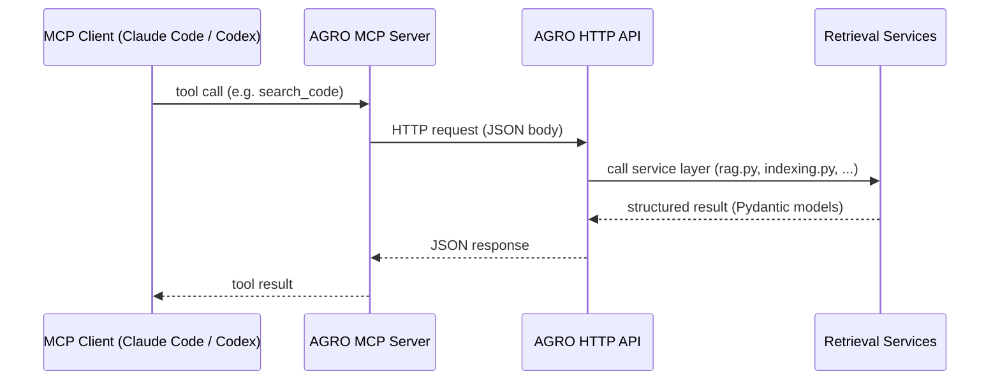

# API Documentation & OpenAPI Spec

AGRO exposes a full OpenAPI 3 schema through the FastAPI app defined in `server.asgi:create_app`. The legacy `server/app.py` entry point just wires that up for older setups.

This page explains:

- Where the OpenAPI spec comes from
- How configuration flows into the API layer
- How the web UI and MCP servers use it
- How to extend the API without fighting the config system


## Where to find the docs

When the AGRO server is running, you get three useful HTTP surfaces:

<div class="grid cards" markdown>

- :material-api:
  **OpenAPI JSON**  
  `GET /openapi.json`  
  Machine‑readable schema for all endpoints, models, and error responses.

- :material-book-open-page-variant:
  **Swagger UI**  
  `GET /docs`  
  FastAPI’s interactive docs. Good for poking individual endpoints.

- :material-language-markdown:
  **ReDoc**  
  `GET /redoc`  
  Alternative, more compact view of the same OpenAPI schema.

</div>

All three are backed by the same FastAPI app and the same Pydantic models.


## How configuration reaches the API

AGRO does not hard‑code behavior in the HTTP layer. Almost everything flows through the central configuration registry in `server/services/config_registry.py`.

The registry merges three sources with a clear precedence:

1. `.env` file – infrastructure and secrets (highest precedence)
2. `agro_config.json` – tunable RAG parameters, model config
3. Pydantic defaults – safe fallbacks

!!! note "Config precedence in practice"
    If you set `FINAL_K` in both `agro_config.json` and `.env`, the `.env` value wins. The API layer never talks to `os.environ` directly; it always goes through the registry.

The API services you hit from OpenAPI are thin wrappers around this registry:

- `server/services/rag.py` – search & answer endpoints
- `server/services/indexing.py` – indexing control & status
- `server/services/keywords.py` – discriminative keyword generation & tuning
- `server/services/editor.py` – embedded editor / devtools settings
- `server/services/traces.py` – trace listing and retrieval
- `server/services/config_store.py` – reading/writing `agro_config.json` and secrets

Each of these modules pulls configuration via `get_config_registry()` and exposes a small, typed surface to FastAPI.


## Example: retrieval endpoints and `FINAL_K`

The retrieval endpoints are wired through `server/services/rag.py`. The OpenAPI schema for these endpoints is generated from the FastAPI route definitions and the Pydantic models they use.

A concrete example is how `top_k` is resolved when you don’t pass it explicitly:

```py title="server/services/rag.py" linenums="1" hl_lines="18-24"
import logging
import os
from typing import Any, Dict, List, Optional

from fastapi import Request
from fastapi.responses import JSONResponse

from retrieval.hybrid_search import search_routed_multi
from server.metrics import stage
from server.telemetry import log_query_event
from server.services.config_registry import get_config_registry
import uuid

logger = logging.getLogger("agro.api")

# Module-level config registry
_config_registry = get_config_registry()


def do_search(q: str, repo: Optional[str], top_k: Optional[int], request: Optional[Request] = None) -> Dict[str, Any]:
    if top_k is None:
        try:
            # Try FINAL_K first, fall back to LANGGRAPH_FINAL_K
            top_k = _config_registry.get_int('FINAL_K', _config_registry.get_int('LANGGRAPH_FINAL_K', 10))
        except Exception:
            top_k = 10
    ...
```

From the OpenAPI side you just see `top_k: int | None`. The actual default is resolved at runtime from the config registry, not baked into the schema.

This is intentional:

- The OpenAPI spec stays stable
- You can change retrieval behavior via `.env` / `agro_config.json` without regenerating anything
- Tools that call the API (including MCP clients) don’t need to know about the internal knobs


## Example: indexing control

Indexing is exposed as a small set of endpoints that ultimately call `server/services/indexing.py:start` and friends.

```py title="server/services/indexing.py" linenums="1" hl_lines="18-33"
import asyncio
import os
import subprocess
import sys
import threading
from typing import Any, Dict, List

from common.paths import repo_root
from server.index_stats import get_index_stats as _get_index_stats
from server.services.config_registry import get_config_registry

# Module-level config registry
_config_registry = get_config_registry()

_INDEX_STATUS: List[str] = []
_INDEX_METADATA: Dict[str, Any] = {}


def start(payload: Dict[str, Any] | None = None) -> Dict[str, Any]:
    global _INDEX_STATUS, _INDEX_METADATA
    payload = payload or {}
    _INDEX_STATUS = ["Indexing started..."]
    _INDEX_METADATA = {}

    def run_index():
        global _INDEX_STATUS, _INDEX_METADATA
        try:
            repo = _config_registry.get_str("REPO", "agro")
            _INDEX_STATUS.append(f"Indexing repository: {repo}")
            # Ensure the indexer resolves repo paths correctly and uses the same interpreter
            root = repo_root()
            env = {**os.environ, "REPO": repo, "REPO_ROOT": str(root), "PYTHONPATH": str(root)}
            if payload.get("enrich"):
                env["ENRICH_CODE_CHUNKS"] = "true"
                _INDEX_STATUS.append("Enriching chunks with su...")
            ...
```

The OpenAPI schema for the indexing endpoint only needs to describe `payload` (e.g. `{ "enrich": true }`). Everything else – which repo to index, how to resolve paths, whether to enrich chunks – is driven by the config registry and environment.


## Config‑aware admin & editor endpoints

Several admin‑style endpoints exist purely to support the web UI and devtools. They’re still part of the same OpenAPI schema, but they’re worth calling out because they lean heavily on the registry.

### Editor settings

`server/services/editor.py` exposes a small JSON surface that the web UI uses to configure the embedded editor / devtools panel:

```py title="server/services/editor.py" linenums="1" hl_lines="16-26"
from server.services.config_registry import get_config_registry
from server.models.agro_config_model import AGRO_CONFIG_KEYS

...

def read_settings() -> Dict[str, Any]:
    """Read editor settings, preferring registry (agro_config.json/.env) with legacy file fallback."""
    registry = get_config_registry()
    settings = {
        "port": registry.get_int("EDITOR_PORT", 4440),
        "enabled": registry.get_bool("EDITOR_ENABLED", True),
        "embed_enabled": registry.get_bool("EDITOR_EMBED_ENABLED", True),
        "bind": registry.get_str("EDITOR_BIND", "local"),  # 'local' or 'public'
        "image": registry.get_str("EDI..."),
        ...
    }
    ...
    return settings
```

The OpenAPI schema just says “this endpoint returns a JSON object with these fields.” The actual values – and whether the editor is even enabled – come from `.env` / `agro_config.json`.

This is the pattern across the admin endpoints:

- **Config store** (`server/services/config_store.py`) – reads/writes `agro_config.json`, hides `SECRET_FIELDS` from responses, and validates against `AGRO_CONFIG_KEYS`.
- **Keywords** (`server/services/keywords.py`) – exposes keyword stats and regeneration, but all the tuning knobs (`KEYWORDS_MAX_PER_REPO`, `KEYWORDS_BOOST`, etc.) are cached from the registry.
- **Traces** (`server/services/traces.py`) – lists and fetches trace files under `out/<repo>/traces`, with `repo` defaulting to `REPO` from the environment.


## Secrets and the OpenAPI schema

`server/services/config_store.py` is the main place where secrets and OpenAPI meet.

```py title="server/services/config_store.py" linenums="1" hl_lines="12-23"
import json
import logging
import os
import tempfile
from pathlib import Path
from typing import Any, Dict, List, Optional
from pydantic import ValidationError

from common.config_loader import _load_repos_raw
from common.paths import repo_root, gui_dir
from server.services.config_registry import get_config_registry
from server.models.agro_config_model import AGRO_CONFIG_KEYS

logger = logging.getLogger("agro.api")


SECRET_FIELDS = {
    'OPENAI_API_KEY', 'ANTHROPIC_API_KEY', 'GOOGLE_API_KEY',
    'COHERE_API_KEY', 'VOYAGE_API_KEY', 'LANGSMITH_API_KEY',
    'LANGCHAIN_API_KEY', 'LANGTRACE_API_KEY', 'NETLIFY_API_KEY',
    'OAUTH_TOKEN', 'GRAFANA_API_KEY', 'GRAFANA_AUTH_TOKEN',
    'MCP_API_KEY', 'JINA_API_KEY', 'DEEPSEEK_API_KEY', 'MISTRAL_API_KEY',
    'XAI_API_KEY', 'GROQ_API_KEY', 'FIREWORKS_API_KEY'
}
```

The OpenAPI schema for the config endpoints is generated from Pydantic models that *exclude* these fields from responses. You can still set them via the API (or `.env`), but you won’t see them echoed back in plain text.

!!! warning
    Don’t rely on the OpenAPI schema as a “list of all secrets.” New providers and keys are added over time. The authoritative list is `SECRET_FIELDS` in `config_store.py` and the `.env` template in `getting-started/environment-example.md`.


## How MCP servers use the OpenAPI spec

AGRO’s MCP integration (see `features/mcp.md`) doesn’t talk to FastAPI directly, but it does rely on the same Pydantic models and service layer that generate the OpenAPI schema.

The flow looks like this:



Because everything is typed once (Pydantic models → FastAPI → OpenAPI), you get:

- A single source of truth for request/response shapes
- The same validation and defaults whether you call via HTTP, the web UI, or MCP
- Less drift between “what the docs say” and “what the MCP tools actually accept”

You don’t need to regenerate or hand‑edit the OpenAPI spec to make MCP work; you just add or adjust Pydantic models and service functions.


## Extending the API safely

If you want to add a new endpoint or tweak an existing one, the safest path is:

1. **Add or modify a Pydantic model** under `server/models/` (or extend `AgroConfigRoot` if it’s a config surface).
2. **Add a small service function** under `server/services/` that:
   - Pulls configuration via `get_config_registry()`
   - Does the work
   - Returns plain dicts / Pydantic models
3. **Wire it into FastAPI** in the ASGI app (or the relevant router).

FastAPI will:

- Infer the OpenAPI schema from your function signature and models
- Expose it at `/openapi.json`, `/docs`, `/redoc`
- Keep the web UI and MCP servers in sync automatically

??? tip "Use AGRO to document AGRO"
    The AGRO repo is indexed into its own RAG engine. If you’re not sure how a particular endpoint is wired, open the Chat tab in the web UI and ask something like:

    > “Show me where the indexing HTTP endpoints are defined and how they call `server/services/indexing.py`.”

    You’ll get code‑level answers with links into the repo, which is usually faster than grepping through handlers by hand.


## OpenAPI and environment‑driven behavior

One last point: the OpenAPI schema is intentionally **static**. It describes shapes, not behavior.

Behavior is driven by:

- `.env` (infrastructure, secrets, repo selection)
- `agro_config.json` (models, retrieval knobs, evaluation settings)
- The configuration registry’s precedence rules

This means:

- You can run the same OpenAPI schema against very different backends (local models vs cloud, different repos, different retrieval strategies).
- Small codebases can stick to simple BM25‑only configs without touching the API.
- When you *do* turn on more advanced features (learning reranker, enrichment, MCP tools), the HTTP surface doesn’t change shape – only what happens behind it.

If you need to see exactly what the current server thinks the API looks like, `GET /openapi.json` is the ground truth.