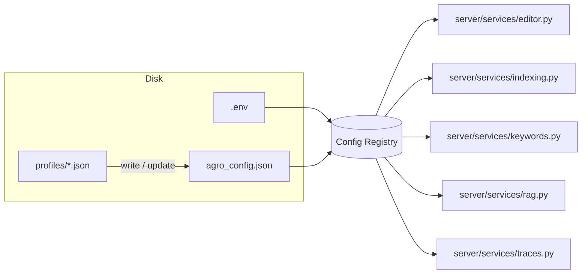

# Profiles

Profiles are saved configurations for AGRO’s environment and repositories.
They’re just JSON files on disk, but they sit on top of the **configuration
registry** so they don’t have to know about `.env` vs `agro_config.json`
vs Pydantic defaults.

This page explains how profiles interact with the new config registry and the
service layer (`config_store`, `editor`, `indexing`, `keywords`, `rag`,
`traces`).

!!! note "TL;DR"
    - Profiles are still *file-based JSON* under `GUI_DIR/profiles`.
    - The **config registry** is now the single source of truth at runtime.
    - Service code never reads JSON directly – it always goes through the
      registry.
    - Profiles are a *way to write* config, not a second config system.


## Where profiles live

Profiles are stored under the GUI directory:

```text
<repo-root>/web/public/profiles/
    ├── default.json
    ├── my-project.json
    └── prod-like.json
```

The path is derived from `gui_dir` in `common/paths.py`, so if you move the web
assets, the profile location follows.

Each profile is a JSON object whose keys are a subset of `AGRO_CONFIG_KEYS`
(from `server/models/agro_config_model.py`).


## How profiles relate to the config registry

The **config registry** (`server/services/config_registry.py`) is the thing the
backend actually uses. It merges three sources with a fixed precedence:

1. `.env` file (loaded via `python-dotenv`)
2. `agro_config.json` (validated by Pydantic)
3. Pydantic defaults (hard-coded fallbacks)

Profiles sit *outside* that stack. They’re a way to produce or update
`agro_config.json` (and sometimes `.env`), but once the server is running,
all reads go through the registry.



The important bit: **services never parse profile JSON**. They only call
`get_config_registry()` and use typed accessors like `get_int`, `get_bool`,
`get_str`.


## Service layer: how config is actually used

This section is here so you can see what a profile *needs* to set to affect
real behavior.

### Configuration registry

`server/services/config_registry.py` is the central piece:

- Loads `.env` *first* (via `load_dotenv(override=True)`).
- Loads and validates `agro_config.json` into `AgroConfigRoot`.
- Exposes a thread-safe registry with helpers:
  - `get_int(key, default)`
  - `get_float(key, default)`
  - `get_bool(key, default)`
  - `get_str(key, default)`
- Tracks where each value came from (env vs config vs default).
- Supports legacy aliases like `MQ_REWRITES → MAX_QUERY_REWRITES`.

Profiles don’t talk to this directly; the API / UI does. But everything else
in the server *only* talks to the registry.


### Config store & secrets

`server/services/config_store.py` is the thin layer that reads/writes
`agro_config.json` and exposes it to the API / UI.

Key points:

- Uses `_load_repos_raw` and `repo_root()` to find the right config file.
- Validates writes against the same Pydantic model as the registry.
- Writes are done via `_atomic_write_text` to avoid partial files, with a
  Docker‑friendly fallback when `os.replace()` fails on watched volumes.
- Sensitive keys are masked using `SECRET_FIELDS`:

  ```py title="server/services/config_store.py" linenums="1" hl_lines="5-10"
  SECRET_FIELDS = {
      'OPENAI_API_KEY', 'ANTHROPIC_API_KEY', 'GOOGLE_API_KEY',
      'COHERE_API_KEY', 'VOYAGE_API_KEY', 'LANGSMITH_API_KEY',
      'LANGCHAIN_API_KEY', 'LANGTRACE_API_KEY', 'NETLIFY_API_KEY',
      'OAUTH_TOKEN', 'GRAFANA_API_KEY', 'GRAFANA_AUTH_TOKEN',
      'MCP_API_KEY', 'JINA_API_KEY', 'DEEPSEEK_API_KEY', 'MISTRAL_API_KEY',
      'XAI_API_KEY', 'GROQ_API_KEY', 'FIREWORKS_API_KEY'
  }
  ```

When you save a profile from the UI, it will:

1. Update `agro_config.json` (non-secret knobs).
2. Optionally update `.env` for infrastructure / secret values.
3. Use the config registry on the next request – no direct profile reads.


### Editor service

`server/services/editor.py` exposes a small settings surface for the built-in
code editor. It shows how the registry is supposed to be used from services:

```py title="server/services/editor.py" linenums="1" hl_lines="15-22"
from server.services.config_registry import get_config_registry


def read_settings() -> Dict[str, Any]:
    """Read editor settings, preferring registry (agro_config.json/.env) with legacy file fallback."""
    registry = get_config_registry()
    settings = {
        "port": registry.get_int("EDITOR_PORT", 4440),
        "enabled": registry.get_bool("EDITOR_ENABLED", True),
        "embed_enabled": registry.get_bool("EDITOR_EMBED_ENABLED", True),
        "bind": registry.get_str("EDITOR_BIND", "local"),  # 'local' or 'public'
        "image": registry.get_str("EDITOR_IMAGE", "code-server"),
        # ...
    }
    # legacy file fallback omitted
    return settings
```

If you want a profile to change the editor port or binding, you set those keys
in the profile → they end up in `agro_config.json` → the registry sees them.


### Indexing service

`server/services/indexing.py` is the entry point for (re)building the index.
It uses the registry once at module import time:

```py title="server/services/indexing.py" linenums="1" hl_lines="8-10 24-31"
from server.services.config_registry import get_config_registry

# Module-level config registry
_config_registry = get_config_registry()


def start(payload: Dict[str, Any] | None = None) -> Dict[str, Any]:
    global _INDEX_STATUS, _INDEX_METADATA
    payload = payload or {}
    _INDEX_STATUS = ["Indexing started..."]
    _INDEX_METADATA = {}

    def run_index():
        global _INDEX_STATUS, _INDEX_METADATA
        try:
            repo = _config_registry.get_str("REPO", "agro")
            _INDEX_STATUS.append(f"Indexing repository: {repo}")
            root = repo_root()
            env = {**os.environ, "REPO": repo, "REPO_ROOT": str(root), "PYTHONPATH": str(root)}
            if payload.get("enrich"):
                env["ENRICH_CODE_CHUNKS"] = "true"
                _INDEX_STATUS.append("Enriching chunks with summaries...")
            # spawn indexer subprocess with env
        except Exception:
            ...
```

What this means for profiles:

- `REPO` is the main knob that determines which codebase is indexed.
- Flags like `ENRICH_CODE_CHUNKS` are passed via environment variables.

If you want a profile per repo, you typically:

- Set `REPO` in the profile.
- Optionally set enrichment / chunking knobs that the indexer reads from
  `agro_config.json`.


### Keyword extraction service

`server/services/keywords.py` caches a handful of tuning parameters at module
load time:

```py title="server/services/keywords.py" linenums="1" hl_lines="7-13 16-23"
from server.services.config_registry import get_config_registry

# Module-level config caching
_config_registry = get_config_registry()
_KEYWORDS_MAX_PER_REPO = _config_registry.get_int('KEYWORDS_MAX_PER_REPO', 50)
_KEYWORDS_MIN_FREQ = _config_registry.get_int('KEYWORDS_MIN_FREQ', 3)
_KEYWORDS_BOOST = _config_registry.get_float('KEYWORDS_BOOST', 1.3)
_KEYWORDS_AUTO_GENERATE = _config_registry.get_int('KEYWORDS_AUTO_GENERATE', 1)
_KEYWORDS_REFRESH_HOURS = _config_registry.get_int('KEYWORDS_REFRESH_HOURS', 24)


def reload_config():
    """Reload cached config values from registry."""
    global _KEYWORDS_MAX_PER_REPO, _KEYWORDS_MIN_FREQ, _KEYWORDS_BOOST
    global _KEYWORDS_AUTO_GENERATE, _KEYWORDS_REFRESH_HOURS
    _KEYWORDS_MAX_PER_REPO = _config_registry.get_int('KEYWORDS_MAX_PER_REPO', 50)
    _KEYWORDS_MIN_FREQ = _config_registry.get_int('KEYWORDS_MIN_FREQ', 3)
    _KEYWORDS_BOOST = _config_registry.get_float('KEYWORDS_BOOST', 1.3)
    _KEYWORDS_AUTO_GENERATE = _config_registry.get_int('KEYWORDS_AUTO_GENERATE', 1)
    _KEYWORDS_REFRESH_HOURS = _config_registry.get_int('KEYWORDS_REFRESH_HOURS', 24)
```

Profiles that care about discriminative keywords can set these keys. If you
change them at runtime, call `reload_config()` (the UI already does this when
applying config changes).


### RAG service

`server/services/rag.py` is the HTTP entry point for retrieval + generation.
It uses the registry for things like `FINAL_K` (how many chunks to return):

```py title="server/services/rag.py" linenums="1" hl_lines="15-18 27-35"
from server.services.config_registry import get_config_registry

# Module-level config registry
_config_registry = get_config_registry()


def do_search(q: str, repo: Optional[str], top_k: Optional[int], request: Optional[Request] = None) -> Dict[str, Any]:
    if top_k is None:
        try:
            # Try FINAL_K first, fall back to LANGGRAPH_FINAL_K
            top_k = _config_registry.get_int('FINAL_K', _config_registry.get_int('LANGGRAPH_FINAL_K', 10))
        except Exception:
            top_k = 10
    # ... call retrieval.hybrid_search.search_routed_multi(...)
```

If you want a “deep” profile vs a “fast” profile, this is where you tune:

- `FINAL_K` / `LANGGRAPH_FINAL_K`
- Any other retrieval / reranking knobs defined in `AgroConfigRoot`.


### Traces service

`server/services/traces.py` is intentionally simple – it just lists and reads
trace JSON files from `out/<repo>/traces`:

```py title="server/services/traces.py" linenums="1" hl_lines="8-15 24-31"
from common.config_loader import out_dir
from server.tracing import latest_trace_path


def list_traces(repo: Optional[str]) -> Dict[str, Any]:
    r = (repo or __import__('os').getenv('REPO', 'agro')).strip()
    base = Path(out_dir(r)) / 'traces'
    files: List[Dict[str, Any]] = []
    try:
        if base.exists():
            for p in sorted([x for x in base.glob('*.json') if x.is_file()], key=lambda x: x.stat().st_mtime, reverse=True)[:50]:
                files.append({
                    'path': str(p),
                    'name': p.name,
                    'mtime': __import__('datetime').datetime.fromtimestamp(p.stat().st_mtime).isoformat(),
                })
    except Exception as e:
        logger.exception("Failed to list traces: %s", e)
    return {'repo': r, 'files': files}
```

This is mostly driven by `REPO` again. Profiles that switch repos will see a
different trace directory.


## How the web UI uses profiles

The React components under `web/src/components` are wired to the same HTTP
endpoints that talk to `config_store` and the registry. A few relevant ones:

- `Admin/GeneralSubtab.tsx` – global settings, repo selection, etc.
- `Dashboard/EmbeddingConfigPanel.tsx` – embedding / retrieval knobs.
- `DevTools/Editor.tsx` – editor settings (port, bind, enable/disable).
- `Infrastructure/MCPSubtab.tsx` – MCP / tool integration config.

When you:

1. Select a profile in the UI
2. Edit settings
3. Click “Save”

…the UI will:

- POST the merged config to the backend.
- Backend validates and writes `agro_config.json` (and `.env` if needed).
- Config registry is reloaded.
- Services that cache values (like `keywords`) are told to `reload_config()`.

You don’t have to think about `.env` vs JSON vs defaults – the UI and
`config_store` handle that.


## Designing profile JSON

Profiles are *not* required to contain every key. Anything missing will fall
back to:

1. `.env` (for infra / secrets)
2. `agro_config.json` (previous values)
3. Pydantic defaults

A minimal profile that just switches repos might look like:

```json title="web/public/profiles/my-repo.json" linenums="1"
{
  "REPO": "my-repo",
  "FINAL_K": 12,
  "KEYWORDS_MAX_PER_REPO": 80,
  "EDITOR_ENABLED": true,
  "EDITOR_PORT": 4450
}
```

A more “infra-heavy” profile (for a cloud-backed setup) might *also* be
accompanied by a `.env` file that sets:

```bash
# .env
QDRANT_URL=https://...
QDRANT_API_KEY=...
OPENAI_API_KEY=...
REPO_ROOT=/mnt/code
```

The profile doesn’t need to know about those – it just sets the RAG knobs.


## When to use profiles vs `.env`

Use a **profile** when you want to:

- Switch between repos (`REPO`).
- Change retrieval / reranking / keyword tuning.
- Toggle optional features (editor, MCP, tracing, evaluation settings).
- Save a “baseline” configuration for evaluation runs.

Use **`.env`** when you want to:

- Change infrastructure: ports, hostnames, volumes.
- Set secrets: API keys, OAuth tokens.
- Override low-level behavior that must be available *before* Pydantic loads
  `agro_config.json`.

The config registry is designed so you can mix both without surprises.


## Extending profiles for new features

If you add a new feature and want it to be profile‑aware, the pattern is:

1. **Add a field** to `AgroConfigRoot` / `AGRO_CONFIG_KEYS`.
2. **Use the registry** in your service:

   ```py
   registry = get_config_registry()
   my_flag = registry.get_bool("MY_FEATURE_ENABLED", False)
   ```

3. **Expose it in the UI** under an appropriate tab.
4. Profiles can now set `"MY_FEATURE_ENABLED": true` and everything works.

You don’t need a separate “profile model” – the Pydantic config model *is* the
schema.


## Summary

- Profiles are still simple JSON files, but they now sit on top of a
  centralized, Pydantic‑validated config registry.
- All backend services (`editor`, `indexing`, `keywords`, `rag`, `traces`,
  etc.) read from the registry, not from profile files.
- The web UI and `config_store` are responsible for mapping profile edits into
  `agro_config.json` and `.env`.
- If you stick to `get_config_registry()` in new code, profiles “just work”
  without extra plumbing.
