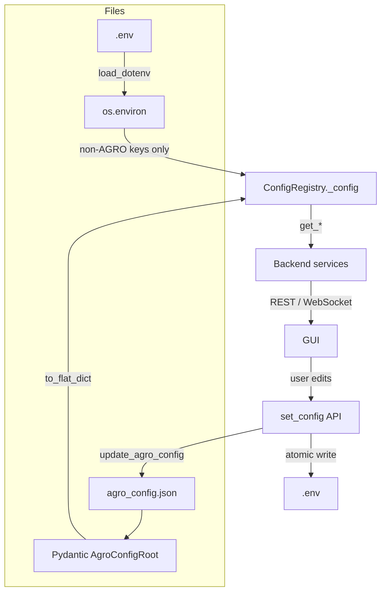

# Configuration

AGRO has a single source of truth for tunable RAG behavior: `agro_config.json`, backed by Pydantic models and surfaced through a central `ConfigRegistry`. Secrets and infrastructure paths live in `.env`.

This page covers:

- Overall config architecture
- `agro_config.json` structure and categories
- Environment variables (`.env`)
- The Pydantic config system
- How settings flow from config → backend → GUI

---

## Configuration Architecture

AGRO merges configuration from three places, with clear roles:

1. `agro_config.json` — **tunable RAG + app behavior** (Pydantic‑validated)
2. `.env` — **secrets + infrastructure** (API keys, paths, ports)
3. Pydantic defaults — **safe fallbacks** when nothing else is set

!!! note "Precedence & responsibilities"
    - :material-file-code: `agro_config.json`: All **AGRO\_*** runtime knobs  
    - :material-file-hidden: `.env`: Provider keys, host URLs, editor image, etc.  
    - :material-shield-alert: `.env` **does not override** `agro_config.json` for AGRO config keys. This is intentional and enforced in `ConfigRegistry`.



---

## `agro_config.json` Overview

`agro_config.json` is a nested JSON file, with sections mapped to Pydantic models in `server/models/agro_config_model.py`. Each nested field is exposed as a flat, env‑style key (e.g. `retrieval.rrf_k_div` → `RRF_K_DIV`) via `AgroConfigRoot.to_flat_dict()`.

Top‑level sections:

| Section          | Purpose                                             |
|------------------|------------------------------------------------------|
| `retrieval`      | Hybrid search, query expansion, hydration, BM25     |
| `scoring`        | File/path boosts, vendor preference                 |
| `layer_bonus`    | Layer‑aware prioritization, intent matrix           |
| `embedding`      | Embedding models, dimensions, caching               |
| `chunking`       | AST/greedy chunking behavior                        |
| `indexing`       | Vector DB, BM25, repo paths, indexing limits        |
| `reranking`      | Local/cloud rerankers and blending                  |
| `generation`     | Chat models, timeouts, Ollama/OpenAI backends       |
| `enrichment`     | Semantic cards and code enrichment                   |
| `keywords`       | Automatic keyword extraction settings               |
| `tracing`        | Logging, metrics, LangSmith/LangTrace               |
| `training`       | Reranker training hyperparameters                   |
| `ui`             | Chat UI, editor, Grafana, theme, runtime mode       |
| `hydration`      | Result hydration defaults                           |
| `evaluation`     | Evaluation dataset paths and multi‑query settings   |
| `system_prompts` | System prompts for different internal agents        |

<figure markdown="span">
  { width="100%" }
  <figcaption>Configure system prompts for Chat, Retrieval, and other agents directly in the UI.</figcaption>
</figure>

In the GUI, every field has a tooltip with:

- A plain‑language explanation
- Links to relevant docs or papers when applicable
- Searchable descriptions so you don’t have to leave AGRO to understand a knob

<figure markdown="span">
  { width="100%" }
  <figcaption>The built-in Parameter Glossary helps you understand every configuration knob.</figcaption>
</figure>

---

## Pydantic Config System

All of `agro_config.json` is validated and documented via Pydantic models in `server/models/agro_config_model.py`.

Key pieces:

- `RetrievalConfig`, `ScoringConfig`, `LayerBonusConfig`, `EmbeddingConfig`, `ChunkingConfig`, `IndexingConfig`, `RerankingConfig`, `GenerationConfig`, etc.
- `AgroConfigRoot` (not shown in the snippet here) wraps all of them and provides:
  - `to_flat_dict()` — nested JSON → flat env‑style keys
  - `from_flat_dict()` — flat keys back to nested JSON
- `AGRO_CONFIG_KEYS` — the list of all flat config keys that belong to AGRO (used to separate AGRO config from `.env` vars).

Some notable validators and behaviors:

- :material-function: `RetrievalConfig.validate_rrf_k_div`  
  Enforces `rrf_k_div >= 10` for meaningful rank smoothing.

- :material-function: `RetrievalConfig.normalize_hydration`  
  Normalizes hydration mode aliases (`off` → `none`).

- :material-function: `RetrievalConfig.validate_weights_sum_to_one`  
  **Normalizes** `bm25_weight + vector_weight` to 1.0 instead of failing. This means you can set rough weights; AGRO will renormalize and clamp them rather than crashing.

- :material-function: `ScoringConfig.validate_exact_boost_greater_than_partial`  
  Ensures exact filename matches always get a higher boost than partial path matches.

- :material-function: `ChunkingConfig.validate_overlap_less_than_size`  
  Guards against pathological `chunk_overlap >= chunk_size`.

- :material-function: `EmbeddingConfig.validate_dim_matches_model`  
  Rejects unusual embedding dimensions (catches “I mis‑read the model docs” bugs early).

!!! tip "Why Pydantic everywhere?"
    I wanted config to be self‑documenting and safe:
    - Types and ranges enforced at load time
    - Defaults live next to the code that consumes them
    - JSON schema is available for future autogenerated docs
    - The GUI can show **exact** constraints in tooltips

---

## Config Registry (`ConfigRegistry`)

`server/services/config_registry.py` wraps all config access behind a single API.

### Load & precedence

On startup (or first access), `ConfigRegistry.load()`:

1. Loads `.env` via `load_dotenv(override=True)` at module import time.
2. Loads `agro_config.json` into `AgroConfigRoot` with full Pydantic validation.
3. Flattens the Pydantic model into `self._config` with `source="agro_config.json"`.
4. Adds additional env vars from `os.environ` **only if** they’re not AGRO config keys.

```python linenums="1" hl_lines="29-41 44-51"
class ConfigRegistry:
    def load(self) -> None:
        with self._lock:
            self._config.clear()
            self._sources.clear()

            agro_config_path = repo_root() / "agro_config.json"
            try:
                if agro_config_path.exists():
                    raw_json = json.loads(agro_config_path.read_text())
                    self._agro_config_model = AgroConfigRoot(**raw_json)
                else:
                    self._agro_config_model = AgroConfigRoot()
            except ValidationError:
                self._agro_config_model = AgroConfigRoot()
            ...

            flat_agro_config = self._agro_config_model.to_flat_dict()
            for key, value in flat_agro_config.items():
                self._config[key] = value
                self._sources[key] = "agro_config.json"

            # .env is for secrets only; AGRO_CONFIG_KEYS stay from agro_config.json
            for key, value in os.environ.items():
                if key not in self._config:
                    self._config[key] = value
                    self._sources[key] = ".env"
```

### Access helpers

`ConfigRegistry` exposes typed getters:

```python linenums="1"
registry = get_config_registry()
registry.load()  # once at startup

k = registry.get_int("FINAL_K", default=10)
bm25_weight = registry.get_float("BM25_WEIGHT", default=0.3)
debug = registry.get_bool("DEBUG", default=False)
model = registry.get_str("GEN_MODEL", default="gpt-4o-mini")
intent_matrix = registry.get_dict("INTENT_MATRIX")
```

It also tracks where values came from:

```python linenums="1"
sources = registry.get_all_with_sources()
# {
#   "RRF_K_DIV": {"value": 60, "source": "agro_config.json"},
#   "OPENAI_API_KEY": {"value": "••••", "source": ".env"},
#   ...
# }
```

The GUI uses this to show “source badges” (e.g. `agro_config.json` vs `.env`).

### Updating config (`update_agro_config`)

The GUI (and APIs) update AGRO settings via `ConfigRegistry.update_agro_config()`:

1. Accepts flat env‑style keys:
   ```json
   {"RRF_K_DIV": 80, "BM25_WEIGHT": 0.6}
   ```
2. Normalizes legacy aliases (e.g. `MQ_REWRITES` → `MAX_QUERY_REWRITES`).
3. Merges with current `agro_config.json` content.
4. Validates via Pydantic (`AgroConfigRoot.from_flat_dict`).
5. Atomically writes a new `agro_config.json`.
6. Calls `self.reload()` so all services see the new values.

This is wired to the GUI “Save config” flow.

## Integrations

AGRO provides a centralized UI to manage external integrations like MCP, LangSmith, and Grafana.

<figure markdown="span">
  { width="100%" }
  <figcaption>Configure MCP servers, LangSmith tracing, and Grafana connections in one place.</figcaption>
</figure>

---

## Backend Config Store (`config_store.py`)

`server/services/config_store.py` is the bridge between:

- Config files (`.env`, `repos.json`, `agro_config.json`)
- Environment variables (`os.environ`)
- API endpoints used by the GUI

### Atomic writes

All file writes go through `_atomic_write_text`, which writes to a temp file and `os.replace()`s it:

```python linenums="1"
def _atomic_write_text(path: Path, content: str) -> None:
    path.parent.mkdir(parents=True, exist_ok=True)
    fd, tmp_path_str = tempfile.mkstemp(dir=path.parent, prefix=path.name, suffix=".tmp")
    tmp_path = Path(tmp_path_str)
    try:
        with os.fdopen(fd, 'w', encoding='utf-8') as fh:
            fh.write(content)
            fh.flush()
            os.fsync(fh.fileno())
        os.replace(tmp_path, path)
    finally:
        if tmp_path.exists():
            tmp_path.unlink()
```

This avoids partial writes if the process dies mid‑write.

### Secrets and `.env`

AGRO distinguishes between:

- **AGRO config keys** (from `AGRO_CONFIG_KEYS`) → `agro_config.json`
- **Everything else** → `.env`

`SECRET_FIELDS` defines which env vars are considered secrets and should be masked in API responses:

```python linenums="1"
SECRET_FIELDS = {
    'OPENAI_API_KEY', 'ANTHROPIC_API_KEY', 'GOOGLE_API_KEY',
    'COHERE_API_KEY', 'VOYAGE_API_KEY', 'LANGSMITH_API_KEY',
    'LANGCHAIN_API_KEY', 'LANGTRACE_API_KEY', 'NETLIFY_API_KEY',
    'OAUTH_TOKEN', 'GRAFANA_API_KEY', 'GRAFANA_AUTH_TOKEN',
    'MCP_API_KEY'
}
```

#### `env_reload()`

Reloads `.env`, clears cached repo config, and reloads the config registry:

```python linenums="1"
def env_reload() -> Dict[str, Any]:
    from dotenv import load_dotenv as _ld
    _ld(override=False)
    from common.config_loader import clear_cache
    clear_cache()
    registry = get_config_registry()
    registry.reload()
    return {"ok": True}
```

#### `secrets_ingest(text, persist)`

Parses `KEY=VALUE` lines, sets them in `os.environ`, and optionally persists them to `.env`.

Useful for pasting a block of API keys from the GUI.

#### `save_mcp_key(key)`

A dedicated helper to store an MCP API key safely in `.env` and `os.environ`, without logging the value.

### Getting a config snapshot: `get_config()`

`get_config(unmask=False)` returns a JSON‑serializable snapshot for the GUI:

```json
{
  "env": {
    "RRF_K_DIV": 60,
    "OPENAI_API_KEY": "••••••••••••••••",
    "REPO_ROOT": "/path/to/repo",
    "FILES_ROOT": "...",
    ...
  },
  "default_repo": "my-repo",
  "repos": [...],
  "hints": {
    "rerank_backend": {"backend": "local", "reason": "local_model_present"},
    "config_sources": {
      "RRF_K_DIV": "agro_config.json",
      "OPENAI_API_KEY": ".env"
    }
  }
}
```

Steps:

1. Loads `repos.json` via `load_repos()`.
2. Iterates `os.environ`, masking `SECRET_FIELDS` unless `unmask=True`.
3. Adds derived path defaults: `REPO_ROOT`, `FILES_ROOT`, `GUI_DIR`, `DOCS_DIR`, `DATA_DIR`.
4. Merges in `agro_config.json` values from `ConfigRegistry` **only for keys not already in `env`**.
5. Adds `hints`:
   - `rerank_backend`: result of `_effective_rerank_backend()`
   - `config_sources`: per‑key source from `ConfigRegistry.get_source()`

`_effective_rerank_backend()` auto‑detects what reranker backend you actually have available (local model present, Cohere key set, etc.), so the GUI can show a realistic default.

### Setting config: `set_config(payload)`

`set_config` is the main write API used by the GUI. It accepts:

```json
{
  "env": {
    "RRF_K_DIV": 80,
    "BM25_WEIGHT": 0.6,
    "OPENAI_API_KEY": "sk-...",
    "REPO": "my-repo"
  },
  "repos": [
    {
      "name": "my-repo",
      "path": "/code/my-repo",
      "keywords": ["agro", "rag"],
      "path_boosts": ["server", "retrieval"],
      "layer_bonuses": {...},
      "exclude_paths": ["node_modules", ".git"]
    }
  ]
}
```

Behavior:

1. Split env updates into:
   - `agro_config_updates` — keys in `AGRO_CONFIG_KEYS`
   - `env_file_updates` — everything else

2. For AGRO config keys:
   - Call `registry.update_agro_config(agro_config_updates)`
   - On validation error, return an error and **do not** touch `.env` or `repos.json`

3. For `.env` keys:
   - Backup existing `.env` to `.env.backup-YYYYMMDD-HHMMSS` (best effort)
   - Merge updates into an in‑memory copy
   - Apply to `os.environ`
   - Atomically rewrite `.env`

4. For `repos.json`:
   - Upsert repo entries by name
   - Update `default_repo` from `REPO` env var if set
   - Atomically rewrite `repos.json`

Return payload:

```json
{
  "status": "success",
  "applied_env_keys": ["OPENAI_API_KEY", "REPO", ...],
  "applied_agro_config_keys": ["RRF_K_DIV", "BM25_WEIGHT"],
  "repos_count": 3
}
```

---

## `agro_config.json` Sections (Detailed)

Below are the main sections, with key options. The GUI presents these with tooltips and validation hints; you rarely need to edit the JSON by hand.

???+ collapsible "retrieval"
    **Model:** `RetrievalConfig` in `server/models/agro_config_model.py`  
    **JSON path:** `retrieval.*`

    | Key                      | Type   | Default | Description |
    |--------------------------|--------|---------|-------------|
    | `rrf_k_div`              | int    | 60      | RRF rank smoothing constant (higher = more weight to top ranks). Must be 10–200. |
    | `langgraph_final_k`      | int    | 20      | Final number of results to return from the LangGraph pipeline. |
    | `max_query_rewrites`     | int    | 2       | Max query rewrites for multi‑query expansion. |
    | `fallback_confidence`    | float  | 0.55    | Confidence threshold for switching to fallback retrieval strategies. |
    | `final_k`                | int    | 10      | Default top‑k for search results. |
    | `eval_final_k`           | int    | 5       | Top‑k during evaluation runs. |
    | `conf_top1`              | float  | 0.62    | Confidence threshold for top‑1 result. |
    | `conf_avg5`              | float  | 0.55    | Confidence threshold for average over top‑5. |
    | `conf_any`               | float  | 0.55    | Minimum acceptable confidence for any hit. |
    | `eval_multi`             | int    | 1       | Enable multi‑query in eval (0/1). |
    | `query_expansion_enabled`| int    | 1       | Enable synonym expansion (0/1). |
    | `bm25_weight`            | float  | 0.3     | Weight for BM25 in hybrid search (auto‑normalized). |
    | `bm25_k1`                | float  | 1.2     | BM25 term frequency saturation. Higher = more weight to term frequency. |
    | `bm25_b`                 | float  | 0.4     | BM25 length normalization (0 = no penalty, 1 = full penalty). 0.3–0.5 recommended for code. |
    | `vector_weight`          | float  | 0.7     | Weight for dense vector search (auto‑normalized). |
    | `card_search_enabled`    | int    | 1       | Enable semantic card‑based retrieval (0/1). |
    | `multi_query_m`          | int    | 4       | Number of query variants in multi‑query. |
    | `use_semantic_synonyms`  | int    | 1       | Enable semantic synonym expansion (0/1). |
    | `topk_dense`             | int    | 75      | Top‑k for dense vector search. |
    | `topk_sparse`            | int    | 75      | Top‑k for sparse BM25 search. |
    | `hydration_mode`         | str    | `"lazy"`| Result hydration mode: `lazy`, `eager`, `none`. `"off"` is accepted and normalized to `"none"`. |
    | `hydration_max_chars`    | int    | 2000    | Max characters per hydrated result. |
    | `disable_rerank`         | int    | 0       | Disable reranking entirely (0/1). |

    !!! note "Weight normalization"
        `bm25_weight + vector_weight` is automatically normalized to 1.0. If both are zero or invalid, AGRO resets them to safe defaults (0.3 / 0.7) instead of failing.

???+ collapsible "scoring"
    **Model:** `ScoringConfig`  
    **JSON path:** `scoring.*`

    | Key                     | Type   | Default | Description |
    |-------------------------|--------|---------|-------------|
    | `card_bonus`            | float  | 0.08    | Additive bonus for chunks matched via card‑based retrieval. |
    | `filename_boost_exact`  | float  | 1.5     | Multiplier when filename exactly matches query terms. Must be > `filename_boost_partial`. |
    | `filename_boost_partial`| float  | 1.2     | Multiplier when path components partially match query terms. |
    | `vendor_mode`           | str    | `"prefer_first_party"` | Vendor code preference: `prefer_first_party`, `prefer_vendor`, `neutral`. |
    | `path_boosts`           | str    | `"/gui,/server,/indexer,/retrieval"` | Comma‑separated path prefixes to boost. |

???+ collapsible "layer_bonus"
    **Model:** `LayerBonusConfig`  
    **JSON path:** `layer_bonus.*`

    | Key             | Type   | Default | Description |
    |-----------------|--------|---------|-------------|
    | `gui`           | float  | 0.15    | Bonus for GUI/front‑end layers. |
    | `retrieval`     | float  | 0.15    | Bonus for retrieval/API layers. |
    | `indexer`       | float  | 0.15    | Bonus for indexing/ingestion layers. |
    | `vendor_penalty`| float  | -0.1    | Penalty for vendor/third‑party code (negative). |
    | `freshness_bonus`| float | 0.05–0.1| Bonus for recently modified files. |
    | `intent_matrix` | dict   | see JSON | Intent‑to‑layer bonus matrix. Keys are query intents, values are layer→multiplier maps. |

    The `intent_matrix` lets AGRO bias results based on inferred query intent (e.g. “infra” vs “gui”). This is more flexible than hard‑coding path rules.

???+ collapsible "embedding"
    **Model:** `EmbeddingConfig`  
    **JSON path:** `embedding.*`

    | Key                     | Type   | Default                  | Description |
    |-------------------------|--------|--------------------------|-------------|
    | `embedding_type`        | str    | `"openai"`               | Provider: `openai`, `voyage`, `local`, `mxbai`. |
    | `embedding_model`       | str    | `"text-embedding-3-large"` | OpenAI embedding model name. |
    | `embedding_dim`         | int    | 3072                     | Embedding dimension; must be one of `[128,256,384,512,768,1024,1536,3072]`. |
    | `voyage_model`          | str    | `"voyage-code-3"`        | Voyage embedding model. |
    | `embedding_model_local` | str    | `"all-MiniLM-L6-v2"`     | Local SentenceTransformer model. |
    | `embedding_batch_size`  | int    | 64                       | Batch size for embedding generation. |
    | `embedding_max_tokens`  | int    | 8000                     | Max tokens per embedding chunk. |
    | `embedding_cache_enabled`| int   | 1                        | Enable embedding cache (0/1). |
    | `embedding_timeout`     | int    | 30                       | Embedding API timeout (seconds). |
    | `embedding_retry_max`   | int    | 3                        | Max retries for embedding API. |

???+ collapsible "chunking"
    **Model:** `ChunkingConfig`  
    **JSON path:** `chunking.*`
    | Key                     | Type   | Default | Description |
    |-------------------------|--------|---------|-------------|
    | `chunk_size`            | int    | 900     | Target characters per chunk. |
    | `chunk_overlap`         | int    | 300     | Overlap characters between chunks. |
    | `language_aware`        | int    | 1       | Use AST-based chunking if available (0/1). |

???+ collapsible "indexing"
    **Model:** `IndexingConfig`  
    **JSON path:** `indexing.*`

    <figure markdown="span">
      { width="100%" }
      <figcaption>Advanced indexing settings allow fine-tuning of chunking strategies, embedding models, and exclusions.</figcaption>
    </figure>

    | Key                     | Type   | Default | Description |
    |-------------------------|--------|---------|-------------|
    | `index_batch_size`      | int    | 100     | Batch size for Qdrant upserts. |
    | `exclude_patterns`      | list   | []      | Additional glob patterns to exclude. |
