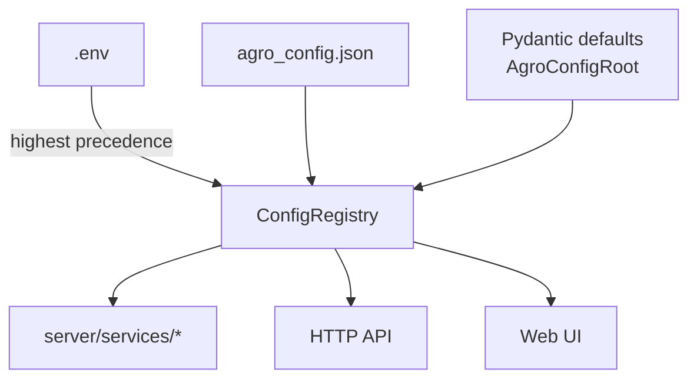

# Configuration

AGRO has a single source of truth for tunable behavior: a central **configuration registry** backed by Pydantic models and a thin service layer.

This page explains how that registry is wired, how `.env` and `agro_config.json` interact, and how the web UI / HTTP API talk to it.

<div class="grid cards" markdown>
- :material-tune: **Goal**  
  One place to ask "what is AGRO configured to do right now?" and one place to change it.
- :material-file-document: **Sources**  
  `.env` for infrastructure & secrets, `agro_config.json` for RAG behavior, Pydantic defaults for everything else.
- :material-cog-sync: **Runtime**  
  Thread‑safe registry, hot‑reload support, and a small API surface (`get_int`, `get_str`, etc.).
</div>


## Configuration sources & precedence

All configuration flows through `server/services/config_registry.py`. That module builds a single `ConfigRegistry` instance at process start and everything else (indexer, RAG, editor, keywords, web UI) reads from it.

Precedence is explicit and simple:

1. **`.env` file** – secrets and infrastructure overrides
2. **`agro_config.json`** – tunable RAG parameters, model config, UI defaults
3. **Pydantic defaults** – fallback values defined in `AgroConfigRoot`

Higher precedence wins. If a key is present in `.env`, it *always* overrides the same key in `agro_config.json`.



!!! note "Legacy env variables"
    `config_registry` keeps a small alias map for older keys. For example:

    ```py
    LEGACY_KEY_ALIASES = {
        "MQ_REWRITES": "MAX_QUERY_REWRITES",
    }
    ```

    If you still have `MQ_REWRITES` in your environment, AGRO will treat it as `MAX_QUERY_REWRITES`. New setups should use the canonical names from `AGRO_CONFIG_KEYS`.


## The configuration registry

The registry lives in `server/services/config_registry.py` and is accessed via a single helper:

```py title="server/services/config_registry.py" linenums="1"
from server.services.config_registry import get_config_registry

_config_registry = get_config_registry()

value = _config_registry.get_int("FINAL_K", 10)
```

### What the registry does

At a high level:

- Loads `.env` **first** (via `python-dotenv`) so `os.getenv` sees the same values
- Loads and validates `agro_config.json` into a Pydantic `AgroConfigRoot`
- Merges everything with the precedence rules above
- Exposes **type‑safe accessors**:
  - `get_str(key, default)`
  - `get_int(key, default)`
  - `get_float(key, default)`
  - `get_bool(key, default)`
- Tracks **where** each value came from (env vs config vs default)
- Uses a lock so reloads are thread‑safe

You almost never touch this directly; you call `get_config_registry()` and then use the typed helpers.


### Thread‑safety & reloads

The registry is built once at import time and guarded by a `threading.Lock`. When a reload happens (e.g. via the config API), the registry:

- Re‑reads `.env`
- Re‑parses `agro_config.json`
- Rebuilds the internal maps under the lock

Callers that cache individual values (see `keywords.py` below) expose their own `reload_config()` to pick up changes.


## How services use configuration

Most of the service layer modules take the same approach:

```py title="Typical pattern" linenums="1"
from server.services.config_registry import get_config_registry

_config_registry = get_config_registry()

SOME_FLAG = _config_registry.get_bool("SOME_FLAG", False)
```

This section walks through the concrete services that matter for day‑to‑day configuration.


### Config store & secrets

`server/services/config_store.py` is the bridge between the registry, the web UI, and the on‑disk config files.

Key responsibilities:

- Load the current `agro_config.json` (via `common.config_loader._load_repos_raw`)
- Apply edits from the UI / API
- Validate against `AgroConfigRoot`
- Write back to disk **atomically**
- Hide secret values when returning config to the UI

#### Atomic writes

The helper `_atomic_write_text` is used whenever AGRO writes `agro_config.json` or related files:

```py title="server/services/config_store.py" linenums="1"
def _atomic_write_text(path: Path, content: str, max_retries: int = 3) -> None:
    """Atomically write text to a file with fallback for Docker volume mounts.

    Docker Desktop on macOS can fail with 'Device or resource busy' on os.replace()
    when the file is being watched. We try atomic first, then fall back to direct write.
    """
    import time

    path.parent.mkdir(parents=True, exist_ok=True)
    for attempt in range(max_retries):
        tmp = Path(tempfile.mkstemp(dir=path.parent)[1])
        tmp.write_text(content, encoding="utf-8")
        try:
            os.replace(tmp, path)
            return
        except OSError:
            time.sleep(0.05)
    # Fallback: best‑effort direct write
    path.write_text(content, encoding="utf-8")
```

This is one of those boring but important details: it avoids half‑written config files when the file is being watched by Docker / bind mounts.

#### Secret fields

`config_store` defines a set of keys that are treated as secrets:

```py title="server/services/config_store.py" linenums="1"
SECRET_FIELDS = {
    "OPENAI_API_KEY", "ANTHROPIC_API_KEY", "GOOGLE_API_KEY",
    "COHERE_API_KEY", "VOYAGE_API_KEY", "LANGSMITH_API_KEY",
    "LANGCHAIN_API_KEY", "LANGTRACE_API_KEY", "NETLIFY_API_KEY",
    "OAUTH_TOKEN", "GRAFANA_API_KEY", "GRAFANA_AUTH_TOKEN",
    "MCP_API_KEY", "JINA_API_KEY", "DEEPSEEK_API_KEY", "MISTRAL_API_KEY",
    "XAI_API_KEY", "GROQ_API_KEY", "FIREWORKS_API_KEY"
}
```

When the UI asks for the current config, these values are either omitted or replaced with placeholders. The actual values live in `.env` and are loaded by `load_dotenv` at startup.

!!! warning
    Do not commit `.env` to version control. Use `.env.example` (see `getting-started/environment-example.md`) as a template and keep real keys local.


### Editor service configuration

The **DevTools → Editor** panel in the UI is backed by `server/services/editor.py`.

The service exposes a small JSON settings file for the embedded code editor, but it prefers the central registry when possible:

```py title="server/services/editor.py" linenums="1" hl_lines="13-20"
from server.services.config_registry import get_config_registry


def _settings_path() -> Path:
    settings_dir = Path(__file__).parent.parent / "out" / "editor"
    settings_dir.mkdir(parents=True, exist_ok=True)
    return settings_dir / "settings.json"


def read_settings() -> Dict[str, Any]:
    """Read editor settings, preferring registry (agro_config.json/.env) with legacy file fallback."""
    registry = get_config_registry()
    settings = {
        "port": registry.get_int("EDITOR_PORT", 4440),
        "enabled": registry.get_bool("EDITOR_ENABLED", True),
        "embed_enabled": registry.get_bool("EDITOR_EMBED_ENABLED", True),
        "bind": registry.get_str("EDITOR_BIND", "local"),  # 'local' or 'public'
        "image": registry.get_str("EDITOR_IMAGE", "codercom/code-server:latest"),
    }
    # ... merge with legacy settings.json if present
    return settings
```

So if you want to change the embedded editor:

- Set `EDITOR_PORT`, `EDITOR_ENABLED`, `EDITOR_EMBED_ENABLED`, `EDITOR_BIND`, `EDITOR_IMAGE` in `agro_config.json` or `.env`
- Or edit the DevTools → Editor panel in the UI, which writes through `config_store`


### Indexing service configuration

`server/services/indexing.py` is the entry point for starting an index run from the UI or HTTP API.

It uses the registry to determine which repo to index and which enrichment options to enable:

```py title="server/services/indexing.py" linenums="1" hl_lines="15-27"
from server.services.config_registry import get_config_registry
from common.paths import repo_root

_config_registry = get_config_registry()


def start(payload: Dict[str, Any] | None = None) -> Dict[str, Any]:
    global _INDEX_STATUS, _INDEX_METADATA
    payload = payload or {}
    _INDEX_STATUS = ["Indexing started..."]
    _INDEX_METADATA = {}

    def run_index():
        try:
            repo = _config_registry.get_str("REPO", "agro")
            _INDEX_STATUS.append(f"Indexing repository: {repo}")

            root = repo_root()
            env = {**os.environ, "REPO": repo, "REPO_ROOT": str(root), "PYTHONPATH": str(root)}

            if payload.get("enrich"):
                env["ENRICH_CODE_CHUNKS"] = "true"
                _INDEX_STATUS.append("Enriching chunks with summaries and symbols")

            # spawn indexer subprocess with this env
        except Exception as e:
            _INDEX_STATUS.append(f"Indexing failed: {e}")
```

Relevant knobs:

- `REPO` – default repository name (also used by other services)
- `ENRICH_CODE_CHUNKS` – when set (via payload or env), the indexer adds summaries / symbols to chunks

The indexer itself reads many more settings from `agro_config.json` (chunk sizes, BM25 weights, dense model names, etc.); those are documented in the retrieval and model configuration pages.


### Keyword extraction configuration

`server/services/keywords.py` controls the discriminative keyword layer that sits on top of BM25.

It reads its configuration once at import time and exposes a `reload_config()` helper to pick up changes:

```py title="server/services/keywords.py" linenums="1" hl_lines="8-22"
from server.services.config_registry import get_config_registry

_config_registry = get_config_registry()
_KEYWORDS_MAX_PER_REPO = _config_registry.get_int("KEYWORDS_MAX_PER_REPO", 50)
_KEYWORDS_MIN_FREQ = _config_registry.get_int("KEYWORDS_MIN_FREQ", 3)
_KEYWORDS_BOOST = _config_registry.get_float("KEYWORDS_BOOST", 1.3)
_KEYWORDS_AUTO_GENERATE = _config_registry.get_int("KEYWORDS_AUTO_GENERATE", 1)
_KEYWORDS_REFRESH_HOURS = _config_registry.get_int("KEYWORDS_REFRESH_HOURS", 24)


def reload_config():
    """Reload cached config values from registry."""
    global _KEYWORDS_MAX_PER_REPO, _KEYWORDS_MIN_FREQ, _KEYWORDS_BOOST
    global _KEYWORDS_AUTO_GENERATE, _KEYWORDS_REFRESH_HOURS
    _KEYWORDS_MAX_PER_REPO = _config_registry.get_int("KEYWORDS_MAX_PER_REPO", 50)
    _KEYWORDS_MIN_FREQ = _config_registry.get_int("KEYWORDS_MIN_FREQ", 3)
    _KEYWORDS_BOOST = _config_registry.get_float("KEYWORDS_BOOST", 1.3)
    _KEYWORDS_AUTO_GENERATE = _config_registry.get_int("KEYWORDS_AUTO_GENERATE", 1)
    _KEYWORDS_REFRESH_HOURS = _config_registry.get_int("KEYWORDS_REFRESH_HOURS", 24)
```

These map directly to the discriminative keyword behavior:

| Key                       | Type   | Meaning |
| :------------------------ | :----- | :------ |
| `KEYWORDS_MAX_PER_REPO`   | int    | Max number of discriminative keywords per repo |
| `KEYWORDS_MIN_FREQ`       | int    | Minimum frequency for a term to be considered |
| `KEYWORDS_BOOST`          | float  | Multiplicative boost applied to keyword matches in BM25 |
| `KEYWORDS_AUTO_GENERATE`  | int    | `1` to auto‑generate keywords from the index, `0` to rely on static files |
| `KEYWORDS_REFRESH_HOURS`  | int    | How often to refresh auto‑generated keywords |

If you change these via the UI/API, the keyword service will call `reload_config()` so the new values take effect without a restart.


### RAG / search configuration

The HTTP search endpoint (`/api/search` and `/api/rag`) is implemented in `server/services/rag.py`. It uses the registry for a few key parameters:

```py title="server/services/rag.py" linenums="1" hl_lines="21-33"
from server.services.config_registry import get_config_registry
from retrieval.hybrid_search import search_routed_multi

_config_registry = get_config_registry()


def do_search(q: str, repo: Optional[str], top_k: Optional[int], request: Optional[Request] = None) -> Dict[str, Any]:
    if top_k is None:
        try:
            # Try FINAL_K first, fall back to LANGGRAPH_FINAL_K
            top_k = _config_registry.get_int("FINAL_K", _config_registry.get_int("LANGGRAPH_FINAL_K", 10))
        except Exception:
            top_k = 10

    repo = (repo or _config_registry.get_str("REPO", "agro")).strip()

    results = search_routed_multi(
        query=q,
        repo=repo,
        top_k=top_k,
        # ... other options come from agro_config.json via retrieval stack
    )
    # ... wrap into JSON response
```

Important keys here:

- `FINAL_K` – default number of final chunks to return from the hybrid pipeline
- `LANGGRAPH_FINAL_K` – legacy / graph‑specific fallback
- `REPO` – default repository if the client doesn’t specify one

The rest of the retrieval behavior (BM25 weights, dense reranker, learning reranker, etc.) is configured via `agro_config.json` and documented in `features/rag.md` and `features/learning-reranker.md`.


### Trace listing configuration

`server/services/traces.py` is a small helper used by the **Analytics → Tracing** UI to list and fetch LangGraph / RAG traces.

It doesn’t use the registry directly, but it does respect the `REPO` environment variable:

```py title="server/services/traces.py" linenums="1" hl_lines="8-15"
from common.config_loader import out_dir
from server.tracing import latest_trace_path


def list_traces(repo: Optional[str]) -> Dict[str, Any]:
    r = (repo or __import__("os").getenv("REPO", "agro")).strip()
    base = Path(out_dir(r)) / "traces"
    # ... list up to 50 JSON trace files
```

If you want traces for a different repo by default, set `REPO` in `.env` or `agro_config.json`.


## How the web UI maps to configuration

The React components under `web/src/components` talk to the backend through a small config API. The important bit is that **everything** they surface is ultimately backed by the registry and/or `agro_config.json`.

Some examples:

- **Admin → General / Integrations / Secrets**
  - Reads and writes model provider keys, telemetry flags, and general settings via `config_store`
  - Secret fields are masked using `SECRET_FIELDS`
- **Dashboard → EmbeddingConfigPanel / StorageCalculatorSuite**
  - Reads embedding model names, dimensions, and storage estimates from `agro_config.json`
- **DevTools → Editor / Reranker / Testing**
  - Editor uses `EDITOR_*` keys as shown above
  - Reranker and Testing panels use the same model / retrieval config keys as the CLI and evaluation pipeline

You don’t need to know the exact HTTP endpoints to use this; the UI is just a front‑end for the registry and config store.


## Environment vs agro_config.json

AGRO splits configuration into two surfaces on purpose:

- `.env` – **infrastructure & secrets**
  - Database / Qdrant URLs
  - API keys
  - Ports and bind addresses
  - Anything you’d normally set in a deployment manifest
- `agro_config.json` – **RAG behavior & models**
  - Which embedding model to use
  - BM25 vs dense weights
  - Reranker models and thresholds
  - Keyword extraction knobs
  - UI defaults (e.g. default model in chat)

!!! tip "Rule of thumb"
    If it’s something you’d change per‑environment (dev vs prod), put it in `.env`.

    If it’s something you’d change per‑**experiment** (different retrieval setup, different reranker), put it in `agro_config.json`.


## Backwards compatibility

A few design choices are there to avoid breaking existing setups:

- **`load_dotenv(override=True)`** at the top of `config_registry` means older code that still calls `os.getenv` directly will see the same values as the registry.
- **Legacy key aliases** (`LEGACY_KEY_ALIASES`) keep older env names working.
- Services that used to read their own JSON files (like the editor) now:
  - Prefer the registry
  - Fall back to their legacy `out/*/settings.json` if present

If you’re extending AGRO, prefer going through `get_config_registry()` instead of calling `os.getenv` directly. It keeps everything consistent and makes it easier to document.


## Extending configuration

If you want to add a new tunable parameter:

1. Add it to the Pydantic model in `server/models/agro_config_model.py` and to `AGRO_CONFIG_KEYS`
2. Use `get_config_registry().get_*` in your service code
3. (Optional) Expose it in the web UI under an appropriate panel

Because everything flows through Pydantic, new fields:

- Get validation for free
- Show up in the config API
- Can be documented and surfaced with tooltips in the UI

AGRO is indexed on itself, so once you add a field you can go to the **Chat** tab and ask:

> “Where is `MY_NEW_SETTING` used and how should I document it?”

The retrieval pipeline will find the relevant code and docs so you don’t have to grep.
