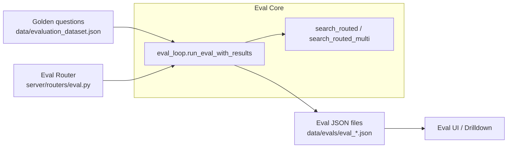

# Evaluation & Regression Testing

AGRO ships with a full evaluation loop for the RAG pipeline:

- Local, file-based golden dataset
- CLI, UI, and HTTP API entry points
- Config snapshotting so you can see **which knobs** produced **which accuracy**
- Baseline comparison for regression detection
- Per-question drilldown to debug retrieval failures

The goal is to make it very cheap to answer: _“Did that change actually improve retrieval?”_

---

## Overview

AGRO’s eval stack is built around four pieces:

- A **golden questions file** (`evaluation_dataset.json` / `golden.json`)
- A **core eval loop** (`eval/eval_rag.py`, `eval/eval_loop.py`)
- A **FastAPI router** (`server/routers/eval.py`) that exposes the loop
- A **UI drilldown** that reads `data/evals/*.json` and lets you inspect failures

Mermaid view of the flow:



---

## Golden Questions Format

Golden questions live in a JSON file. The location is resolved by `_resolve_golden_path()` with this priority:

1. `GOLDEN_PATH` from the config registry, or
2. `GOLDEN_PATH` environment variable, defaulting to `data/evaluation_dataset.json`
3. If that path doesn’t exist and looks “legacy” (e.g. `golden.json` at repo root), it will try `data/<name>`
4. Final fallback: `data/golden.json`

!!! note "Where does AGRO actually look?"
    The effective path is computed at runtime and cached in `GOLDEN_PATH`.  
    If you’re unsure, just run:

    ```bash
    python -m eval.eval_rag
    ```

    If the golden file is missing, it will print the path it tried.

### File structure

The golden file is a JSON array. Each element is a dict like:

```json
[
  {
    "q": "Where is ProviderSetupWizard rendered?",
    "repo": "project",
    "expect_paths": [
      "core/admin_ui/src/components/ProviderSetupWizard.tsx"
    ]
  },
  {
    "q": "Where do we mask PHI in events?",
    "repo": "project",
    "expect_paths": [
      "app/services/phi_masking.py",
      "app/events/filters/phi_filter.py"
    ]
  }
]
```

Fields:

| Field          | Type             | Required | Description                                                                 |
|----------------|------------------|----------|-----------------------------------------------------------------------------|
| `q`           | `string`         | ✅       | The natural-language question to run through the RAG pipeline              |
| `repo`        | `string`         | ❌       | Logical repo name; overrides `REPO` env var for this question              |
| `expect_paths`| `string[]`       | ❌       | List of substrings that should appear in retrieved `file_path` values     |

AGRO’s hit logic is:

```python
def hit(paths: List[str], expect: List[str]) -> bool:
    return any(any(exp in p for p in paths) for exp in expect)
```

So `expect_paths` are **substrings**, not exact paths. That makes refactors (e.g. moving files under a different root) less painful.

!!! tip "Comments and invalid entries"
    - Any entry without a `q` field is ignored. You can use this to add comment-like rows.
    - Empty questions (`""` or whitespace) are skipped with a warning to stderr.
    - The loader enforces `gold` to be a JSON array; anything else is rejected with a clear error.

---

## How to Run Evaluations

You can run evals three ways:

- From the **GUI** (Eval tab)
- Via the **CLI** using the Python entrypoints
- Directly via the **HTTP API**

Use the tabs below to see each approach.

=== "GUI :material-monitor:"

AGRO exposes the eval system in the UI (Eval / Pipeline Quality tab):

1. Open the AGRO web UI.
2. Go to **Eval** / **Pipeline Quality**.
3. Configure:
   - `use_multi` — whether to use `search_routed_multi` (multi-stage retrieval)
   - `final_k` — number of documents kept after routing/merging
   - `sample_limit` — optional cap on how many golden questions to run
4. Start:
   - For a standard run: triggers `/api/eval/run`
   - For a metrics-heavy run: triggers `/api/eval/run_instrumented`
5. Watch:
   - Progress bar based on `_EVAL_STATUS["progress"]` / `["total"]`
   - Summary metrics (Hit@1, Hit@K, etc.)
   - Drilldown table of each question

All runs write JSON files under `data/evals/`, which the UI reads back for history and drilldown.

=== "CLI :material-console:"

You can run evals directly from the repo.

#### 1. Simple eval (no baseline):

```bash
python -m eval.eval_rag
```

This:

- Resolves `GOLDEN_PATH` (see above)
- Runs each question using either:
  - `search_routed_multi(q, repo_override=repo, m=MULTI_M, final_k=FINAL_K)` when `USE_MULTI=1`
  - `search_routed(q, repo_override=repo, final_k=FINAL_K)` otherwise
- Tracks:
  - Top-1 and Top-K hits
  - Per-question retrieved paths
- Writes a new file under `data/evals/eval_<run_id>.json`

Example console output:

```text
[1/42] repo=project q=Where is ProviderSetupWizard rendered?
  top1=['core/admin_ui/src/components/ProviderSetupWizard.tsx']
  top5 hit=True
...
Results saved to data/evals/eval_20250101_123456.json
{
  "total": 42,
  "top1": 30,
  "topk": 37,
  "final_k": 5,
  "use_multi": true,
  "secs": 12.34
}
```

#### 2. Eval with regression tracking + baseline

Use `eval/eval_loop.py` for a more structured workflow:

```bash
python -m eval.eval_loop
```

You can also import and call it:

```python
from eval.eval_loop import run_eval_with_results, save_baseline

results = run_eval_with_results(
    sample_limit=50,      # or None for all
    use_multi_override=True,
    final_k_override=10,
)

# Save as baseline to compare future runs
save_baseline(results)
```

Key parameters:

- `sample_limit: int | None` — cap number of questions
- `use_multi_override: bool | None` — override config-level `USE_MULTI`
- `final_k_override: int | None` — override config-level `FINAL_K`

`run_eval_with_results` returns the same structure the UI consumes (see [Eval JSON format](#eval-json-format)).

!!! note "Latest eval for external dashboards"
    `save_latest(results)` writes a compact JSON to  
    `data/tracking/evals_latest.json` for scraping by Grafana/Loki/etc.

=== "HTTP API :material-api:"

The eval router lives in `server/routers/eval.py` and exposes several endpoints.

#### `POST /api/eval/run`

Runs the standard evaluation loop (no Prometheus instrumentation).

```bash
curl -X POST http://localhost:8000/api/eval/run \
  -H "Content-Type: application/json" \
  -d '{
    "sample_limit": 100,
    "use_multi": true,
    "final_k": 8
  }'
```

Payload fields:

| Field          | Type    | Required | Description                                      |
|----------------|---------|----------|--------------------------------------------------|
| `sample_limit` | int     | ❌       | Max number of questions to run                  |
| `use_multi`    | bool    | ❌       | Force multi-stage retrieval on/off              |
| `final_k`      | int     | ❌       | Override final number of retrieved docs         |

Response:

```json
{ "ok": true, "message": "Evaluation started" }
```

Use `/api/eval/status` (if wired in UI) or inspect `data/evals` to see the results.

#### `POST /api/eval/run_instrumented`

Runs an instrumented eval with Prometheus metrics:

- Per-run metrics: total questions, duration, top1/topk hits
- Per-question metrics via `record_eval_question`
- Config snapshot via `record_eval_run`

```bash
curl -X POST http://localhost:8000/api/eval/run_instrumented
```

The payload is currently ignored; it uses config values:

- `EVAL_MULTI`
- `EVAL_FINAL_K`
- `EVAL_MULTI_M`
- `GOLDEN_PATH` (note: this endpoint currently does **not** use `_resolve_golden_path`, it reads `GOLDEN_PATH` directly from config)

#### `GET /api/eval/run/stream`

Streams an eval run over **Server-Sent Events (SSE)** with progress logs.

```bash
curl -N "http://localhost:8000/api/eval/run/stream?use_multi=1&final_k=5&sample_limit=50"
```

Query params:

| Param         | Type | Description                                     |
|---------------|------|-------------------------------------------------|
| `use_multi`   | int  | `0` or `1` to disable/enable multi retrieval   |
| `final_k`     | int  | Final K override                                |
| `sample_limit`| int  | Limit number of questions                       |

Streamed events include:

- `{"type": "log", "message": "..."}`
- `{"type": "progress", "percent": 42.0, "message": "Question 21/50"}`
- `{"type": "error", "message": "..."}`

At the end, the run summary is also written to `data/evals/eval_<run_id>.json` and `_EVAL_STATUS["results"]`.

---

## Metrics Tracked

The core eval loop focuses on **retrieval quality** metrics. Generation quality is out of scope for now.

### Hit@K (Top-1 and Top-K)

For each question:

- `top1_hit`: whether any `expect_paths` substring matched the **first** retrieved `file_path`
- `topk_hit`: whether any `expect_paths` substring matched **any** of the retrieved `file_path` values (up to `final_k`)

Aggregated metrics:

- `top1_hits`: number of questions where `top1_hit == True`
- `topk_hits`: number of questions where `topk_hit == True`
- `top1_accuracy`: `top1_hits / total`
- `topk_accuracy`: `topk_hits / total`

These are reported both in:

- CLI output (`eval_rag.main`)
- JSON summary (`run_eval_with_results`, router endpoints)

!!! tip "Why substring matching?"
    Exact path matching is brittle across refactors. Substring matching is a pragmatic compromise:
    - You can use stable segments like `"ProviderSetupWizard.tsx"` or `"phi_masking.py"`.
    - You don’t have to rewrite your golden file every time you move a directory.

### Runtime & Config

Each run also includes:

- `duration_secs`: total wall-clock time for the run
- `timestamp`: human-readable start time
- `final_k`: the actual K used for that run
- `use_multi`: whether multi-stage retrieval was active
- `config`: a **whitelisted config snapshot** (see next section)

### MRR (Mean Reciprocal Rank)

The docstring at the top of `server/routers/eval.py` mentions MRR, but the current JSON schema and code paths shown here primarily track Hit@K and basic counts.

If/when MRR is wired in, it would typically be:

```python
# Pseudocode
rr = 0.0
for question in questions:
    rank = first_index_where_hit_or_none(...)
    if rank is not None:
        rr += 1.0 / (rank + 1)
mrr = rr / total
```

For now, you should treat Hit@1 / Hit@K as the canonical metrics.

!!! warning "MRR in docs vs code"
    The router docstring is slightly ahead of the implementation. If you don’t see `mrr` fields in your eval JSON, you’re not missing anything — it’s just not implemented yet in this branch.

---

## Config Snapshot & Runtime Stamping

One thing I wanted from day one: _when a run looks good (or bad), I want to know exactly what settings produced it._

That’s handled by two helpers in `eval/eval_rag.py`:

- `capture_eval_config()`
- `stamp_eval_runtime_config(...)`

### `capture_eval_config()`

This function:

1. Pulls all config values from the central registry via `get_all_with_sources()`
2. Filters them against a whitelist `RAG_EVAL_CONFIG_KEYS` (defined in `server/models/agro_config_model`)
3. Strips out anything that looks like a secret (`API_KEY`, `TOKEN`, `PASSWORD`, etc.)
4. Returns a dict of **RAG-relevant settings only**, with lowercase keys

If the registry isn’t available (e.g. eval imported before server fully initialized), it logs a warning and returns `{}`.

!!! note "Why the whitelist?"
    I don’t want eval JSON polluted with UI theme choices or editor ports.  
    `RAG_EVAL_CONFIG_KEYS` is meant to track only knobs that actually affect retrieval quality.

### `stamp_eval_runtime_config(...)`

This function takes a config snapshot and the actual runtime overrides, and “stamps” them in:

```python
def stamp_eval_runtime_config(
    config_snapshot: dict,
    use_multi_val: bool,
    final_k_val: int,
    multi_m_val: int | None = None,
) -> dict:
    cfg = dict(config_snapshot or {})
    cfg['eval_multi'] = int(bool(use_multi_val))
    cfg['use_multi'] = bool(use_multi_val)
    cfg['eval_final_k'] = int(final_k_val)
    cfg['final_k'] = int(final_k_val)
    if multi_m_val is not None:
        cfg['eval_multi_m'] = int(multi_m_val)
        cfg['multi_m'] = int(multi_m_val)
    return cfg
```

This is important because:

- You can start a run with overrides (via CLI or `/api/eval/run/stream?final_k=20`)
- Those overrides may differ from “static” config
- Without stamping, the saved eval JSON would **not** reflect the actual runtime values

`run_eval_with_results` and the router endpoints all call `stamp_eval_runtime_config` so that the `config` block in each eval file is accurate.

---

## Baseline Comparison & Regression Tracking

The minimal regression tracking flow is:

1. Run a “good” eval and store its results as a **baseline**
2. After changing retrieval config or code, run a new eval
3. Compare new metrics to baseline and drill into deltas

The code for this lives in `eval/eval_loop.py`.

### Baseline file location

`BASELINE_PATH` is configurable:

- From config registry: `BASELINE_PATH`, default `data/evals/eval_baseline.json`
- Or via environment variable: `BASELINE_PATH`

### Saving a baseline

From Python:

```python
from eval.eval_loop import run_eval_with_results, save_baseline

results = run_eval_with_results(
    sample_limit=None,
    use_multi_override=None,
    final_k_override=None,
)
save_baseline(results)  # writes to BASELINE_PATH
```

This creates a canonical JSON baseline you can compare future runs against.

### Latest run tracking

`save_latest(results)` (also in `eval_loop.py`) writes:

```text
data/tracking/evals_latest.json
```

This is meant for external observability (Grafana/Loki, etc.):

- You can scrape the latest metrics periodically
- You don’t have to parse every `data/evals/eval_*.json` file

!!! tip "Use the same golden file"
    For the baseline to be meaningful, keep your golden dataset stable.  
    If you need to evolve it, consider versioning the golden file name and storing that in the eval config snapshot.

---

## Eval JSON Format

All eval entrypoints (CLI, router, eval loop) converge on essentially the same JSON structure.

Top-level fields:

```json
{
  "run_id": "20250101_123456",      // not always present (eval_loop may omit)
  "total": 42,
  "top1_hits": 30,
  "topk_hits": 37,
  "top1_accuracy": 0.714,
  "topk_accuracy": 0.881,
  "final_k": 5,
  "use_multi": true,
  "duration_secs": 12.34,
  "timestamp": "2025-01-01 12:34:56",
  "config": {
    "rag_index_type": "hybrid",
    "eval_multi": 1,
    "use_multi": true,
    "eval_final_k": 5,
    "final_k": 5,
    "eval_multi_m": 10,
    "multi_m": 10,
    "...": "..."
  },
  "results": [
    {
      "question": "Where is ProviderSetupWizard rendered?",
      "repo": "project",
      "expect_paths": [
        "core/admin_ui/src/components/ProviderSetupWizard.tsx"
      ],
      "top1_path": [
        "core/admin_ui/src/components/ProviderSetupWizard.tsx"
      ],
      "top1_hit": true,
      "topk_hit": true,
      "top_paths": [
        "core/admin_ui/src/components/ProviderSetupWizard.tsx",
        "..."
      ]
    }
  ]
}
```

Instrumented runs (`/api/eval/run_instrumented`) add:

- `docs` per question with `file_path` and `score`
- `duration_secs` per question

The UI uses this to:

- Show a table of questions, hits, misses, and top paths
- Let you click into a question and inspect retrieved documents and scores

---

## Eval Drilldown

<figure markdown="span">
  { width="100%" }
  <figcaption>The Eval Analysis view showing regression detection, root cause analysis, and side-by-side config comparison.</figcaption>
</figure>

The drilldown is where this stops being “just a number” and becomes actually useful.

Each question entry in `results` contains:

- The raw question (`question`)
- The repository (`repo`)
- The expected path substrings (`expect_paths`)
- The actual retrieved paths (`top_paths`)
- Hit flags (`top1_hit`, `topk_hit`)

Instrumented runs additionally include:

- Per-doc scores
- Per-question duration

The UI can render this as:

- A sortable table of all questions with:
  - Hit@1 / Hit@K flags
  - Which file actually came back at rank 1
- A detail view for a single question:
  - List of retrieved docs, with scores
  - Highlight which ones matched `expect_paths`
  - Show differences between runs (baseline vs current)

This is particularly helpful when:

- You tweak weights (e.g. BM25 vs embedding) and want to know _which_ questions got worse
- You change chunking or routing and want to see if entire directories disappear from results
- You run multi-stage retrieval (`search_routed_multi`) and want to verify the final merge behavior

??? collapsible "Example question drilldown payload (instrumented run)"
    ```json
    {
      "question": "Where do we mask PHI in events?",
      "repo": "project",
      "expect_paths": [
        "app/services/phi_masking.py",
        "app/events/filters/phi_filter.py"
      ],
      "top_paths": [
        "app/services/phi_masking.py",
        "app/events/other_stuff.py",
        "docs/compliance/phi.md"
      ],
      "top1_path": [
        "app/services/phi_masking.py"
      ],
      "top1_hit": true,
      "topk_hit": true,
      "duration_secs": 0.123,
      "docs": [
        { "file_path": "app/services/phi_masking.py", "score": 0.98 },
        { "file_path": "app/events/other_stuff.py", "score": 0.76 },
        { "file_path": "docs/compliance/phi.md", "score": 0.65 },
        { "file_path": "README.md", "score": 0.20 },
        { "file_path": "scripts/misc.py", "score": 0.10 }
      ]
    }
    ```

With this, you can quickly answer:

- Did we retrieve the right file?
- If not, what did we retrieve instead?
- Is the ranking sane given the scores?
- Is the latency acceptable?

---

## Practical Tips

- **Small codebases**: Don’t overcomplicate it. A simple BM25-only setup with a small golden file is enough to catch most regressions.
- **Config changes**: Any time you change chunking, routing, or index config, run an eval and compare to your baseline.
- **Golden dataset maintenance**:
  - Add questions whenever the model gets something wrong in real usage.
  - Keep `expect_paths` relatively stable (use filename or a stable directory segment).
- **Secrets**: Eval config snapshots deliberately skip anything that looks like a secret. If you see empty `config` blocks, it usually means:
  - The config registry wasn’t available when `capture_eval_config()` ran, or
  - `RAG_EVAL_CONFIG_KEYS` doesn’t include the keys you care about. In that case, edit it.

If you want to extend the eval system (e.g. add MRR, or more fine-grained metrics), the core loop is small and lives in `eval/`. It’s MIT-licensed — change whatever you want.