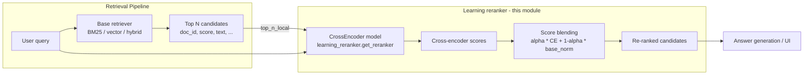
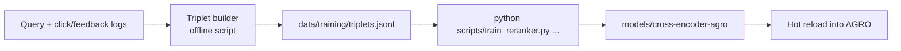

# Self-learning cross-encoder reranker

AGRO ships with a **learning** reranker: a cross-encoder model that can be fine-tuned on your own query history and feedback, then hot‑reloaded into the running server.

This is separate from the production reranker used in the main retrieval flow:

- `retrieval/rerank.py` → production reranking
- `server/learning_reranker.py` → **learning** reranker (feedback-driven, hot-reloadable)
- `scripts/train_reranker.py` → offline trainer for the cross‑encoder

The goal is simple: instead of using a generic reranker trained on web search, AGRO can learn how *you* search *your* codebase, and adjust ranking based on that signal.

---

## Why a self-learning reranker is useful

Most RAG stacks use a fixed, generic reranker. That’s fine for “average web documents”, but codebases are weird:

- You have project-specific naming, patterns, and idioms
- Some files are more useful than others for answering questions
- People repeat certain query styles (“where is X implemented?”, “how does Y work?”)

A cross-encoder reranker that you can fine‑tune on your own feedback is valuable because:

- It learns which snippets are actually helpful for your prompts
- It can adapt to your repository structure and documentation style
- It can correct biases of the base retriever (BM25 / vector / hybrid)
- It gives you a controlled place to use your feedback data without sending it to a third‑party service

You get a ranking model that’s **specialized to your repo and your team’s queries**, not the internet.

---

## High-level architecture



Internally, the learning reranker is a `sentence_transformers.CrossEncoder` that:

1. Takes `(query, candidate_text)` pairs
2. Produces a scalar relevance score per pair
3. Blends that score with the base retrieval score
4. Returns re-ordered candidates, with additional diagnostics in each item

---

## Components

### `server/learning_reranker.py`

This is the runtime module used by the server to:

- Load and hot‑reload the cross‑encoder model
- Rerank candidate documents
- Expose diagnostic info about the current reranker

Key pieces:

- :material-tune: **Configuration cache** – reads env/registry once and caches:
  - `AGRO_RERANKER_MODEL_PATH`
  - `AGRO_RERANKER_ALPHA`
  - `AGRO_RERANKER_TOPN`
  - `AGRO_RERANKER_BATCH`
  - `AGRO_RERANKER_MAXLEN`
  - `AGRO_RERANKER_RELOAD_ON_CHANGE`
  - `AGRO_RERANKER_RELOAD_PERIOD_SEC`
  - `AGRO_RERANKER_ENABLED`
- :material-rocket-launch: **Hot-reloadable CrossEncoder** – watches the model directory and reloads when files change
- :material-swap-vertical: **Blended scoring** – combines base retriever scores with cross‑encoder scores
- :material-information-outline: **Introspection** – `get_reranker_info()` returns the current state for debugging/monitoring

---

## Configuration: shared reranker settings

Most reranker-related configuration is centralized in:

```python
# reranker/config.py

@dataclass(frozen=True)
class RerankerSettings:
    enabled: bool
    backend: str           # "local" | "cohere" | "none"
    local_model_dir: Optional[Path]
    hf_model_id: str       # HF model id used if no local dir
    alpha: float
    top_n_local: int
    top_n_cloud: int
    batch_size: int
    max_length: int
    snippet_chars: int
    cohere_model: str
    cohere_api_key_present: bool
    reload_on_change: bool
    reload_period_sec: int
    source_env: Dict[str, str]
```

The loader consolidates legacy env variables from multiple subsystems:

| Purpose                      | Env var                             | Notes |
|-----------------------------|--------------------------------------|-------|
| Enable/disable reranker     | `AGRO_RERANKER_ENABLED`             | `1` or `0` |
| Backend selection           | `RERANK_BACKEND`                    | `"local"` / `"cohere"` / `"none"` |
| Local model path            | `AGRO_RERANKER_MODEL_PATH`          | Directory or file, resolved relative to repo root |
| HF model fallback           | `RERANKER_MODEL`                    | Used when no local model dir exists |
| Blending weight             | `AGRO_RERANKER_ALPHA`               | `0.0 - 1.0` |
| Top N for local reranking   | `AGRO_RERANKER_TOPN`                | `0` means “rerank all” |
| Top N for cloud reranking   | `COHERE_RERANK_TOP_N`               | Only used when backend=`cohere` |
| Batch size                  | `AGRO_RERANKER_BATCH`               | Inference batch size |
| Max token length            | `AGRO_RERANKER_MAXLEN`              | Truncation length for cross‑encoder |
| Input snippet truncation    | `RERANK_INPUT_SNIPPET_CHARS`        | Char limit before feeding to reranker |
| Cohere model                | `COHERE_RERANK_MODEL`               | E.g. `rerank-3.5` |
| Cohere API key              | `COHERE_API_KEY`                    | If missing, backend falls back to `"local"` |
| Hot reload toggle           | `AGRO_RERANKER_RELOAD_ON_CHANGE`    | `1` or `0` |
| Hot reload period (seconds) | `AGRO_RERANKER_RELOAD_PERIOD_SEC`   | Min 1 second |
| Shared loader flag          | `AGRO_RERANKER_SHARED_LOADER`       | Feature flag for unified config |

!!! tip "Local vs HF model resolution"
    `AGRO_RERANKER_MODEL_PATH` is first interpreted as a *local* path.  
    If it resolves to an existing directory/file under the repo root, that’s used.  
    Otherwise, it falls back to a Hugging Face model id.

    ```python linenums="1"
    def resolve_model_target(settings: RerankerSettings) -> str:
        if settings.local_model_dir is not None:
            return str(settings.local_model_dir)
        return settings.hf_model_id
    ```

---

## How the runtime reranker works

### Loading and hot-reloading the model

The core loader in `server/learning_reranker.py`:

```python linenums="1" hl_lines="13 22-27 34-39"
def get_reranker() -> CrossEncoder:
    """
    Loads and (optionally) hot-reloads the CrossEncoder model.
    Uses cached config values from config_registry.
    """
    global _RERANKER, _RERANKER_PATH, _RERANKER_MTIME, _LAST_CHECK
    path = _AGRO_RERANKER_MODEL_PATH or "cross-encoder/ms-marco-MiniLM-L-12-v2"
    need_reload = False

    if _RERANKER is None or path != _RERANKER_PATH:
        need_reload = True
    elif _AGRO_RERANKER_RELOAD_ON_CHANGE:
        period = _AGRO_RERANKER_RELOAD_PERIOD_SEC or 60
        now = time.monotonic()
        if now - _LAST_CHECK >= period:
            _LAST_CHECK = now
            mtime = _latest_mtime(path)
            if mtime > _RERANKER_MTIME:
                need_reload = True

    if need_reload:
        max_length = _AGRO_RERANKER_MAXLEN or 512
        _RERANKER = CrossEncoder(path, max_length=max_length)
        _RERANKER_PATH = path
        _RERANKER_MTIME = _latest_mtime(path)
    return _RERANKER
```

Key behavior:

- First load:
  - If no model is loaded, it loads `AGRO_RERANKER_MODEL_PATH` or the default HF model.
- Hot reload:
  - If `AGRO_RERANKER_RELOAD_ON_CHANGE=1`, it periodically (every `AGRO_RERANKER_RELOAD_PERIOD_SEC` seconds) checks the latest modification time under the model directory.
  - If any file changes (e.g. you just finished fine‑tuning and overwrote the directory), it reloads the model in-place.

This means you can:

- Train a new cross‑encoder in `models/cross-encoder-agro`
- Overwrite that directory while the server is running
- Have AGRO pick it up automatically without a restart

!!! note "Model directory scanning"
    `_latest_mtime(path)` walks the whole directory tree and tracks the newest `st_mtime`.  
    This is cheap relative to training/inference and is gated by `AGRO_RERANKER_RELOAD_PERIOD_SEC`.

---

### Blended reranking logic

The main entry point for reranking is:

```python linenums="1" hl_lines="15 22-31 33-43"
def rerank_candidates(
    query: str,
    candidates: List[Dict[str, Any]],
    blend_alpha: Optional[float] = None
) -> List[Dict[str, Any]]:
    """
    Rerank candidates using cached config values.
    candidates: [{"doc_id": str, "score": float, "text": str, "clicked": bool}, ...]
    """
    if not candidates or "text" not in candidates[0]:
        return candidates

    if blend_alpha is None:
        blend_alpha = _AGRO_RERANKER_ALPHA or 0.7

    base_sorted = sorted(candidates, key=lambda c: float(c.get("score", 0.0)), reverse=True)
    topn = _AGRO_RERANKER_TOPN if _AGRO_RERANKER_TOPN is not None else 50
    topn = max(0, topn)
    head = base_sorted if topn == 0 else base_sorted[:topn]
    tail = [] if topn == 0 else base_sorted[topn:]

    model = get_reranker()
    pairs = [(query, c.get("text", "")) for c in head]
    batch_size = _AGRO_RERANKER_BATCH or 16
    ce_scores = model.predict(pairs, batch_size=batch_size)
    base_scores = [float(c.get("score", 0.0)) for c in head]
    base_norm = _minmax(base_scores)

    reranked_head = []
    for c, ce, bn in zip(head, ce_scores, base_norm):
        blended = (blend_alpha * float(ce)) + ((1.0 - blend_alpha) * float(bn))
        item = dict(c)
        item["rerank_score"] = blended
        item["cross_encoder_score"] = float(ce)
        item["base_score_norm"] = float(bn)
        reranked_head.append(item)
    reranked_head.sort(key=lambda x: x["rerank_score"], reverse=True)
    return reranked_head + tail
```

How it works:

1. **Input**: a list of candidate objects, each with at least:
   - `score` – base retriever score
   - `text` – snippet text to rerank
2. **Top‑N selection**:
   - Candidates are sorted by `score` descending
   - The first `AGRO_RERANKER_TOPN` go into the “head” for cross‑encoder reranking
   - The rest (“tail”) are left untouched and appended at the end
3. **Cross‑encoder scoring**:
   - Build `(query, candidate_text)` pairs
   - Run `CrossEncoder.predict` in batches of `AGRO_RERANKER_BATCH`
4. **Score normalization**:
   - Base scores are min-max normalized into `[0, 1]` via `_minmax`
   - If all base scores are equal, they’re all set to `0.5` to avoid degenerate blending
5. **Blending**:
   - For each candidate:  
     `rerank_score = alpha * cross_encoder_score + (1 - alpha) * base_score_norm`
   - `alpha` comes from `AGRO_RERANKER_ALPHA` or the `blend_alpha` argument
6. **Output**:
   - Candidates are sorted by `rerank_score`
   - Each candidate gains:
     - `rerank_score`
     - `cross_encoder_score`
     - `base_score_norm`

!!! tip "Why blend instead of replace?"
    The base retriever score often encodes useful signals (BM25 term match, vector similarity, etc.).  
    Blending lets the cross‑encoder adjust ranking *without* discarding those signals, which is usually more stable than using the cross‑encoder score alone.

---

### Introspection and diagnostics

`get_reranker_info()` exposes the current state:

```python linenums="1"
def get_reranker_info() -> Dict[str, Any]:
    info: Dict[str, Any] = {
        "enabled": bool(_AGRO_RERANKER_ENABLED),
        "path": path,
        "resolved_path": resolved,
        "model_loaded": _RERANKER is not None,
        "device": None,
        "alpha": _AGRO_RERANKER_ALPHA or 0.7,
        "topn": _AGRO_RERANKER_TOPN or 50,
        "batch": _AGRO_RERANKER_BATCH or 16,
        "maxlen": _AGRO_RERANKER_MAXLEN or 512,
        "reload_on_change": bool(_AGRO_RERANKER_RELOAD_ON_CHANGE),
        "reload_period_sec": _AGRO_RERANKER_RELOAD_PERIOD_SEC or 60,
        "model_dir_mtime": _RERANKER_MTIME,
        "last_check_monotonic": _LAST_CHECK,
    }
```

This is what you’ll want to surface in diagnostics endpoints / UI to confirm:

- Which model is loaded (and from where)
- Whether hot reload is enabled
- What `alpha`, `topn`, and `maxlen` are currently set to
- Which device the model is running on (CPU/GPU)

---

## Training process: from feedback to model

<figure markdown="span">
  { width="100%" }
  <figcaption>The Learning Reranker interface: mine triplets from logs, train the cross-encoder, and evaluate performance.</figcaption>
</figure>

AGRO’s self-learning story is:

1. Collect feedback about which snippets are useful for specific queries
2. Convert that into training data (triplets)
3. Fine‑tune a cross‑encoder on those triplets
4. Point `AGRO_RERANKER_MODEL_PATH` at the trained model
5. Optionally enable hot reload to pick up new models as you iterate

### 1. Data collection (triplets)

The trainer expects a JSONL file of **triplets**:

```json
{"query": "how do we validate JWTs?", "positive_text": "...", "negative_texts": ["...", "..."]}
```

Schema:

- `query`: the original user query
- `positive_text`: snippet that was actually helpful / clicked / chosen
- `negative_texts`: list of snippets that were shown but *not* helpful

You can generate these triplets from:

- Click logs in your UI
- Explicit thumbs-up / thumbs-down feedback
- Internal evaluation runs where you annotate “best” snippets for a query

AGRO doesn’t enforce a single pipeline here; it just defines the format that `scripts/train_reranker.py` expects.

!!! tip "Keep negatives realistic"
    Training works best when the `negative_texts` are **plausible but wrong** – things the retriever might surface that *look* relevant but aren’t actually useful for answering the query.

---

### 2. Converting triplets to training pairs

The trainer converts triplets into `(query, text, label)` pairs with `sentence_transformers.InputExample`:

```python linenums="1" hl_lines="5-12"
def to_pairs(items: List[Dict[str, Any]]):
    """Convert triplets to (query, text, label) pairs for training."""
    pairs = []
    for it in items:
        q = it["query"]
        pt = it["positive_text"]
        pairs.append(InputExample(texts=[q, pt], label=1.0))
        for nt in it["negative_texts"]:
            pairs.append(InputExample(texts=[q, nt], label=0.0))
    return pairs
```

So a single triplet like:

```json
{
  "query": "where is the HTTP client implemented?",
  "positive_text": "class HttpClient { ... }",
  "negative_texts": [
    "class HttpServer { ... }",
    "README: how to run the HTTP server"
  ]
}
```

expands into 3 training pairs:

- `(query, positive_text, label=1.0)`
- `(query, negative_text_1, label=0.0)`
- `(query, negative_text_2, label=0.0)`

---

### 3. Training with `scripts/train_reranker.py`

The training script is standalone and lives under `scripts/train_reranker.py`.

Usage:

```bash
python scripts/train_reranker.py \
  --triplets data/training/triplets.jsonl \
  --base cross-encoder/ms-marco-MiniLM-L-12-v2 \
  --out models/cross-encoder-agro \
  --epochs 2 \
  --batch 16 \
  --max_length 512
```

Arguments:

| Flag          | Default                                   | Description |
|---------------|-------------------------------------------|-------------|
| `--triplets`  | `data/training/triplets.jsonl`           | Path to your triplets JSONL file |
| `--base`      | `cross-encoder/ms-marco-MiniLM-L-12-v2`  | Base cross‑encoder to fine‑tune |
| `--out`       | `models/cross-encoder-agro`              | Output directory for the trained model |
| `--epochs`    | `2`                                      | Number of training epochs |
| `--batch`     | `16`                                     | Training batch size |
| `--max_length`| `512`                                    | Token max length (truncation) |

Training flow (simplified):

```python linenums="1" hl_lines="18-25 34-53 69-74"
triplets = load_triplets(Path(args.triplets))
random.shuffle(triplets)

# 90/10 split (with guard for tiny datasets)
cut = int(0.9 * len(triplets))
if cut == 0 and len(triplets) > 0:
    cut = 1
train_tr, dev_tr = triplets[:cut], triplets[cut:]

train_pairs = to_pairs(train_tr)
dev_pairs = to_pairs(dev_tr)

model = CrossEncoder(args.base, num_labels=1, max_length=args.max_length)

train_dl = DataLoader(train_pairs, shuffle=True, batch_size=args.batch, pin_memory=False)
dev_dl = DataLoader(dev_pairs, shuffle=False, batch_size=args.batch, pin_memory=False)

def eval_acc():
    total, correct = 0, 0
    scores = model.predict(
        [[ex.texts[0], ex.texts[1]] for ex in dev_pairs],
        batch_size=args.batch
    )
    for s, ex in zip(scores, dev_pairs):
        total += 1
        if (s >= 0.5 and ex.label >= 0.5) or (s < 0.5 and ex.label < 0.5):
            correct += 1
    return correct / max(1, total)

warmup_steps = int(len(train_pairs) / args.batch * args.epochs * 0.1)

for epoch in range(args.epochs):
    model.fit(
        train_dataloader=train_dl,
        epochs=1,
        warmup_steps=warmup_steps if epoch == 0 else 0,
        output_path=args.out,
        use_amp=False,
        show_progress_bar=False,
    )
    if len(dev_pairs) > 0:
        acc = eval_acc()
        print(f"[EPOCH {epoch+1}/{args.epochs}] Dev accuracy: {acc:.4f}")

# Final save
model.save(args.out)
print(f"saved model to: {args.out}")
```

Notes:

- Uses the built‑in BCE loss from `CrossEncoder`
- Computes a simple accuracy metric on the dev set after each epoch (if any dev data exists)
- Explicitly disables `pin_memory` in the dataloaders to avoid noisy CPU‑only warnings
- Saves the model at `args.out` after training

!!! warning "Tiny datasets"
    With very few triplets, the 90/10 split can easily leave you with 0 training items.  
    The script guards against this by forcing at least 1 triplet into the train set when any exist, but you should still aim for a reasonable number of queries and negatives before expecting meaningful improvements.

---

### 4. Wiring the trained model into AGRO

Once training finishes:

1. Point the reranker at your trained model:

    ```bash
    export AGRO_RERANKER_MODEL_PATH="models/cross-encoder-agro"
    ```

2. (Optional) Enable hot reload so AGRO picks up future retrains automatically:

    ```bash
    export AGRO_RERANKER_RELOAD_ON_CHANGE=1
    export AGRO_RERANKER_RELOAD_PERIOD_SEC=60   # or whatever interval you prefer
    ```

3. Ensure the reranker is enabled:

    ```bash
    export AGRO_RERANKER_ENABLED=1
    ```

4. Restart the server if you’re not using hot reload, or just wait for the next reload interval if you are.

Internally, `reranker/config.py` will resolve `AGRO_RERANKER_MODEL_PATH` to a local path under the repo root, and `server/learning_reranker.py` will load that directory with `CrossEncoder`.

---

## How to trigger training in practice

The actual “trigger” depends on how you collect feedback, but the basic loop looks like this:

