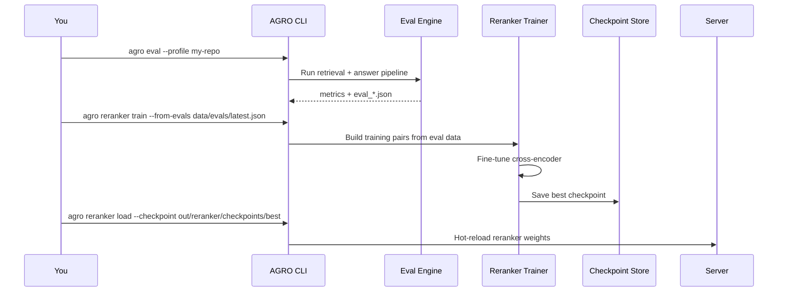

# Self-learning cross-encoder reranker

AGRO ships with a **learning** reranker: a cross‑encoder model that can be fine‑tuned on your own query history and feedback, then hot‑reloaded into the running system.

I built this because most RAG stacks stop at “BM25 + dense + off‑the‑shelf reranker.” That’s fine for generic QA, but it leaves a lot of performance on the table for a specific codebase where:

- You care about *your* style of questions
- You have recurring failure modes (e.g. “always picks the interface, never the implementation”)
- You’re willing to log feedback and run evaluations

This page explains how the learning reranker fits into AGRO, how it’s configured, and how to iterate on it safely.


## Where the reranker sits in the pipeline

The reranker is the last stage of the retrieval stack. Everything before it is about **recall**; the reranker is about **precision**.

```mermaid
flowchart LR
  Q[User query] --> R1[BM25 sparse search]
  Q --> R2[Dense vector search]
  Q --> R3[Discriminative keywords]

  R1 --> M[Hybrid merge & scoring]
  R2 --> M
  R3 --> M

  M --> C[Candidate set (N docs)]
  C --> CE[Cross-encoder reranker]
  CE --> K[Top K reranked docs]
  K --> LLM[Answer generation]
```

The cross‑encoder reranker:

- Takes the top‑N candidates from the hybrid search
- Scores each `(query, chunk)` pair with a small encoder model
- Returns a new ordering that the LLM sees as its context

You can run with:

- No reranker (just hybrid scores)
- A static reranker (e.g. a pre‑trained cross‑encoder)
- A **learning** reranker that you fine‑tune on your own data

The rest of this page is about that last option.


## Configuration surface

All reranker configuration flows through `agro_config.json` and the central config registry (`server/services/config_registry.py`). You don’t need to touch the Python code to change models or training behavior.

The relevant keys live under the reranker section of `AgroConfigRoot` (see `server/models/agro_config_model.py`). In practice you’ll interact with them in two places:

- **Web UI → Dev Tools → Reranker** – sliders, dropdowns, and tooltips
- **`agro_config.json`** – the on‑disk source of truth

A minimal JSON snippet looks like this:

```json title="agro_config.json" hl_lines="5-15"
{
  "RERANKER_ENABLED": true,
  "RERANKER_TOP_K": 20,
  "RERANKER_MODEL": "local:cross-encoder/ms-marco-MiniLM-L-6-v2",

  "RERANKER_LEARNING_ENABLED": true,
  "RERANKER_LEARNING_TRAIN_STEPS": 2000,
  "RERANKER_LEARNING_BATCH_SIZE": 16,
  "RERANKER_LEARNING_LR": 2e-5,
  "RERANKER_LEARNING_WARMUP_RATIO": 0.1,
  "RERANKER_LEARNING_EVAL_EVERY": 200,
  "RERANKER_LEARNING_SAVE_BEST_ONLY": true,
  "RERANKER_LEARNING_OUTPUT_DIR": "out/reranker/checkpoints"
}
```

!!! note
    Exact key names may evolve; the UI always reflects the current schema and every field has a tooltip that explains what it does, with links to the relevant papers where it makes sense.

Under the hood, these values are read via the config registry:

```py title="server/services/rag.py" linenums="1" hl_lines="18-23"
from server.services.config_registry import get_config_registry

_config_registry = get_config_registry()


def do_search(q: str, repo: Optional[str], top_k: Optional[int], request: Optional[Request] = None) -> Dict[str, Any]:
    if top_k is None:
        try:
            # Try FINAL_K first, fall back to LANGGRAPH_FINAL_K
            top_k = _config_registry.get_int('FINAL_K', _config_registry.get_int('LANGGRAPH_FINAL_K', 10))
        except Exception:
            top_k = 10
    # ... later in the pipeline, the reranker uses the same registry
```

Because everything goes through the registry, you can:

- Override infrastructure bits via `.env`
- Keep RAG knobs (like reranker settings) in `agro_config.json`
- Ask AGRO itself “what does `RERANKER_LEARNING_LR` do?” in the Chat tab


## Data: where training signals come from

The learning reranker is only as good as the signals you feed it. AGRO collects those signals from a few places:

<div class="grid cards" markdown>
- :material-clipboard-text: **Golden dataset**  
  Curated question → answer → supporting chunks in `data/golden.json` and `data/evaluation_dataset.json`.

- :material-history: **Query history**  
  Logged queries and retrieved chunks, with feedback, under `data/tracking/` and `data/evals/`.

- :material-thumb-up-outline: **Explicit feedback**  
  Thumbs‑up/down in the UI and CLI, stored alongside eval runs in `data/evals/*.json`.
</div>

The evaluation subsystem (`features/evaluation.md`) already writes out rich JSON snapshots of each run:

- Which chunks were retrieved
- Which ones were considered “good” for a question
- How BM25 / dense / reranker scores compared

The reranker trainer just reuses that data instead of inventing a new format.


## Training loop

Training is driven by the CLI and the evaluation machinery. The rough flow is:



The nice part is that you don’t have to manually maintain a separate “training dataset” for the reranker. You just:

1. Run evals on your current pipeline
2. Inspect failures
3. Re‑run training using the latest eval snapshots
4. Reload the reranker and re‑eval

AGRO keeps all the intermediate eval JSONs under `data/evals/` so you can always roll back to a previous baseline.


## How the model is used at inference time

At query time, the reranker sees a small candidate set (e.g. 50–100 chunks) and scores each `(query, chunk)` pair.

A typical scoring call looks like this conceptually:

```py title="pseudocode" linenums="1"
from typing import List


def rerank(query: str, candidates: List[Chunk]) -> List[Chunk]:
    # 1. Build model inputs
    pairs = [
        reranker_tokenizer.build_pair(query, c.text, max_length=512)
        for c in candidates
    ]

    # 2. Run the cross-encoder
    scores = reranker_model(pairs)  # shape: [len(candidates)]

    # 3. Combine with existing scores if desired
    for c, s in zip(candidates, scores):
        c.rerank_score = float(s)

    # 4. Sort and truncate
    return sorted(candidates, key=lambda c: c.rerank_score, reverse=True)[:FINAL_K]
```

The actual implementation lives in the retrieval layer (see `retrieval/hybrid_search.py` and the reranker module), but the important bits for you are:

- **`RERANKER_TOP_K`** controls how many candidates the cross‑encoder sees
- **`FINAL_K`** (or `LANGGRAPH_FINAL_K`) controls how many chunks the LLM actually gets
- You can choose to use the reranker score alone, or blend it with BM25 / dense scores

For small repos, you may find that BM25 alone is good enough and the reranker doesn’t buy you much. That’s fine; just turn it off. The point is to have the option when you need it.


## Web UI: Dev Tools → Reranker

The **Dev Tools → Reranker** tab in the web UI is the main control panel for this feature. It’s wired to the same config registry and training code as the CLI.

Typical controls you’ll see there:

- Enable/disable reranking entirely
- Choose the base cross‑encoder model (local or cloud)
- Set `RERANKER_TOP_K` and related limits
- Trigger a training run from recent evals
- Inspect current checkpoint metadata (training steps, eval metrics, timestamp)

Every field has a tooltip that:

- Explains what the parameter does
- Links to the relevant part of the docs or the original paper (for things like learning rate schedules)
- Is searchable from the Help / Glossary tab

Because AGRO is indexed on itself, you can also go to the **Chat** tab and ask things like:

> “How does the reranker training loop work?”  
> “Where is `RERANKER_LEARNING_TRAIN_STEPS` used in the code?”

and it will show you the actual Python files and config models involved.


## MCP and reranking

If you’re using AGRO via MCP (see `features/mcp.md`) from tools like Claude Code or Codex, the reranker still runs in the same place in the pipeline:

- The MCP server exposes a “search this repo” tool
- That tool calls the same HTTP API / internal functions as the web UI
- The reranker reorders candidates before they’re sent back over MCP

You don’t need a separate configuration path for “MCP mode.” Once the reranker is enabled and trained, everything that hits the RAG engine – web UI, CLI, MCP – benefits from it.


## When you probably don’t need it

I don’t recommend turning this on for every toy project. Some rough heuristics:

You **probably don’t need** the learning reranker if:

- Your repo is small (< a few thousand chunks) and BM25 already finds the right files
- You’re not running evals or collecting feedback
- Latency is more important than squeezing out the last bit of precision

You **probably do want** it if:

- You have a large monorepo with many near‑duplicate files
- You see systematic failure modes in evals (e.g. always picking tests instead of implementation)
- You’re already running the evaluation loop and are comfortable iterating on models

The nice part is that you can start simple:

1. Run with BM25 + dense only
2. Add a static reranker
3. Once you have evals and feedback, enable learning and fine‑tune

No code changes required at any step – just configuration and CLI/UI usage.


## Rough edges & caveats

A few honest notes:

- Training is currently driven from the CLI and eval JSONs; there isn’t a full “one‑click AutoML” UI yet.
- You’re responsible for picking a base model that fits your hardware. Cross‑encoders can be expensive if you crank `RERANKER_TOP_K` too high.
- If you change chunking or retrieval settings drastically, you should re‑train the reranker; it’s learning on top of the current pipeline behavior.

If you want to change how the reranker works internally, the code is MIT‑licensed. You can:

- Swap in a different cross‑encoder architecture
- Change how scores are combined with BM25 / dense
- Add your own training objectives (e.g. listwise losses)

Ask AGRO itself “where is the reranker implemented?” and it will walk you through the relevant modules.
