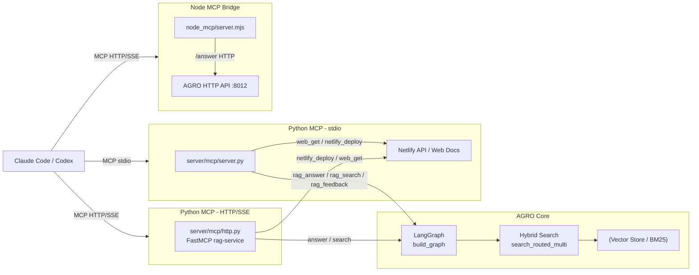

# MCP Integration

AGRO exposes its RAG engine over the **Model Context Protocol (MCP)** so tools like Claude Code / Codex can query your local codebase without you copy‑pasting files or wiring up ad‑hoc APIs.

This page covers:

- What MCP is and why it’s useful
- Transports AGRO supports (stdio, HTTP/SSE)
- How to run and configure the MCP servers
- The tools AGRO exposes
- Example `claude_desktop_config.json` setups

---

## What is MCP and why should you care?

[Model Context Protocol](https://modelcontextprotocol.io/) is a spec for **tooling and data sources** that LLM-based clients can call in a structured way.

In practice for AGRO:

- Claude Code / Codex can:
  - Ask AGRO questions about your repo (`rag_answer` / `answer`)
  - Run retrieval-only queries (`rag_search` / `search`)
  - Trigger deploys (`netlify_deploy`)
  - Fetch docs from a small allowlist of sites (`web_get`)
- The client doesn’t need to know:
  - How you store embeddings
  - Which models you use
  - What your LangGraph looks like

Instead, Claude treats AGRO as a **first-class tool** it can call when it needs context, the same way it calls a filesystem or a Git tool.

!!! tip "Why this helps agentic coding tools"
    Agentic coding tools work best when they can:
    
    - Pull **just enough** context when they need it
    - Ask **follow-up questions** that reuse prior state (threads)
    - Get **structured results** (file paths + line ranges) instead of raw text dumps
    
    AGRO’s MCP servers expose exactly that: focused retrieval, line-precise citations, and stable per-repo threads for your codebase.

---

## Architecture overview

AGRO ships **two MCP server implementations** plus a small Node bridge:

- `server/mcp/server.py` – stdio MCP server (for Claude Desktop, Codex via stdio)
- `server/mcp/http.py` – HTTP/SSE MCP server using `fastmcp` (for remote MCP clients, platform evals)
- `node_mcp/server.mjs` – Node HTTP bridge around AGRO’s `/answer` API



---

## Transports supported

AGRO exposes MCP over two main transports, plus a Node bridge.

### 1. Stdio MCP server (Python)

File: `server/mcp/server.py`

- Transport: **stdio** JSON-RPC
- Intended for: Claude Desktop, Codex, or any MCP client that speaks stdio
- Tools exposed:
  - `rag_answer` / `rag.answer`
  - `rag_search` / `rag.search`
  - `rag_feedback` / `rag.feedback`
  - `netlify_deploy` / `netlify.deploy`
  - `web_get` / `web.get`

The server uses `LangGraph` directly, but will **prefer hitting AGRO’s HTTP API** (`http://127.0.0.1:8012/api/chat`) when possible, so it can reuse the same logging/feedback/event IDs as the UI.

??? collapsible "Stdio server responsibilities"
    - Initialize the LangGraph (`build_graph()`)
    - Validate repo names against `list_repos()`
    - Call:
      - `/api/chat` for `rag_answer` (when available)
      - `search_routed_multi` for `rag_search`
      - `/api/feedback` for `rag_feedback`
    - Provide a small set of web/Netlify utilities

### 2. HTTP MCP server (Python via FastMCP)

File: `server/mcp/http.py`

- Transport: **HTTP** (`fastmcp`, typically HTTP+SSE for clients)
- Intended for: Remote MCP clients, platform evals, network-based integrations
- Tools exposed:
  - `answer`
  - `search`
  - `netlify_deploy`
  - `web_get`

This server is more “canonical” MCP in the modern sense: you point a client at `http://host:port/mcp` and it discovers tools via `tools/list`.

```python linenums="1" title="server/mcp/http.py (entrypoint)" hl_lines="34-39"
if __name__ == "__main__":
    # Serve over HTTP for remote MCP (platform evals). Use env overrides for host/port/path.
    host = os.getenv("MCP_HTTP_HOST", "0.0.0.0")
    port = int(os.getenv("MCP_HTTP_PORT", "8013"))
    path = os.getenv("MCP_HTTP_PATH", "/mcp")
    mcp.run(transport="http", host=host, port=port, path=path)
```

### 3. Node MCP bridge

File: `node_mcp/server.mjs`

- Transport: **HTTP** (custom, not FastMCP)
- Intended for: Simple MCP clients that just need a single `answer` tool
- Tools exposed:
  - `answer` (wraps AGRO’s `/answer` HTTP endpoint)

This bridge is intentionally minimal: it just forwards `answer` calls to a configurable RAG API.

```js linenums="1" title="node_mcp/server.mjs (core idea)" hl_lines="29-56 62-83"
if (req.method === "POST" && req.url === "/mcp") {
  // ...
  if (request.method === "tools/list") {
    response = { 
      jsonrpc: "2.0", 
      id: request.id, 
      result: { 
        tools: [
          {
            name: "answer",
            description: "Get RAG answer",
            inputSchema: {
              type: "object",
              properties: {
                q: { type: "string" },
                repo: { type: "string" }
              },
              required: ["q"]
            }
          }
        ]
      }
    };
  } else if (request.method === "tools/call") {
    const { name, arguments: args } = request.params;
    
    if (name === "answer") {
      const { q, repo = "agro" } = args;
      const url = `${RAG_API_URL}/answer?q=${encodeURIComponent(q)}&repo=${encodeURIComponent(repo)}`;
      const ragResponse = await fetch(url, { 
        signal: AbortSignal.timeout(10000)
      });
      const ragData = await ragResponse.json();
      response = { 
        jsonrpc: "2.0", 
        id: request.id, 
        result: {
          content: [{ type: "text", text: JSON.stringify(ragData, null, 2) }]
        }
      };
    }
  }
}
```

---

## Running the MCP servers

You can run **any combination** of these depending on your setup.

### Stdio MCP server

=== "Basic (Python venv)"

    ```bash linenums="1"
    # From project root, with your venv activated
    python -m server.mcp.server
    ```

    This will start a stdio MCP server that reads/writes JSON-RPC over stdin/stdout.
    
    Most MCP clients (Claude Desktop, Codex) will spawn this process themselves based on config, so you usually don’t run it manually.

=== "As an executable script"

    ```bash linenums="1"
    chmod +x server/mcp/server.py
    ./server/mcp/server.py
    ```

    !!! note
        `server.py` is designed for stdio. You generally won’t see a port or HTTP endpoint; the client talks to it via pipes.

### HTTP MCP server (FastMCP)

=== "Default config"

    ```bash linenums="1"
    # From project root
    python -m server.mcp.http
    ```

    This uses the defaults from the file:
    
    - `MCP_HTTP_HOST=0.0.0.0`
    - `MCP_HTTP_PORT=8013`
    - `MCP_HTTP_PATH=/mcp`

=== "Custom host/port/path"

    ```bash linenums="1"
    export MCP_HTTP_HOST=127.0.0.1
    export MCP_HTTP_PORT=9000
    export MCP_HTTP_PATH=/mcp
    python -m server.mcp.http
    ```

    Your MCP endpoint will then be at:

    ```text
    http://127.0.0.1:9000/mcp
    ```

### Node MCP bridge

=== "Run with default RAG API URL"

    ```bash linenums="1"
    cd node_mcp
    PORT=8014 node server.mjs
    ```

    - MCP endpoint: `http://127.0.0.1:8014/mcp`
    - Health check: `http://127.0.0.1:8014/health`
    - RAG API: defaults to `http://127.0.0.1:8012`

=== "Custom RAG API URL"

    ```bash linenums="1"
    cd node_mcp
    export RAG_API_URL="http://127.0.0.1:8012"
    node server.mjs
    ```

    !!! warning
        The Node bridge expects AGRO’s HTTP API to expose an `/answer` endpoint that accepts `q` and `repo` query params. If you’ve customized the API, you may need to tweak `server.mjs`.

---

## Tools exposed via MCP

### Stdio MCP server tools (`server/mcp/server.py`)

The stdio server returns this tool list for `tools/list`:

```python linenums="1" title="server/mcp/server.py (tools/list)" hl_lines="5-78"
if method == "tools/list":
    tools = [
        {
            "name": "rag_answer",
            "description": "Get a synthesized answer with citations from local codebase",
            "inputSchema": {
                "type": "object",
                "properties": {
                    "repo": {"type": "string"},
                    "question": {"type": "string"}
                },
                "required": ["repo", "question"]
            }
        },
        {
            "name": "rag_search",
            "description": "Retrieval-only search (returns file paths + line ranges)",
            "inputSchema": {
                "type": "object",
                "properties": {
                    "repo": {"type": "string"},
                    "question": {"type": "string"},
                    "top_k": {"type": "integer", "default": 10}
                },
                "required": ["repo", "question"]
            }
        },
        {
            "name": "rag_feedback",
            "description": "Submit feedback rating (1-5 stars) for a previous query to improve search quality",
            "inputSchema": {
                "type": "object",
                "properties": {
                    "event_id": {"type": "string", "description": "Event ID from previous rag_answer call"},
                    "rating": {"type": "integer", "minimum": 1, "maximum": 5, "description": "Rating from 1 (poor) to 5 (excellent)"},
                    "note": {"type": "string", "description": "Optional feedback note"}
                },
                "required": ["event_id", "rating"]
            }
        },
        {
            "name": "netlify_deploy",
            "description": "Trigger a Netlify build for project.net, project.dev, or both (uses NETLIFY_API_KEY)",
            "inputSchema": {
                "type": "object",
                "properties": {
                    "domain": {"type": "string", "enum": ["project.net", "project.dev", "both"], "default": "both"}
                }
            }
        },
        {
            "name": "web_get",
            "description": "HTTP GET (allowlisted hosts only: openai.com, platform.openai.com, github.com, openai.github.io)",
            "inputSchema": {
                "type": "object",
                "properties": {
                    "url": {"type": "string"},
                    "max_bytes": {"type": "integer", "default": 20000}
                },
                "required": ["url"]
            }
        }
    ]
```

#### `rag_answer` / `rag.answer`

- **Purpose:** Full RAG pipeline – retrieval + answer generation with citations.
- **Inputs:**

  | Field     | Type   | Description                                  |
  |----------|--------|----------------------------------------------|
  | `repo`   | string | Repo name (must match `list_repos()` entry) |
  | `question` | string | Natural language question about the repo   |

- **Output (simplified):**

  ```json
  {
    "answer": "text...",
    "citations": [
      "path/to/file.py:10-42",
      "src/foo/bar.ts:5-19"
    ],
    "repo": "your-repo",
    "confidence": 0.78,
    "event_id": "..."   // when using /api/chat
  }
  ```

- **Behavior:**

  1. Try `POST http://127.0.0.1:8012/api/chat` with `{ question, repo }`
  2. If that fails, fall back to direct `LangGraph` invocation
  3. Return up to 5 citations as `file_path:start_line-end_line`

!!! tip "Why this is good for Claude Code"
    Claude can:
    
    - Call `rag_answer` when it needs a **high-level explanation** (“How does auth work?”)
    - Use citations to open precise file/line ranges in your editor
    - Reuse `event_id` to send feedback later via `rag_feedback`

#### `rag_search` / `rag.search`

- **Purpose:** Retrieval-only – no generation, just ranked code locations.
- **Inputs:**

  | Field      | Type    | Description                                  |
  |-----------|---------|----------------------------------------------|
  | `repo`    | string  | Repo name                                    |
  | `question`| string  | Query / description of what to find          |
  | `top_k`   | integer | Max results (default: 10)                    |

- **Output:**

  ```json
  {
    "results": [
      {
        "file_path": "src/foo.ts",
        "start_line": 10,
        "end_line": 42,
        "language": "typescript",
        "rerank_score": 0.91,
        "repo": "your-repo"
      }
    ],
    "repo": "your-repo",
    "count": 1
  }
  ```

This is ideal when the client wants to **assemble its own prompt** or build a reasoning chain, instead of asking AGRO to generate text.

#### `rag_feedback` / `rag.feedback`

- **Purpose:** Send 1–5 star feedback for a previous `rag_answer`.
- **Inputs:**

  | Field      | Type    | Description                                              |
  |-----------|---------|----------------------------------------------------------|
  | `event_id`| string  | Event ID from the earlier `rag_answer` call             |
  | `rating`  | integer | 1–5 (validated in code)                                  |
  | `note`    | string? | Optional free-text note                                  |

- **Output:**

  ```json
  {
    "success": true,
    "message": "Feedback submitted: 5/5 stars"
  }
  ```

Under the hood this hits `POST http://127.0.0.1:8012/api/feedback` with:

```json
{ "event_id": "...", "signal": "star5", "note": "optional" }
```

#### `netlify_deploy` / `netlify.deploy`

- **Purpose:** Trigger Netlify builds for AGRO’s own docs/sites (or your fork).
- **Inputs:**

  | Field    | Type   | Allowed values                     | Default |
  |---------|--------|-------------------------------------|---------|
  | `domain`| string | `"project.net"`, `"project.dev"`, `"both"` | `"both"` |

- **Output:**

  ```json
  {
    "results": [
      {
        "domain": "project.net",
        "status": "triggered",
        "site_id": "xxx",
        "build_id": "yyy"
      }
    ]
  }
  ```

!!! warning
    Requires `NETLIFY_API_KEY` in the environment. If it’s missing, you’ll get an error.

#### `web_get` / `web.get`

- **Purpose:** Small, allowlisted HTTP GET for docs.
- **Allowlisted hosts:**

  - `openai.com`
  - `platform.openai.com`
  - `github.com`
  - `openai.github.io`

- **Inputs:**

  | Field      | Type    | Description                | Default |
  |-----------|---------|----------------------------|---------|
  | `url`     | string  | Full URL (must be http/https) | —       |
  | `max_bytes`| integer | Max bytes to read          | 20000   |

- **Output:**

  ```json
  {
    "url": "https://github.com/...",
    "status": 200,
    "length": 12345,
    "clipped": true,
    "content_preview": "first N bytes..."
  }
  ```

---

### HTTP MCP server tools (`server/mcp/http.py`)

The HTTP server uses `fastmcp` decorators:

```python linenums="1" title="server/mcp/http.py (tools)" hl_lines="15 31 48 75"
mcp = FastMCP("rag-service")

@mcp.tool()
def answer(repo: str, question: str) -> Dict[str, Any]:
    ...

@mcp.tool()
def search(repo: str, question: str, top_k: int = 10) -> Dict[str, Any]:
    ...

@mcp.tool()
def netlify_deploy(domain: str = "both") -> Dict[str, Any]:
    ...

@mcp.tool()
def web_get(url: str, max_bytes: int = 20000) -> Dict[str, Any]:
    ...
```

The semantics are basically the same as the stdio tools, but with slightly different names and no `rag_feedback`:

| HTTP MCP tool     | Stdio MCP equivalent | Notes                            |
|-------------------|----------------------|----------------------------------|
| `answer`          | `rag_answer`         | Retrieval + generation           |
| `search`          | `rag_search`         | Retrieval only                   |
| `netlify_deploy`  | `netlify_deploy`     | Same behavior                    |
| `web_get`         | `web_get`            | Same allowlist + behavior        |

---

### Node MCP bridge tools (`node_mcp/server.mjs`)

The Node bridge exposes a **single** tool:

| Tool   | Description              | Inputs                     |
|--------|--------------------------|----------------------------|
| `answer` | RAG answer via HTTP API | `q` (string), `repo` (string, optional, default `"agro"`) |

The response is whatever the `/answer` HTTP endpoint returns, wrapped as a text blob.

---

## Example Claude Desktop config

Claude Desktop uses a `claude_desktop_config.json` file to discover MCP servers.

Below are example setups for:

- Stdio MCP server (Python)
- HTTP MCP server (FastMCP)
- Node MCP bridge

!!! note
    These examples assume you’ve already cloned AGRO and set up your Python environment.

### 1. Stdio MCP server (Python)

This config tells Claude to launch `server/mcp/server.py` as a stdio MCP server.

```json linenums="1" title="claude_desktop_config.json (stdio MCP)"
{
  "mcpServers": {
    "agro-stdio": {
      "command": "python",
      "args": [
        "-m",
        "server.mcp.server"
      ],
      "workingDirectory": "/path/to/agro",
      "env": {
        "PYTHONPATH": "/path/to/agro",
        "AGRO_CONFIG": "/path/to/agro_config.yaml"
      }
    }
  }
}
```

!!! tip "Where this shines for Claude Code"
    With this config, Claude can:
    
    - Call `rag_answer` to get explanations + citations for your repo
    - Call `rag_search` to find relevant files and open them directly
    - Use `rag_feedback` to send star ratings (if the client chooses to)

### 2. HTTP MCP server (FastMCP)

If Claude (or another client) supports HTTP-based MCP servers, you can point it at `server/mcp/http.py`.

```json linenums="1" title="claude_desktop_config.json (HTTP MCP)"
{
  "mcpServers": {
    "agro-http": {
      "command": "python",
      "args": [
        "-m",
        "server.mcp.http"
      ],
      "workingDirectory": "/path/to/agro",
      "env": {
        "PYTHONPATH": "/path/to/agro",
        "AGRO_CONFIG": "/path/to/agro_config.yaml",
        "MCP_HTTP_HOST": "127.0.0.1",
        "MCP_HTTP_PORT": "8013",
        "MCP_HTTP_PATH": "/mcp"
      }
    }
  }
}
```

The client will:

1. Start the process
2. Discover tools via `tools/list` over HTTP at `http://127.0.0.1:8013/mcp`
3. Call `answer`, `search`, etc.

### 3. Node MCP bridge

If you prefer the Node bridge:

```json linenums="1" title="claude_desktop_config.json (Node bridge)"
{
  "mcpServers": {
    "agro-node-bridge": {
      "command": "node",
      "args": [
        "server.mjs"
      ],
      "workingDirectory