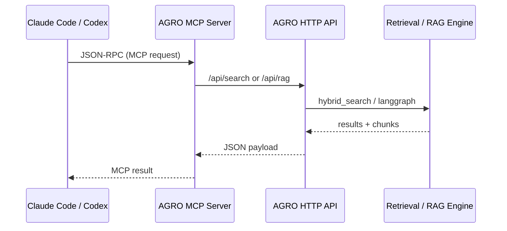

# MCP Integration

AGRO exposes its RAG engine over the **Model Context Protocol (MCP)** so tools like Claude Code / Codex can query your local codebase without you copy‑pasting files or wiring up ad‑hoc HTTP calls.

Under the hood this is a plain MCP server built on top of `pygls` and `lsprotocol`. It speaks JSON‑RPC 2.0 over stdio or TCP, and uses the same retrieval / RAG stack as the HTTP API.

This page focuses on:

- What the MCP server actually does
- How it interacts with AGRO's configuration registry
- How to run it and point tools at it
- When it’s worth using MCP vs just calling the HTTP API


## Why MCP for AGRO?

I built the MCP server for two reasons:

1. **Editor‑native tooling** – Claude Code / Codex and similar tools already know how to talk MCP. If AGRO speaks MCP, those tools can:
   - Ask questions about your repo
   - Fetch code snippets and context
   - Run RAG queries with the same retrieval pipeline as the web UI

2. **Avoid re‑implementing glue** – instead of writing a custom extension for every editor, AGRO just exposes a single MCP server. Anything that understands MCP can plug in.

The important bit: the MCP server is not a separate indexing or retrieval stack. It’s just another front‑end on top of the same services the HTTP API uses.


## Architecture overview

At a high level, the MCP server is just another client of the AGRO backend:



Key points:

- The MCP server **does not** maintain its own index.
- It calls into the same FastAPI app and retrieval code (`retrieval.hybrid_search`, `server.services.rag`) that the web UI and CLI use.
- Configuration (models, repo, retrieval knobs) flows through the **configuration registry** just like everything else.


## Configuration & the registry

The MCP server reads configuration from the same places as the rest of AGRO:

1. `.env` – infrastructure and secrets
2. `agro_config.json` – tunable RAG behavior and model settings
3. Pydantic defaults – last‑resort fallbacks

The service layer that matters here is:

- `server/services/config_registry.py` – central, thread‑safe config registry
- `server/services/config_store.py` – persistence and validation for `agro_config.json`

The registry gives you type‑safe accessors and consistent precedence:

```py title="server/services/config_registry.py" linenums="1" hl_lines="15 24-28"
from dotenv import load_dotenv
from pydantic import ValidationError

# Load .env FIRST before any os.environ access
load_dotenv(override=True)

from server.models.agro_config_model import AgroConfigRoot, AGRO_CONFIG_KEYS

...

class ConfigRegistry:
    ...

    def get_int(self, key: str, default: int | None = None) -> int:
        ...

    def get_str(self, key: str, default: str | None = None) -> str:
        ...

    def get_bool(self, key: str, default: bool | None = None) -> bool:
        ...
```

The MCP server uses this registry for things like:

- Which **repo** to serve (`REPO`)
- Which **port / bind address** to listen on (if you run it over TCP)
- Which **models** and RAG parameters to use when it calls into the HTTP API

You don’t configure MCP separately – you configure AGRO once, and the MCP server picks it up.


## What the MCP server exposes

The exact tool / resource names are defined in the MCP server implementation (see the repo for the current list), but conceptually you get:

- **Search / RAG tools** – run a query against the indexed repo and get back:
  - Answer text (if you’re using the full RAG pipeline)
  - Ranked code/document chunks with metadata
- **Index / status tools** – check whether the repo is indexed, trigger re‑indexing
- **Config / introspection tools** – query AGRO’s own configuration and docs (because AGRO is indexed on itself)

The important bit for editor tools:

- They can ask AGRO for **just the context they need** (e.g. “give me the 5 most relevant chunks for this question”), instead of streaming entire files into the model.
- They can do this repeatedly inside a single chat / coding session without you manually copying anything.


## Running the MCP server

There are two main ways to run it:

### 1. Via the CLI

The CLI has a dedicated MCP command (see `cli/commands/mcp.py`):

```bash
# From the repo root
python -m cli.agro mcp --repo my-project
```

Typical flags you’ll see:

- `--repo` – which profile / repo to serve (defaults to `REPO` from `.env`)
- `--host`, `--port` – TCP mode if your tool wants a socket instead of stdio

Because everything flows through the config registry, you can also set:

```bash
export REPO=my-project
export OPENAI_API_KEY=...
export ANTHROPIC_API_KEY=...
# etc
python -m cli.agro mcp
```

The MCP server will:

- Load `.env` and `agro_config.json`
- Connect to the running AGRO HTTP API (or start it, depending on how you wire things)
- Expose MCP methods for search / RAG / status


### 2. As a standalone process (advanced)

If you want to embed the MCP server into another process, you can:

- Import the MCP entry point from the CLI module
- Wire its stdio to your host process

This is mostly useful if you’re building your own MCP‑aware tool and want AGRO as a library. For typical editor integrations, the CLI wrapper is simpler.


## Pointing Claude Code / Codex at AGRO

Each MCP‑aware tool has its own way of configuring servers, but the pattern is always the same:

1. **Command** – how to start AGRO’s MCP server
2. **Transport** – stdio or TCP
3. **Capabilities** – what tools / resources the server exposes (the tool usually discovers this via MCP introspection)

A minimal stdio example (pseudoconfig):

```yaml title="claude-code-mcp.yaml" linenums="1"
servers:
  agro:
    command: ["python", "-m", "cli.agro", "mcp", "--repo", "my-project"]
    transport: stdio
```

Once that’s wired up, Claude Code can:

- Call AGRO’s MCP tools to fetch context
- Use that context in its own prompts
- Keep the heavy lifting (indexing, retrieval, RAG) inside AGRO


## How this actually helps (without hand‑wavy “token savings”)

Instead of claiming specific numbers, here’s what the MCP server changes in practice:

- **Less duplication** – the editor tool doesn’t need to re‑implement retrieval. It just asks AGRO: “what’s relevant for this question?”
- **Smaller prompts** – instead of dumping entire files, the tool can send only the top‑K chunks AGRO returns.
- **Consistent behavior** – the same retrieval pipeline is used by:
  - Web UI
  - CLI chat
  - HTTP API
  - MCP server

If you tune BM25 / dense embeddings / reranking in AGRO, the MCP clients automatically benefit.


## Interaction with indexing & RAG services

The MCP server doesn’t know how to index code itself. It delegates to the existing services:

- `server/services/indexing.py` – starts the indexer subprocess with the right env:

  ```py title="server/services/indexing.py" linenums="1" hl_lines="18-27"
  from common.paths import repo_root
  from server.services.config_registry import get_config_registry

  _config_registry = get_config_registry()

  def start(payload: Dict[str, Any] | None = None) -> Dict[str, Any]:
      ...
      repo = _config_registry.get_str("REPO", "agro")
      root = repo_root()
      env = {**os.environ, "REPO": repo, "REPO_ROOT": str(root), "PYTHONPATH": str(root)}
      if payload.get("enrich"):
          env["ENRICH_CODE_CHUNKS"] = "true"
      subprocess.Popen([...], env=env)
  ```

- `server/services/rag.py` – runs the actual search / RAG call:

  ```py title="server/services/rag.py" linenums="1" hl_lines="23-35 40-47"
  from retrieval.hybrid_search import search_routed_multi
  from server.services.config_registry import get_config_registry

  _config_registry = get_config_registry()

  def do_search(q: str, repo: Optional[str], top_k: Optional[int], request: Optional[Request] = None) -> Dict[str, Any]:
      if top_k is None:
          try:
              top_k = _config_registry.get_int('FINAL_K', _config_registry.get_int('LANGGRAPH_FINAL_K', 10))
          except Exception:
              top_k = 10

      repo = (repo or os.getenv('REPO', 'agro')).strip()
      results = search_routed_multi(q, repo=repo, top_k=top_k, request=request)
      ...
      return {"repo": repo, "results": results}
  ```

The MCP server just wraps these in MCP methods.


## When *not* to use MCP

You don’t have to use MCP at all. It’s useful when:

- You’re already using a tool that speaks MCP (Claude Code / Codex, etc.)
- You want that tool to have first‑class access to your indexed codebase

If you just want to:

- Script AGRO from CI
- Build a custom dashboard
- Integrate with another backend service

…then the **HTTP API** is usually simpler. MCP is mainly about making editor‑side tools smarter without extra glue.


## Extending the MCP server

AGRO is MIT‑licensed and indexed on itself. If you want to:

- Add new MCP tools (e.g. “run evals”, “fetch latest trace”, “toggle profile”)
- Expose more of the AGRO internals to your editor

You can:

1. Add a new MCP method in the server implementation
2. Call into the appropriate service layer (`server/services/*.py`)
3. Re‑index AGRO so the chat UI can explain your new tool back to you

Because all configuration flows through Pydantic models and the central registry, new options show up consistently in:

- `agro_config.json`
- The web UI (with tooltips and links)
- The MCP server behavior

You don’t need to thread new env vars through a dozen places by hand.


## Rough edges

A few things to be aware of:

- The MCP server currently assumes you already have AGRO running and indexed for the target repo.
- Error reporting from MCP back to tools is only as good as the underlying HTTP / service layer errors.
- The set of exposed tools is intentionally small; you may want to extend it for your own workflows.

If you hit something that feels missing or awkward, the fastest way to debug is usually:

1. Look at the corresponding `server/services/*.py` file
2. Call the HTTP API directly to see what it returns
3. Mirror that behavior in a new MCP method
