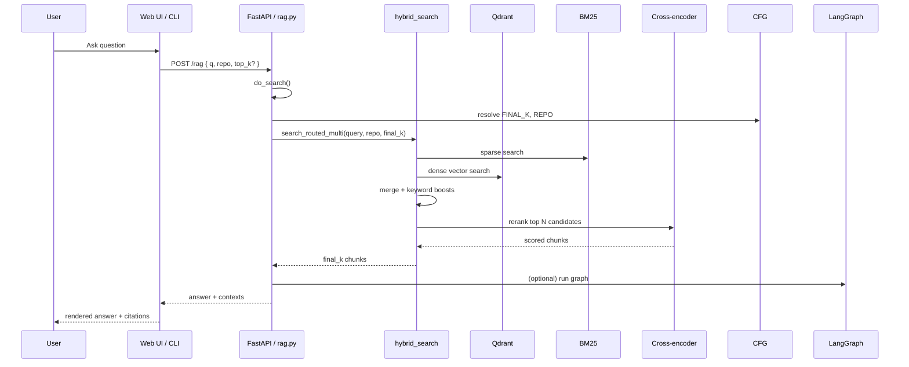

# Retrieval Pipeline

AGRO’s retrieval stack is intentionally layered and heavily configurable, but you don’t have to use every knob from day one. This page walks through what actually happens when you hit “Ask” in the UI or call the `/rag` endpoint, and how the different services and config surfaces tie together.

At a high level:

```mermaid
flowchart LR
  Q[User query] --> RQ[Request handler<br/>server/services/rag.py]
  RQ --> CFG[Config registry<br/>.env + agro_config.json]
  RQ --> HYB[Hybrid search<br/>retrieval/hybrid_search.py]
  HYB -->|BM25| SP[BM25 index]
  HYB -->|Dense| VE[Vector index (Qdrant)]
  HYB --> KW[Discriminative keywords<br/>server/services/keywords.py]
  HYB --> RR[Cross-encoder reranker]
  RR --> RES[Ranked chunks]
  RES --> LG[LangGraph app (optional)<br/>server/langgraph_app.py]
  LG --> ANS[Final answer]
```

The rest of this page is “how it actually works in code,” not just a diagram.


## 1. Entry points: HTTP and CLI

Most retrieval flows end up in `server/services/rag.py`.

- HTTP: `/rag`, `/search`, `/chat` routes call into `do_search` / `search_routed_multi`.
- CLI: `cli/chat_cli.py` and `cli/commands/chat.py` talk to the same HTTP API.

```py title="server/services/rag.py" linenums="1" hl_lines="23-40 60-76"
import logging
import os
from typing import Any, Dict, List, Optional

from fastapi import Request
from fastapi.responses import JSONResponse

from retrieval.hybrid_search import search_routed_multi
from server.metrics import stage
from server.telemetry import log_query_event
from server.services.config_registry import get_config_registry
import uuid

logger = logging.getLogger("agro.api")

# Module-level config registry
_config_registry = get_config_registry()

_graph = None
CFG = {"configurable": {"thread_id": "http"}}


def _get_graph():
    global _graph
    if _graph is None:
        try:
            from server.langgraph_app import build_graph
            _graph = build_graph()
        except Exception as e:
            logger.warning("build_graph failed: %s", e)
            _graph = None
    return _graph


def do_search(q: str, repo: Optional[str], top_k: Optional[int], request: Optional[Request] = None) -> Dict[str, Any]:
    if top_k is None:
        try:
            # Try FINAL_K first, fall back to LANGGRAPH_FINAL_K
            top_k = _config_registry.get_int('FINAL_K', _config_registry.get_int('LANGGRAPH_FINAL_K', 10))
        except Exception:
            top_k = 10

    repo = (repo or os.getenv('REPO', 'agro')).strip()

    with stage("search"):
        results = search_routed_multi(
            query=q,
            repo=repo,
            final_k=top_k,
        )

    # Optional LangGraph orchestration
    graph = _get_graph()
    if graph is not None:
        # ... build graph input, run, merge with results ...
        pass

    log_query_event(q, repo, results)
    return {"repo": repo, "results": results}
```

Key points:

- `do_search` is the single place where `FINAL_K` / `LANGGRAPH_FINAL_K` are resolved from config.
- The actual retrieval work is delegated to `retrieval.hybrid_search.search_routed_multi`.
- LangGraph is *optional*: if `build_graph()` fails, AGRO falls back to “plain” hybrid search.


## 2. Configuration: where retrieval knobs live

Retrieval behavior is driven by the central configuration registry, not scattered `os.getenv` calls.

```py title="server/services/config_registry.py" linenums="1" hl_lines="1-18 40-54"
"""Configuration Registry for AGRO RAG Engine.

This module provides a centralized, thread-safe configuration management system
that merges settings from multiple sources with clear precedence rules:

Precedence (highest to lowest):
1. .env file (secrets and infrastructure overrides)
2. agro_config.json (tunable RAG parameters)
3. Pydantic defaults (fallback values)

Key features:
- Thread-safe load/reload with locking
- Type-safe accessors (get_int, get_float, get_bool)
- Pydantic validation for agro_config.json
- Backward compatibility with os.getenv() patterns
- Config source tracking (which file each value came from)
"""

import json
import logging
import os
import threading
from pathlib import Path
from typing import Any, Dict, Optional

from dotenv import load_dotenv
from pydantic import ValidationError

# Load .env FIRST before any os.environ access
load_dotenv(override=True)

from common.paths import repo_root
from server.models.agro_config_model import AgroConfigRoot, AGRO_CONFIG_KEYS

logger = logging.getLogger("agro.config")

LEGACY_KEY_ALIASES = {
    'MQ_REWRITES': 'MAX_QUERY_REWRITES',
}

# Infrastructure keys that MUST be overridable via environment variables.
# The ...
```

Retrieval-related keys you’ll see referenced from the services layer:

- `FINAL_K` / `LANGGRAPH_FINAL_K` – how many chunks to return after reranking.
- `KEYWORDS_MAX_PER_REPO`, `KEYWORDS_MIN_FREQ`, `KEYWORDS_BOOST`, `KEYWORDS_AUTO_GENERATE`, `KEYWORDS_REFRESH_HOURS` – discriminative keyword extraction.
- `EDITOR_*`, `INDEX_*` – control the embedded editor and indexer behavior.

The registry is used everywhere via `get_config_registry()` and type-safe helpers:

```py
_config_registry = get_config_registry()
_KEYWORDS_MAX_PER_REPO = _config_registry.get_int('KEYWORDS_MAX_PER_REPO', 50)
_KEYWORDS_BOOST = _config_registry.get_float('KEYWORDS_BOOST', 1.3)
```

!!! note "You don’t have to know every key up front"
    The web UI surfaces these settings with inline tooltips and links to docs / papers. You can start with defaults and only touch the knobs when you have a concrete retrieval failure to fix.

For a deeper dive into the registry itself, see [Configuration](../configuration/settings.md).


## 3. Indexing: how code becomes chunks

Retrieval only works if the index is sane. Indexing is orchestrated by `server/services/indexing.py` and the standalone indexer (see `README-INDEXER.md`).

```py title="server/services/indexing.py" linenums="1" hl_lines="11-31"
import asyncio
import os
import subprocess
import sys
import threading
from typing import Any, Dict, List

from common.paths import repo_root
from server.index_stats import get_index_stats as _get_index_stats
from server.services.config_registry import get_config_registry

# Module-level config registry
_config_registry = get_config_registry()

_INDEX_STATUS: List[str] = []
_INDEX_METADATA: Dict[str, Any] = {}


def start(payload: Dict[str, Any] | None = None) -> Dict[str, Any]:
    global _INDEX_STATUS, _INDEX_METADATA
    payload = payload or {}
    _INDEX_STATUS = ["Indexing started..."]
    _INDEX_METADATA = {}

    def run_index():
        global _INDEX_STATUS, _INDEX_METADATA
        try:
            repo = _config_registry.get_str("REPO", "agro")
            _INDEX_STATUS.append(f"Indexing repository: {repo}")
            # Ensure the indexer resolves repo paths correctly and uses the same interpreter
            root = repo_root()
            env = {**os.environ, "REPO": repo, "REPO_ROOT": str(root), "PYTHONPATH": str(root)}
            if payload.get("enrich"):
                env["ENRICH_CODE_CHUNKS"] = "true"
                _INDEX_STATUS.append("Enriching chunks with su...")
            # ... spawn indexer subprocess ...
        except Exception as e:
            _INDEX_STATUS.append(f"Indexing failed: {e}")

    threading.Thread(target=run_index, daemon=True).start()
    return {"status": _INDEX_STATUS}
```

Important details:

- Indexing runs in a background thread and spawns a separate Python process with the same interpreter and `PYTHONPATH`.
- `REPO` and `REPO_ROOT` are passed through the environment so the indexer can resolve paths consistently.
- `ENRICH_CODE_CHUNKS` toggles additional semantic enrichment of chunks (e.g. adding symbol context) without changing the core BM25 / dense indexing logic.

The actual chunking, tokenization, and Qdrant collection layout live under `common/` and `retrieval/` and are covered in more detail in the main RAG design doc.


## 4. Discriminative keywords layer

On top of BM25 and dense vectors, AGRO maintains a small per-repo set of “discriminative keywords” that help with:

- Disambiguating overloaded terms in large monorepos.
- Boosting domain-specific tokens that BM25 alone tends to underweight.

This is handled by `server/services/keywords.py`.

```py title="server/services/keywords.py" linenums="1" hl_lines="7-26 28-38"
import json
import os
import time
from pathlib import Path
from typing import Any, Dict, List

from common.paths import repo_root
from server.services.config_registry import get_config_registry

# Module-level config caching
_config_registry = get_config_registry()
_KEYWORDS_MAX_PER_REPO = _config_registry.get_int('KEYWORDS_MAX_PER_REPO', 50)
_KEYWORDS_MIN_FREQ = _config_registry.get_int('KEYWORDS_MIN_FREQ', 3)
_KEYWORDS_BOOST = _config_registry.get_float('KEYWORDS_BOOST', 1.3)
_KEYWORDS_AUTO_GENERATE = _config_registry.get_int('KEYWORDS_AUTO_GENERATE', 1)
_KEYWORDS_REFRESH_HOURS = _config_registry.get_int('KEYWORDS_REFRESH_HOURS', 24)


def reload_config():
    """Reload cached config values from registry."""
    global _KEYWORDS_MAX_PER_REPO, _KEYWORDS_MIN_FREQ, _KEYWORDS_BOOST
    global _KEYWORDS_AUTO_GENERATE, _KEYWORDS_REFRESH_HOURS
    _KEYWORDS_MAX_PER_REPO = _config_registry.get_int('KEYWORDS_MAX_PER_REPO', 50)
    _KEYWORDS_MIN_FREQ = _config_registry.get_int('KEYWORDS_MIN_FREQ', 3)
    _KEYWORDS_BOOST = _config_registry.get_float('KEYWORDS_BOOST', 1.3)
    _KEYWORDS_AUTO_GENERATE = _config_registry.get_int('KEYWORDS_AUTO_GENERATE', 1)
    _KEYWORDS_REFRESH_HOURS = _config_registry.get_int('KEYWORDS_REFRESH_HOURS', 24)


def _keywords_path(repo: str) -> Path:
    return repo_root() / 'data' / 'discriminative_keywords.json'


def get_keywords(repo: str) -> Dict[str, Any]:
    # Load from disk, auto-regenerate if stale, etc.
    ...
```

Why this is useful:

- For small codebases, plain BM25 is often enough. You can set `KEYWORDS_AUTO_GENERATE=0` and ignore this entire layer.
- For larger repos, this gives you a cheap, interpretable way to bias retrieval toward “interesting” tokens without retraining the dense model.

The keywords are stored in `data/discriminative_keywords.json` and can be inspected or edited directly if you want full control.


## 5. Hybrid search and reranking

The core retrieval logic lives in `retrieval/hybrid_search.py` (not shown here in full). Conceptually it does:

1. Run BM25 over the code chunk index.
2. Run dense vector search over the same chunks in Qdrant.
3. Optionally incorporate discriminative keyword scores.
4. Merge and normalize scores.
5. Run a cross-encoder reranker over the top N candidates.

The reranker is itself configurable and can be trained on your own feedback (see [Self-learning cross-encoder reranker](learning-reranker.md)).

!!! note "Small repos: you can keep it simple"
    If you’re indexing a small library or a single service, you can disable dense search and reranking entirely and just use BM25. In practice that often gives better latency and more predictable behavior until you have enough data to justify the extra complexity.


## 6. LangGraph orchestration (optional)

If `server/langgraph_app.py` is present and `build_graph()` succeeds, AGRO will:

- Wrap the hybrid search results in a LangGraph workflow.
- Let you plug in more complex reasoning / tool-calling / multi-step flows.
- Still fall back to “plain” retrieval if the graph fails to build.

This is intentionally defensive:

- The retrieval stack should keep working even if your experimental graph code is broken.
- The HTTP API contract (`/rag` returns `{"results": ...}`) doesn’t change.

If you don’t care about LangGraph, you can ignore this entirely and just treat `do_search` as “BM25 + dense + reranker.”


## 7. Editor and live context

AGRO ships with an embedded editor / devtools panel that can:

- Show you the current retrieval config for the active repo.
- Let you tweak settings like `FINAL_K`, reranker weights, and keyword behavior.
- Persist those changes back to `agro_config.json` via the config store.

The editor service is wired through `server/services/editor.py`:

```py title="server/services/editor.py" linenums="1" hl_lines="15-27"
import json
import logging
from pathlib import Path
from typing import Any, Dict
from urllib.request import urlopen
from urllib.error import URLError

from server.services.config_registry import get_config_registry
from server.models.agro_config_model import AGRO_CONFIG_KEYS

logger = logging.getLogger("agro.api")


def _settings_path() -> Path:
    settings_dir = Path(__file__).parent.parent / "out" / "editor"
    settings_dir.mkdir(parents=True, exist_ok=True)
    return settings_dir / "settings.json"


def _status_path() -> Path:
    status_dir = Path(__file__).parent.parent / "out" / "editor"
    status_dir.mkdir(parents=True, exist_ok=True)
    return status_dir / "status.json"


def read_settings() -> Dict[str, Any]:
    """Read editor settings, preferring registry (agro_config.json/.env) with legacy file fallback."""
    registry = get_config_registry()
    settings = {
        "port": registry.get_int("EDITOR_PORT", 4440),
        "enabled": registry.get_bool("EDITOR_ENABLED", True),
        "embed_enabled": registry.get_bool("EDITOR_EMBED_ENABLED", True),
        "bind": registry.get_str("EDITOR_BIND", "local"),  # 'local' or 'public'
        "image": registry.get_str("EDI...")
    }
    ...
```

This is mostly plumbing, but it’s worth knowing that:

- Editor behavior is just more config in the same registry.
- The UI reads from `/out/editor/settings.json` and `/out/editor/status.json`, which are generated here.


## 8. Tracing and evaluation hooks

Retrieval is instrumented for tracing and evaluation so you can debug bad answers.

- `server/services/traces.py` exposes:
  - `list_traces(repo)` – list recent trace files under `out/<repo>/traces`.
  - `latest_trace(repo)` – return the most recent trace path.
- The evaluation pipeline under `features/evaluation.md` can snapshot config and compare different retrieval settings.

```py title="server/services/traces.py" linenums="1" hl_lines="5-24 27-38"
import json
import logging
from pathlib import Path
from typing import Any, Dict, List, Optional

from common.config_loader import out_dir
from server.tracing import latest_trace_path

logger = logging.getLogger("agro.api")


def list_traces(repo: Optional[str]) -> Dict[str, Any]:
    r = (repo or __import__('os').getenv('REPO', 'agro')).strip()
    base = Path(out_dir(r)) / 'traces'
    files: List[Dict[str, Any]] = []
    try:
        if base.exists():
            for p in sorted([x for x in base.glob('*.json') if x.is_file()], key=lambda x: x.stat().st_mtime, reverse=True)[:50]:
                files.append({
                    'path': str(p),
                    'name': p.name,
                    'mtime': __import__('datetime').datetime.fromtimestamp(p.stat().st_mtime).isoformat(),
                })
    except Exception as e:
        logger.exception("Failed to list traces: %s", e)
    return {'repo': r, 'files': files}


def latest_trace(repo: Optional[str]) -> Dict[str, Any]:
    r = (repo or __import__('os').getenv('REPO', 'agro')).strip()
    try:
        p = latest_trace_path(r)
    except Exception as e:
        logger.exception("latest_trace_path failed: %s", e)
    ...
```

The web UI’s **Analytics → Tracing** and **Evaluation** tabs are thin wrappers around these endpoints.


## 9. Putting it together: typical retrieval flow

Here’s the full flow for a single `/rag` call, with the pieces from above:




## 10. When to tune what

You don’t need to memorize every config key. A practical tuning order:

1. **Indexing sanity**
   - Make sure the right files are included / excluded.
   - Check chunk sizes and language detection in the indexer logs.

2. **BM25 only**
   - Disable dense search and reranking.
   - Fix obvious misses by adjusting tokenization / stopwords.

3. **Enable dense + reranker**
   - Turn on dense search in `agro_config.json`.
   - Start with a small reranker `FINAL_K` (e.g. 10–20) to keep latency reasonable.

4. **Discriminative keywords**
   - Enable `KEYWORDS_AUTO_GENERATE` for large repos.
   - Inspect `data/discriminative_keywords.json` and adjust thresholds.

5. **LangGraph / advanced orchestration**
   - Only once retrieval itself is solid.

If you’re not sure what a parameter does, hover it in the UI or ask AGRO itself in the **Chat** tab – the codebase is indexed into its own RAG engine, and the tooltips link back to the relevant docs and papers.
