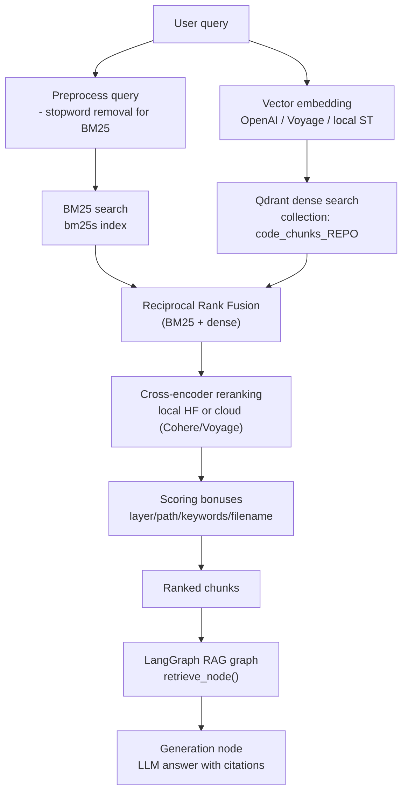

# Retrieval Pipeline

AGRO’s retrieval stack is intentionally layered:

1. :material-format-list-bulleted-type: **BM25 sparse search** over tokenized code chunks  
2. :material-vector-line: **Dense vector search** in Qdrant  
3. :material-function-variant: **Reciprocal Rank Fusion (RRF)** to merge sparse+dense  
4. :material-graph-line-variant: **Cross‑encoder reranking** to clean up the final list  
5. :material-tune: **Domain‑aware scoring bonuses** (paths, layers, keywords, filenames)

The goal is “simple, working search” first, with enough hooks to tune behavior when you need it.

---

## High‑level flow



---

## Components

### Query preprocessing

Location: `retrieval/hybrid_search.py`

```python linenums="1" hl_lines="15-22"
QUERY_STOPWORDS = {
    'where', 'what', 'how', 'when', 'which', 'who', 'why', 'is', 'are',
    'the', 'a', 'an', 'in', 'on', 'at', 'to', 'for', 'of', 'with',
    'does', 'do', 'can', 'could', 'would', 'should', 'please', 'help',
}


def preprocess_query(query: str) -> str:
    """Remove stopwords from query for better BM25 matching."""
    words = query.lower().split()
    filtered = [w for w in words if w not in QUERY_STOPWORDS and len(w) > 1]
    return ' '.join(filtered) if filtered else query
```

BM25 is very literal. Question words like “how”, “where”, “please” just add noise.  
For dense search, we keep the original query; only the BM25 leg uses `preprocess_query`.

!!! note
    If you rely heavily on natural‑language questions, this preprocessing is usually a win.  
    If you want *exact* phrase matching (e.g. log lines), you can disable or customize this set.

---

## Sparse retrieval: BM25

Location: `retrieval/hybrid_search.py::bm25_search`

```python linenums="1" hl_lines="17-43"
def bm25_search(query: str, repo: str, k: int = 50) -> List[tuple]:
    """BM25 sparse search. Returns [(chunk_id, score), ...]"""
    idx_dir = os.path.join(out_dir(repo), 'bm25_index')
    
    # Load BM25 index
    try:
        retriever = bm25s.BM25.load(idx_dir)
    except Exception as e:
        print(f"[bm25] Failed to load index: {e}")
        return []
    
    # Load tokenizer with vocab
    stemmer = Stemmer('english')
    tokenizer = Tokenizer(stemmer=stemmer, stopwords='en')
    try:
        tokenizer.load_vocab(idx_dir)
    except:
        pass
    
    # Preprocess and tokenize query
    processed = preprocess_query(query)
    tokens = tokenizer.tokenize([processed])
    
    # Retrieve
    try:
        indices, scores = retriever.retrieve(tokens, k=k)
        indices = indices[0].tolist() if hasattr(indices[0], 'tolist') else list(indices[0])
        scores = scores[0].tolist() if hasattr(scores[0], 'tolist') else list(scores[0])
    except Exception as e:
        print(f"[bm25] Retrieve failed: {e}")
        return []
    
    # Load ID mapping
    id_map = {}
    map_path = os.path.join(idx_dir, 'bm25_map.json')
    try:
        with open(map_path, 'r') as f:
            id_map = json.load(f)
    except:
        pass
    
    # Map indices to chunk IDs
    results = []
    for idx, score in zip(indices, scores):
        chunk_id = id_map.get(str(idx))
        if chunk_id and score > 0:
            results.append((chunk_id, float(score)))
    
    return results
```

Key points:

- Uses [`bm25s`](https://github.com/xhluca/bm25s) + a persisted index under `out_dir(repo)/bm25_index`
- Tokenization is stemmed English with a stored vocabulary per index
- Returns a `(chunk_id, score)` list, where `chunk_id` is later resolved via `chunks.jsonl`

!!! tip
    For **small or medium codebases** (single repo, <~50k LOC), BM25 alone is often enough.  
    It’s fast, deterministic, and handles symbol names and file paths very well.

---

## Dense retrieval: Qdrant vectors

Location: `retrieval/hybrid_search.py::vector_search`, `get_embedding`

```python linenums="1" hl_lines="1-26 44-62"
def get_embedding(text: str) -> List[float]:
    """Get embedding for query text using config-specified model."""
    if EMBEDDING_TYPE == 'local':
        from sentence_transformers import SentenceTransformer
        # Cache model - use config value
        if not hasattr(get_embedding, '_model') or get_embedding._model_name != EMBEDDING_MODEL_LOCAL:
            get_embedding._model = SentenceTransformer(EMBEDDING_MODEL_LOCAL)
            get_embedding._model_name = EMBEDDING_MODEL_LOCAL
        return get_embedding._model.encode([text], normalize_embeddings=True)[0].tolist()
    
    elif EMBEDDING_TYPE == 'voyage':
        import voyageai
        if not hasattr(get_embedding, '_client'):
            get_embedding._client = voyageai.Client(api_key=os.getenv('VOYAGE_API_KEY'))
        r = get_embedding._client.embed([text], model=VOYAGE_MODEL, input_type='query', output_dimension=512)
        return r.embeddings[0]
    
    else:  # openai (default)
        from openai import OpenAI
        if not hasattr(get_embedding, '_client'):
            get_embedding._client = OpenAI(api_key=os.getenv('OPENAI_API_KEY'))
        r = get_embedding._client.embeddings.create(input=text, model=EMBEDDING_MODEL)
        return r.data[0].embedding


def vector_search(query: str, repo: str, k: int = 50) -> List[tuple]:
    """Qdrant vector search. Returns [(chunk_id, score), ...]"""
    try:
        embedding = get_embedding(query)
    except Exception as e:
        print(f"[vector] Embedding failed: {e}")
        return []
    
    try:
        qc = QdrantClient(url=QDRANT_URL)
        coll = _cfg.get_str('COLLECTION_NAME', f'code_chunks_{repo}')
        
        response = qc.query_points(
            collection_name=coll,
            query=embedding,
            using='dense',
            limit=k,
            with_payload=['id', 'file_path', 'start_line', 'end_line', 'language']
        )
        
        results = []
        points = getattr(response, 'points', response)
        for p in points:
            chunk_id = p.payload.get('id')
            score = getattr(p, 'score', 0.0)
            if chunk_id:
                results.append((chunk_id, float(score)))
        
        return results
    
    except Exception as e:
        print(f"[vector] Search failed: {e}")
        return []
```

Embedding options (all configurable via `ConfigRegistry` / UI):

| Config key              | Meaning                                        | Example default                         |
|-------------------------|-----------------------------------------------|-----------------------------------------|
| `EMBEDDING_TYPE`        | `"openai"`, `"voyage"`, `"local"`             | `openai`                                |
| `EMBEDDING_MODEL`       | OpenAI embedding model                        | `text-embedding-3-large`                |
| `EMBEDDING_MODEL_LOCAL` | SentenceTransformers model id                 | `BAAI/bge-small-en-v1.5`                |
| `VOYAGE_MODEL`          | Voyage embedding model                        | `voyage-code-3`                         |
| `QDRANT_URL`            | Vector DB endpoint                            | `http://127.0.0.1:6333`                 |
| `COLLECTION_NAME`       | Qdrant collection for this repo               | `code_chunks_${REPO}`                   |

Dense search is good at:

- **Semantic matches**: “How do we validate OAuth tokens?” → finds `AuthMiddleware` even if you never said “OAuth”.
- **Cross‑file concepts**: similar logic in different services with different names.

---

## Hybrid retrieval and RRF

The hybrid search path (in `hybrid_search.py`, truncated in the snippet) does:

1. Run **BM25** and **vector** search in parallel
2. Fuse results using **Reciprocal Rank Fusion (RRF)**
3. Optionally feed fused list into the **cross‑encoder** reranker

### Why hybrid?

BM25 and dense search fail in different ways:

- BM25: great for **exact tokens** (`AuthToken`, `get_user_id`), bad at synonyms
- Dense: good for **concepts**, bad at tiny literal differences (e.g. `path="/v2/users"` vs `"/v1/users"`)

RRF keeps both perspectives and doesn’t require you to hand‑tune score scales.

### RRF: Reciprocal Rank Fusion

The core idea: don’t trust raw scores, trust **rank positions**.

Given several ranked lists, each result gets a fusion score:

```text
RRF_score(doc) = Σ_over_lists 1 / (k + rank_i(doc))
```

Where:

- `rank_i(doc)` is the 1‑based rank of `doc` in list `i` (∞ if not present)
- `k` is a small constant (e.g. 60) to dampen the effect of deep ranks

Intuition:

- If a chunk is ranked **high by both BM25 and dense**, its RRF score is large.
- If it’s high in only one list and absent/low in the other, it’s still considered, but lower.

In AGRO:

- RRF is implemented in `rrf_fusion(results_list, k=60, weights=...)`
- `results_list` is something like `[bm25_results, vector_results]`
- You can pass **per‑list weights** to bias towards BM25 or vectors

!!! tip
    RRF is robust against weird score distributions.  
    You don’t need to normalize BM25 vs cosine similarity – only ranks matter.

### BM25 vs Vector weights

AGRO also exposes **scalar weights** for the two legs:

```python linenums="1" hl_lines="1-2"
BM25_WEIGHT = _cfg.get_float('BM25_WEIGHT', 0.3)
VECTOR_WEIGHT = _cfg.get_float('VECTOR_WEIGHT', 0.7)
```

These are used when combining scores (depending on the exact fusion path in `hybrid_search`).  
Common patterns:

- **Code search / symbol‑heavy repos**: increase `BM25_WEIGHT` (e.g. `0.6`)  
- **Heavily documented / prose‑heavy repos**: increase `VECTOR_WEIGHT`

---

## Cross‑encoder reranking

Location: `retrieval/rerank.py`

After RRF, we still have ~tens of candidates. The cross‑encoder reranker:

1. Looks at the **full query + snippet pair** jointly
2. Produces a **relevance score** per pair
3. Sorts and optionally blends this score with the original hybrid score

This is fundamentally different from embeddings:

- Embeddings: encode query and doc **separately** → fast ANN search
- Cross‑encoder: encode query + doc **together** → slower but much more precise

### Configuration model

There are two layers of config:

1. **Shared loader** (`reranker/config.py::RerankerSettings`) — env‑based
2. **ConfigRegistry cache** (`retrieval/rerank.py::_load_cached_config`) — UI / API

The shared loader consolidates older env families:

```python linenums="1" hl_lines="49-79"
@dataclass(frozen=True)
class RerankerSettings:
    enabled: bool
    backend: str  # "local" | "cohere" | "none"
    local_model_dir: Optional[Path]
    hf_model_id: str
    alpha: float
    top_n_local: int
    top_n_cloud: int
    batch_size: int
    max_length: int
    snippet_chars: int
    cohere_model: str
    cohere_api_key_present: bool
    reload_on_change: bool
    reload_period_sec: int
    source_env: Dict[str, str]
```

The runtime resolver (`_resolve_env_strategy`) merges settings from:

- `RERANKER_MODEL` / `AGRO_RERANKER_MODEL_PATH`
- `AGRO_RERANKER_*` knobs
- Backend selectors (`RERANK_BACKEND`, `RERANKER_BACKEND`, `RERANKER_ACTIVE`, `RERANKER_PROVIDER`)

### Backends

`retrieval/rerank.py::_resolve_env_strategy` normalizes backend/provider:

```python linenums="1" hl_lines="1-20 57-82"
_DISABLED_ALIASES = {'off', 'none', 'disabled'}
_LOCALISH = {'local', 'hf'}

def _normalize_backend(value: Optional[str]) -> str:
    ...
def _normalize_provider(value: Optional[str]) -> str:
    ...
def _normalize_active_choice(value: Optional[str]) -> str:
    ...

def _resolve_env_strategy() -> Dict[str, Any]:
    """Resolve reranker backend/provider/model choices from cached config."""
    _load_cached_config()
    active_raw = _RERANKER_ACTIVE or _RERANKER_BACKEND or _RERANK_BACKEND or 'local'
    provider_raw = _RERANKER_PROVIDER or _RERANKER_BACKEND or _RERANK_BACKEND
    backend_raw = _RERANKER_BACKEND or _RERANK_BACKEND

    active = _normalize_active_choice(active_raw)
    provider_hint = _normalize_provider(provider_raw)
    backend_hint = _normalize_backend(backend_raw)

    ...
```

Supported modes:

- **Local** (`backend = "local"` / `"hf"`):
  - Uses `rerankers.Reranker` under the hood
  - Loads HF or local checkpoint (see `resolve_model_target`)
- **Cohere** (`backend = "cohere"`):
  - Uses Cohere’s rerank API
  - Needs `COHERE_API_KEY`
- **None** (`backend = "none"` or `AGRO_RERANKER_ENABLED=0`):
  - Reranking disabled; we keep original ordering with a decaying fallback score

Use `get_rerank_config_info()` to see the current snapshot:

```python linenums="1" hl_lines="1-8"
def get_rerank_config_info() -> Dict[str, Any]:
    """Expose current rerank configuration snapshot."""
    cfg = _resolve_env_strategy()
    ...
    return {
        "backend": cfg.get("backend"),
        "enabled": cfg.get("enabled"),
        "model": model_name,
        ...
        "active": cfg.get("active"),
        "provider": provider,
        "cloud_model": cloud_model,
    }
```

### How reranking works

Core entrypoint: `rerank_results(query, results, top_k, trace)`

=== "Local / HF"

```python linenums="1" hl_lines="1-10 43-63"
def get_reranker() -> Optional[Reranker]:
    global _RERANKER, _RERANKER_MODEL_ID

    settings = _load_settings_if_enabled()
    if settings:
        model_name = resolve_model_target(settings)
        max_length = settings.max_length
    else:
        model_name = _RERANKER_MODEL or DEFAULT_MODEL
        max_length = _AGRO_RERANKER_MAXLEN or 512

    if _RERANKER is not None and _RERANKER_MODEL_ID != model_name:
        _RERANKER = None

    if _RERANKER is None:
        if _maybe_init_hf_pipeline(model_name):
            _RERANKER_MODEL_ID = model_name
            return None
        os.environ.setdefault('TRANSFORMERS_TRUST_REMOTE_CODE', '1')
        _RERANKER = Reranker(model_name, model_type='cross-encoder', trust_remote_code=True, max_length=max_length)
        _RERANKER_MODEL_ID = model_name
    return _RERANKER
```

=== "Cohere (cloud)"

```python linenums="1" hl_lines="40-73"
if backend == 'cohere':
    try:
        import requests as req
        import time
        from server.api_tracker import track_api_call, APIProvider

        api_key = os.getenv('COHERE_API_KEY')
        ...
        docs = []
        for r in results:
            file_ctx = r.get('file_path', '')
            snip_len = snippet_cohere
            code_snip = (r.get('code') or r.get('text') or '')[:snip_len]
            docs.append(f"{file_ctx}\n\n{code_snip}")
        rerank_top_n = min(len(docs), cohere_top_n)

        start = time.time()
        ...
```

!!! note
    AGRO slices each document to `snippet_chars` before sending to the reranker.  
    This is configurable via `RERANK_INPUT_SNIPPET_CHARS` (local) and `COHERE_RERANK_TOP_N` (cloud).

### Score normalization and blending

```python linenums="1" hl_lines="1-10 12-18"
def _sigmoid(x: float) -> float:
    try:
        return 1.0 / (1.0 + math.exp(-float(x)))
    except Exception:
        return 0.0

def _normalize(score: float, model_name: str) -> float:
    if any(k in model_name.lower() for k in ['bge-reranker', 'cross-encoder', 'mxbai', 'jina-reranker']):
        return _sigmoid(score)
    return float(score)
```

For typical cross‑encoders (BGE, MS‑MARCO, etc.), logits are passed through a sigmoid to get `[0,1]` scores.  
These can then be combined with the existing hybrid score using `alpha`:

```text
final_score = alpha * rerank_score + (1 - alpha) * hybrid_score
```

(Exact blending happens inside `rerank_results` after the cloud/local branch.)

!!! tip
    - Increase `AGRO_RERANKER_ALPHA` to **trust the cross‑encoder more**  
    - Decrease it if you want to preserve more of the BM25/vector ordering

---

## Domain‑aware scoring bonuses

After reranking, AGRO applies a set of **multiplicative** bonuses to nudge results that are structurally “more likely” to be what you want.

Location: `retrieval/hybrid_search.py::apply_scoring_bonuses` and helpers.

```python linenums="1" hl_lines="1-22 24-40"
def apply_scoring_bonuses(docs: List[Dict], query: str, repo: str) -> None:
    """Apply all MULTIPLICATIVE scoring bonuses to documents.
    
    Modifies docs in-place, updating 'rerank_score' for each document.
    """
    intent = classify_query(query)
    
    for d in docs:
        fp = d.get('file_path', '')
        layer = (d.get('layer') or '').lower()
        code = d.get('code', '')
        
        # Start with current score
        score = float(d.get('rerank_score', 0.0) or d.get('hybrid_score', 0.0) or d.get('bm25_score', 0.0) or 1.0)
        
        # Ensure minimum base score for multiplicative math
        if score <= 0:
            score = 0.01
        
        # Apply all MULTIPLICATIVE bonuses
        score *= get_layer_bonus(layer, intent)
        score *= get_path_boost(fp, repo)
        score *= get_keyword_boost(query, fp, code, repo)
        score *= get_filename_boost(fp, query)
        
        # Store updated score
        d['rerank_score'] = score
    
    # Re-sort by updated scores
    docs.sort(key=lambda x: x.get('rerank_score', 0.0), reverse=True)
```

All of these are **multipliers** (>1 = boost, <1 = penalty). They don’t override the main ranking, they tilt it.

### Query intent → layer bonuses

```python linenums="1" hl_lines="1-33"
def classify_query(query: str) -> str:
    """Classify query intent to optimize scoring.
    
    Returns one of: 'gui', 'retrieval', 'indexer', 'eval', 'infra', or 'server'
    """
    ql = (query or '').lower()
    ...
    # Default to server (FastAPI, LangGraph, etc.)
    return 'server'


def get_layer_bonus(layer: str, intent: str) -> float:
    """Get MULTIPLICATIVE layer bonus based on query intent.
    ...
    DEFAULT_MATRIX = {
        'gui':       {'gui': 1.2, 'web': 1.2, 'server': 0.9, 'retrieval': 0.8, 'indexer': 0.8},
        'retrieval': {'retrieval': 1.3, 'server': 1.15, 'common': 1.1, 'web': 0.7, 'gui': 0.6},
        'indexer':   {'indexer': 1.3, 'retrieval': 1.15, 'common': 1.1, 'web': 0.7, 'gui': 0.6},
        ...
    }
    ...
```

If you ask “How does hybrid search work?”, chunks labeled as `layer="retrieval"` get a boost, `layer="web"` gets a penalty, etc.

!!! note
    The intent matrix is configurable via `LAYER_INTENT_MATRIX` in `agro_config.json`  
    and exposed in the Web UI under **RAG → Retrieval → Layer Bonuses**.

### Path boosts