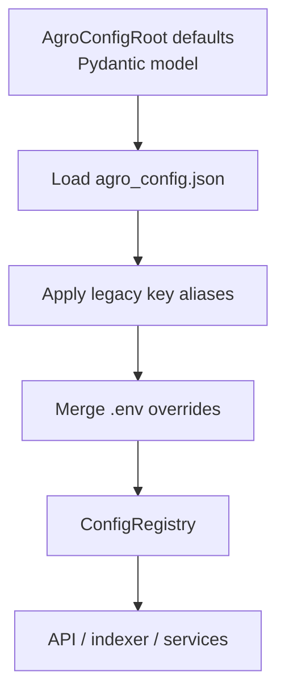

# Environment configuration

AGRO expects two main configuration surfaces:

- `agro_config.json` – tunable RAG behavior, models, retrieval knobs
- `.env` – secrets, infrastructure, and overrides for anything that *must* be set per‑machine or per‑deployment

Under the hood, everything flows through a single **configuration registry** implemented in `server/services/config_registry.py`. The registry is what the HTTP API, the indexer, the editor, and most background services actually read.

This page explains how that registry works, how `.env` and `agro_config.json` interact, and what the rest of the stack expects to find.


## Precedence and sources

The configuration registry merges three sources with a fixed precedence:

1. **`.env` file** – highest priority (secrets, infra, hard overrides)
2. **`agro_config.json`** – tunable RAG parameters and UI‑driven settings
3. **Pydantic defaults** – fallback values baked into the `AgroConfigRoot` model



The registry is created once per process and exposed via:

```py title="server/services/config_registry.py" linenums="1"
from server.services.config_registry import get_config_registry

config = get_config_registry()
port = config.get_int("API_PORT", 8012)
```

All the service modules you saw in the code (`rag.py`, `indexing.py`, `keywords.py`, `editor.py`, etc.) use this same registry.


## Where configuration is actually read

A few concrete examples from the service layer:

### RAG search (`server/services/rag.py`)

```py title="server/services/rag.py" linenums="1" hl_lines="15-22"
_config_registry = get_config_registry()


def do_search(q: str, repo: Optional[str], top_k: Optional[int], request: Optional[Request] = None) -> Dict[str, Any]:
    if top_k is None:
        try:
            # Try FINAL_K first, fall back to LANGGRAPH_FINAL_K
            top_k = _config_registry.get_int(
                "FINAL_K",
                _config_registry.get_int("LANGGRAPH_FINAL_K", 10),
            )
        except Exception:
            top_k = 10
    ...
```

If you set any of the following, they will be picked up in this order:

1. `FINAL_K` in `.env`
2. `FINAL_K` in `agro_config.json`
3. `LANGGRAPH_FINAL_K` in `.env`
4. `LANGGRAPH_FINAL_K` in `agro_config.json`
5. Hardcoded default `10`

You don’t need to know this to use AGRO, but it matters if you’re debugging “why am I still getting 10 results?”


### Indexing (`server/services/indexing.py`)

```py title="server/services/indexing.py" linenums="1" hl_lines="12-25"
_config_registry = get_config_registry()


def start(payload: Dict[str, Any] | None = None) -> Dict[str, Any]:
    ...
    def run_index():
        global _INDEX_STATUS, _INDEX_METADATA
        try:
            repo = _config_registry.get_str("REPO", "agro")
            _INDEX_STATUS.append(f"Indexing repository: {repo}")

            root = repo_root()
            env = {
                **os.environ,
                "REPO": repo,
                "REPO_ROOT": str(root),
                "PYTHONPATH": str(root),
            }
            if payload.get("enrich"):
                env["ENRICH_CODE_CHUNKS"] = "true"
                _INDEX_STATUS.append("Enriching chunks with summaries")
            ...
```

Here `REPO` is read from the registry, then pushed back into the child process environment. If you set `REPO` in `.env`, the indexer and the HTTP API will both see the same value.


### Keyword extraction (`server/services/keywords.py`)

```py title="server/services/keywords.py" linenums="1" hl_lines="8-20"
_config_registry = get_config_registry()
_KEYWORDS_MAX_PER_REPO = _config_registry.get_int("KEYWORDS_MAX_PER_REPO", 50)
_KEYWORDS_MIN_FREQ = _config_registry.get_int("KEYWORDS_MIN_FREQ", 3)
_KEYWORDS_BOOST = _config_registry.get_float("KEYWORDS_BOOST", 1.3)
_KEYWORDS_AUTO_GENERATE = _config_registry.get_int("KEYWORDS_AUTO_GENERATE", 1)
_KEYWORDS_REFRESH_HOURS = _config_registry.get_int("KEYWORDS_REFRESH_HOURS", 24)


def reload_config():
    global _KEYWORDS_MAX_PER_REPO, _KEYWORDS_MIN_FREQ, _KEYWORDS_BOOST
    global _KEYWORDS_AUTO_GENERATE, _KEYWORDS_REFRESH_HOURS
    _KEYWORDS_MAX_PER_REPO = _config_registry.get_int("KEYWORDS_MAX_PER_REPO", 50)
    _KEYWORDS_MIN_FREQ = _config_registry.get_int("KEYWORDS_MIN_FREQ", 3)
    _KEYWORDS_BOOST = _config_registry.get_float("KEYWORDS_BOOST", 1.3)
    _KEYWORDS_AUTO_GENERATE = _config_registry.get_int("KEYWORDS_AUTO_GENERATE", 1)
    _KEYWORDS_REFRESH_HOURS = _config_registry.get_int("KEYWORDS_REFRESH_HOURS", 24)
```

These are classic “tunable knobs” – they live in `agro_config.json` by default, but you can override them with environment variables if you really want to.


### Editor service (`server/services/editor.py`)

```py title="server/services/editor.py" linenums="1" hl_lines="18-26"
from server.services.config_registry import get_config_registry


def read_settings() -> Dict[str, Any]:
    """Read editor settings, preferring registry (agro_config.json/.env) with legacy file fallback."""
    registry = get_config_registry()
    settings = {
        "port": registry.get_int("EDITOR_PORT", 4440),
        "enabled": registry.get_bool("EDITOR_ENABLED", True),
        "embed_enabled": registry.get_bool("EDITOR_EMBED_ENABLED", True),
        "bind": registry.get_str("EDITOR_BIND", "local"),  # 'local' or 'public'
        "image": registry.get_str("EDITOR_IMAGE", "code-server"),
    }
    ...
```

The web UI’s “Editor” tab ultimately writes these values into `agro_config.json`. If you prefer to keep them out of version control, you can set them in `.env` instead.


## The configuration registry

The registry itself lives in `server/services/config_registry.py`. You don’t usually need to touch it, but it’s worth understanding what it guarantees:

- **Thread‑safe**: all loads/reloads are guarded by a lock
- **Type‑safe accessors**: `get_int`, `get_float`, `get_bool`, `get_str`
- **Pydantic validation**: `agro_config.json` is parsed into `AgroConfigRoot`
- **Legacy compatibility**: some old env names are mapped via `LEGACY_KEY_ALIASES`
- **Source tracking**: it can tell you whether a value came from `.env`, `agro_config.json`, or defaults

The high‑level flow is:

1. Load `.env` **first** via `python-dotenv` (`load_dotenv(override=True)`) so any `os.getenv` calls see the right values.
2. Load and validate `agro_config.json` into an `AgroConfigRoot` instance.
3. Build an internal map of keys → values, with `.env` overriding JSON.
4. Expose a small API:

```py title="server/services/config_registry.py" linenums="1" hl_lines="20-40"
class ConfigRegistry:
    def get_str(self, key: str, default: str | None = None) -> str:
        ...

    def get_int(self, key: str, default: int | None = None) -> int:
        ...

    def get_float(self, key: str, default: float | None = None) -> float:
        ...

    def get_bool(self, key: str, default: bool | None = None) -> bool:
        ...

    def reload(self) -> None:
        """Reload .env and agro_config.json under a lock."""
        ...
```

If you’re extending AGRO, use these helpers instead of `os.getenv` directly. They keep behavior consistent with the UI and with the rest of the stack.


## `.env` vs `agro_config.json`

AGRO treats these two files differently on purpose:

| File              | Intended contents                                      | Typical scope                 |
| :---------------- | :----------------------------------------------------- | :---------------------------- |
| `.env`            | Secrets, infra, per‑machine overrides                  | Docker compose, dev machine  |
| `agro_config.json`| RAG behavior, model choices, retrieval parameters      | Checked into repo, per‑profile|

Some practical guidelines:

- Put **API keys** and **hostnames/ports** in `.env`.
- Put **BM25 weights**, **reranker settings**, **model names**, and **feature toggles** in `agro_config.json`.
- If you’re running multiple AGRO instances against the same repo with different behavior, use **profiles** (see `configuration/profiles.md`) and keep `.env` minimal.


## Environment variables used by services

This is not an exhaustive list, but it covers the ones that show up in the service layer you saw in the code.

| Key                          | Used by                         | Description |
| :--------------------------- | :------------------------------ | :---------- |
| `REPO`                       | indexer, RAG, traces            | Logical repository name (also used as Qdrant collection suffix, output dir name, etc.). Defaults to `agro`.
| `REPO_ROOT`                  | indexer                         | Root path of the repo to index. Usually set by the launcher; can be overridden in `.env` if you run things manually.
| `FINAL_K` / `LANGGRAPH_FINAL_K` | RAG search                   | Number of final chunks to return from the retrieval pipeline.
| `KEYWORDS_MAX_PER_REPO`      | keyword service                 | Max number of discriminative keywords to keep per repo.
| `KEYWORDS_MIN_FREQ`          | keyword service                 | Minimum frequency for a term to be considered as a keyword.
| `KEYWORDS_BOOST`             | keyword service                 | Multiplicative boost applied to keyword matches in BM25.
| `KEYWORDS_AUTO_GENERATE`     | keyword service                 | Whether to auto‑generate keywords from the index (1/0).
| `KEYWORDS_REFRESH_HOURS`     | keyword service                 | How often to refresh auto‑generated keywords.
| `EDITOR_PORT`                | editor service / web UI         | Port for the embedded code editor (code‑server or similar).
| `EDITOR_ENABLED`             | editor service / web UI         | Master toggle for the editor feature.
| `EDITOR_EMBED_ENABLED`       | editor service / web UI         | Whether to embed the editor in the AGRO UI.
| `EDITOR_BIND`                | editor service                  | `local` or `public` – controls bind address.

Anything in this table can be set either in `.env` or in `agro_config.json` (if it’s part of `AGRO_CONFIG_KEYS`). `.env` always wins.


## Example: minimal `.env`

There is a dedicated page with a full example: [Example `.env` file](environment-example.md).

A minimal setup for a local single‑repo instance might look like:

```bash
# Core repo settings
REPO=agro
REPO_ROOT=/home/you/src/agro

# HTTP API
API_PORT=8012

# Model provider keys (set only what you actually use)
OPENAI_API_KEY=...
ANTHROPIC_API_KEY=...

# Optional: editor
EDITOR_ENABLED=true
EDITOR_PORT=4440
EDITOR_BIND=local
```

The web UI will read these through the config registry, and the OpenAPI docs at `/docs` will reflect the effective values where relevant.


## How the web UI writes configuration

Most of the React components under `web/src/components` (Admin, Dashboard, Editor, etc.) ultimately talk to a small HTTP API layer that uses `server/services/config_store.py` and `config_registry`:

- **Reading settings**: goes through the registry (`get_config_registry()`), so `.env` overrides are visible in the UI.
- **Writing settings**: updates `agro_config.json` via `config_store`, then triggers a registry reload.

This means:

- If you edit `agro_config.json` by hand, you may need to hit “Reload config” in the UI or restart the backend.
- If you put a value in `.env`, the UI will show it as read‑only (effectively) because the registry will always prefer the env value.


## Backwards compatibility and legacy keys

`config_registry` maintains a small `LEGACY_KEY_ALIASES` map, for example:

```py title="server/services/config_registry.py" linenums="1" hl_lines="14-17"
LEGACY_KEY_ALIASES = {
    "MQ_REWRITES": "MAX_QUERY_REWRITES",
}
```

If you have older `.env` files or scripts that still set `MQ_REWRITES`, they will be mapped to the new `MAX_QUERY_REWRITES` key. You don’t need to care about this for new setups, but it’s useful if you’re upgrading an existing deployment.


## When to use just `.env`

For very small or throwaway setups, you can ignore `agro_config.json` entirely and drive everything from `.env`:

- Set `REPO`, `REPO_ROOT`, and your model keys.
- Optionally set `FINAL_K`, `KEYWORDS_*`, etc.
- Leave `agro_config.json` at its defaults.

This is often enough for a single small codebase, and it keeps the mental model simple. The more advanced retrieval knobs are there when you need them, not something you have to configure up front.


## Debugging configuration issues

If something doesn’t behave the way you expect:

1. Check what the registry sees:
   - Use the **Admin → Configuration** tab in the UI, or
   - Hit the config API endpoint (see `api/endpoints.md`).
2. Look for conflicting values between `.env` and `agro_config.json`.
3. Remember that `.env` is loaded **before** any `os.getenv` calls, but the registry is the source of truth for new code.
4. If you’re extending AGRO, prefer `get_config_registry()` over `os.getenv` so your code plays nicely with the rest of the system.

If you’re still stuck, AGRO is indexed on itself – open the **Chat** tab and ask it “where does `FOO_BAR` come from?” and it will walk you through the relevant code paths.