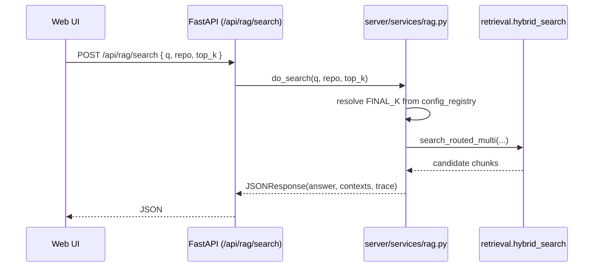

# After AGRO Is Running

Once AGRO is up and the web UI is responding on `http://127.0.0.1:8012`, the next steps are:

1. Point AGRO at a repository
2. Index it
3. Try your first query
4. Explore the configuration surfaces (UI + files)
5. (Optional) Wire up IDE / MCP clients

This page focuses on what happens *after* the containers are healthy and the UI loads.


## 1. Point AGRO at a repository

AGRO is always operating "for a repo" – even if that repo is just the AGRO repo itself.

There are two main ways to set the active repo:

- Via environment / config (long‑lived, good for servers)
- Via the Web UI (quick experiments)

### 1.1 Check the current repo

Open the web UI and go to:

- :material-view-dashboard: **Dashboard** → **System Status**

You should see something like:

- `REPO = agro`
- `REPO_ROOT = /path/to/agro`

Those values come from the **configuration registry**:

- `.env` → highest precedence
- `agro_config.json` → tunable RAG parameters
- Pydantic defaults → fallback

If you just want to index AGRO itself, you can skip to [Index your code](#2-index-your-code).

### 1.2 Change the repo (quick test)

For quick local experiments you can set the repo from the UI without editing files:

1. Go to :material-cog-outline: **Admin** → **General**
2. Look for the **Repository** section
3. Set:
   - **REPO** – short name for this repo (used in Qdrant collection names, profiles, etc.)
   - **REPO_ROOT** – absolute path on disk where the repo lives
4. Click **Save**

Behind the scenes this writes to `agro_config.json` via the `config_store` service and the central `config_registry` picks it up.

!!! note
    You don't have to restart AGRO for most config changes. The registry is designed to be reloaded at runtime, and many services (keywords, editor, indexing) cache values but expose explicit reload hooks.

### 1.3 Change the repo (persistent)

If you're running AGRO as a long‑lived service, set the repo in configuration instead of clicking around:

=== ".env"

```bash
# Infrastructure / environment
REPO=my-project
REPO_ROOT=/home/me/code/my-project
```

=== "agro_config.json"

```json hl_lines="3 4"
{
  "REPO": "my-project",
  "REPO_ROOT": "/home/me/code/my-project",
  "INDEXING": {
    "ENRICH_CODE_CHUNKS": true
  }
}
```

The precedence rules are:

1. `.env` (via `python-dotenv`, loaded at import time in `config_registry`)
2. `agro_config.json` (validated by `AgroConfigRoot`)
3. Pydantic defaults

So if you set `REPO` in both `.env` and `agro_config.json`, the `.env` value wins.


## 2. Index your code

Once `REPO` and `REPO_ROOT` are correct, you can start indexing.

Under the hood, indexing is driven by `server/services/indexing.py`. It:

- Reads `REPO` from the config registry
- Spawns a subprocess using the same Python interpreter
- Sets `REPO_ROOT` and `PYTHONPATH` in the child environment
- Optionally enables code‑chunk enrichment via `ENRICH_CODE_CHUNKS=true`

You can trigger this from the UI, CLI, or HTTP API.

### 2.1 From the Web UI

1. Go to :material-view-dashboard: **Dashboard** → **Indexing** (or the **Indexing** panel on the main dashboard)
2. Click **Start indexing**
3. Optionally enable:
   - **Enrich code chunks** – sets `ENRICH_CODE_CHUNKS=true` for this run
4. Watch progress in:
   - **Live Terminal** panel
   - **Index Stats** / **Storage** panels

The UI polls the `/index/status` and `/index/metadata` endpoints, which read `_INDEX_STATUS` and `_INDEX_METADATA` from `server/services/indexing.py`.

### 2.2 From the CLI

If you prefer terminals:

```bash
# From the repo root
python -m cli.agro index --repo my-project --root /home/me/code/my-project
```

This ultimately calls the same indexing entry point as the UI.

### 2.3 Verify the index

After indexing finishes, check that AGRO actually sees your chunks:

- :material-view-dashboard: **Dashboard** → **Index Display** / **Storage**
- Or hit the HTTP API:

```bash
curl "http://127.0.0.1:8012/api/index/stats?repo=my-project" | jq
```

This calls `server.index_stats.get_index_stats`, which inspects Qdrant collections and returns counts, dimensions, and storage usage.


## 3. Try your first query

At this point you should have:

- `REPO` / `REPO_ROOT` set
- At least one successful indexing run

Now you can actually ask questions.

### 3.1 Web chat

1. Go to :material-chat-processing-outline: **Chat**
2. Make sure the **Repo** selector matches your repo (e.g. `my-project`)
3. Type a question like:

> Where is the HTTP server started?

4. Send the message

The request flows roughly like this:



A few details worth knowing:

- `do_search` in `server/services/rag.py` picks `top_k` from config:
  - `FINAL_K` if set
  - else `LANGGRAPH_FINAL_K`
  - else `10`
- If `server.langgraph_app.build_graph()` is available, AGRO will route through a LangGraph graph; otherwise it falls back to a simpler path.
- Every query is logged via `server.telemetry.log_query_event` and can be inspected in the **Analytics → Tracing** tab.

### 3.2 CLI chat

The CLI uses the same HTTP API as the web UI, just with a TUI wrapper.

```bash
python -m cli.chat_cli --repo my-project
```

You get:

- Per‑thread history
- Model switching
- Feedback hooks that feed into the learning reranker (if enabled)

See [`features/cli-chat.md`](../features/cli-chat.md) for details.


## 4. Explore configuration surfaces

AGRO has a lot of knobs, but you don't have to touch all of them. For a small codebase, a plain BM25 index often works well.

The important thing is understanding *where* configuration lives and how it’s read.

### 4.1 Configuration registry (backend)

The central piece is `server/services/config_registry.py`:

- Loads `.env` **first** via `python-dotenv` (so `os.getenv` sees the right values)
- Loads and validates `agro_config.json` via `AgroConfigRoot`
- Exposes type‑safe accessors:
  - `get_int(key, default)`
  - `get_float(key, default)`
  - `get_bool(key, default)`
  - `get_str(key, default)`
- Tracks where each value came from (env vs config vs default)
- Is thread‑safe (internal lock around reload)

Many services cache values at import time for performance, for example:

- `server/services/keywords.py` reads:
  - `KEYWORDS_MAX_PER_REPO`
  - `KEYWORDS_MIN_FREQ`
  - `KEYWORDS_BOOST`
  - `KEYWORDS_AUTO_GENERATE`
  - `KEYWORDS_REFRESH_HOURS`

and exposes a `reload_config()` function to refresh those from the registry.

!!! note
    If you change keyword‑related settings in the UI or `agro_config.json`, call the appropriate reload endpoint or restart the backend so `keywords.py` picks them up.

### 4.2 Config store (UI ↔ disk)

`server/services/config_store.py` is the thin layer the UI talks to:

- Reads and writes `agro_config.json`
- Knows which fields are secrets (`SECRET_FIELDS`) and will redact them in responses
- Uses `_atomic_write_text` to avoid partial writes on Docker Desktop / watched volumes

The Admin → **Secrets** and **Integrations** subtabs are just frontends to this service.

### 4.3 Editor service

AGRO ships with a small embedded editor / playground, controlled by `server/services/editor.py`:

- Reads config via the registry with sensible defaults:
  - `EDITOR_PORT` (default `4440`)
  - `EDITOR_ENABLED` (default `true`)
  - `EDITOR_EMBED_ENABLED`
  - `EDITOR_BIND` (`local` or `public`)
- Persists a small `settings.json` and `status.json` under `server/out/editor`

You can toggle this from :material-wrench-outline: **Dev Tools → Editor**.


## 5. Inspect traces & debug

When something looks off (bad answer, missing file, weird reranking), you usually want to see the actual pipeline decisions.

### 5.1 Traces API

`server/services/traces.py` exposes two simple endpoints:

- `list_traces(repo)` – lists the last ~50 trace JSON files under `out/<repo>/traces`
- `latest_trace(repo)` – returns the path to the most recent trace (via `server.tracing.latest_trace_path`)

The **Analytics → Tracing** and **Evaluation → Trace Viewer** components use these to show step‑by‑step execution.

### 5.2 Dev tools

The :material-tools: **Dev Tools** section in the UI gives you:

- **Debug** – raw request/response payloads
- **Reranker** – inspect / tweak the cross‑encoder reranker
- **Testing** – quick ad‑hoc evaluation runs
- **Integrations** – MCP / external tools wiring

You don't need any of this to get value from AGRO, but it's there when you want to understand *why* a query behaved a certain way.


## 6. Optional: IDE & MCP integration

AGRO exposes its RAG engine over the **Model Context Protocol (MCP)** so tools like Claude Code / Codex can talk directly to your local codebase.

At a high level:

- AGRO runs as an MCP server
- Your IDE / agent connects to it
- Instead of pasting files into prompts, the tool asks AGRO for relevant chunks

This is wired through the same retrieval stack you just used in the web UI, so any improvements you make to indexing, reranking, or keywords automatically benefit IDE usage.

See [`features/mcp.md`](../features/mcp.md) for concrete setup steps.


## 7. Where to go next

Once you have basic search working:

- Run a small evaluation set: [`features/evaluation.md`](../features/evaluation.md)
- Experiment with the learning reranker: [`features/learning-reranker.md`](../features/learning-reranker.md)
- Tune models and providers: [`configuration/models.md`](../configuration/models.md)
- Read how configuration actually flows: [`configuration/settings.md`](../configuration/settings.md)

And remember: AGRO is indexed on itself. If you're not sure what a parameter does, open the **Chat** tab and ask it about the relevant module or config key.