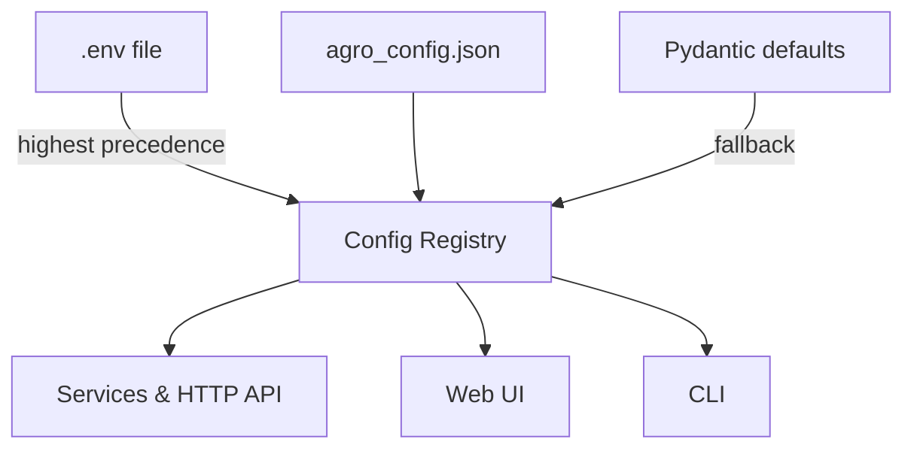

# Quick Start: Run AGRO in 5 Minutes

This page gets you from zero to a working AGRO stack as fast as possible, using the **actual** configuration surfaces the backend reads:

- `.env` – infrastructure, secrets, ports, repo name
- `agro_config.json` – RAG behavior, models, retrieval knobs

Under the hood, everything flows through the **configuration registry** in `server/services/config_registry.py`, so the same values drive the CLI, HTTP API, and web UI.


## 1. Clone the repo and install

```bash
git clone https://github.com/your-org/agro.git
cd agro

# Recommended: use a virtualenv
python -m venv .venv
source .venv/bin/activate  # Windows: .venv\Scripts\activate

pip install -r requirements.txt
```

If you prefer Docker, you can skip the Python environment and jump to the Docker section in the main installation docs. The rest of this page still applies for configuration.


## 2. Create a `.env` file

AGRO does **not** ship a `.env.example` file. Instead, the backend loads environment variables via `python-dotenv` in `server/services/config_registry.py` and `server/services/config_store.py`, and falls back to Pydantic defaults.

Use the dedicated example page as your template:

- [`Example .env file`](environment-example.md)

At minimum, you should set:

```bash
# Which repo to index and query
REPO=agro

# HTTP API / web UI
AGRO_HOST=127.0.0.1
AGRO_PORT=8012

# Editor / devtools (optional, but useful)
EDITOR_ENABLED=1
EDITOR_PORT=4440
EDITOR_BIND=local

# At least one LLM provider key if you want RAG answers, not just search
# (pick whatever you actually use)
OPENAI_API_KEY=sk-...
ANTHROPIC_API_KEY=...
MISTRAL_API_KEY=...
```

!!! note "Where these values are read from"
    - `REPO` is read by multiple services, e.g. `server/services/indexing.py` and `server/services/rag.py`.
    - `EDITOR_*` flags are read in `server/services/editor.py`.
    - API keys are treated as **secrets** in `server/services/config_store.py` and never echoed back in clear text.

You can add more infra settings (Qdrant host/port, monitoring, MCP, etc.) later; the registry will pick them up without code changes.


## 3. Check `agro_config.json`

`agro_config.json` is the main RAG configuration file. It is validated by `AgroConfigRoot` in `server/models/agro_config_model.py` and loaded by the config registry.

For a first run, you can usually keep the defaults and only tweak:

- Default chat / answer model
- Embedding model
- Basic retrieval knobs like `BM25_K1`, `BM25_B`, or `FINAL_K`

```json title="agro_config.json" hl_lines="4 8 16"
{
  "models": {
    "default_chat_model": "gpt-4o-mini",
    "default_answer_model": "gpt-4o-mini",
    "default_embedding_model": "text-embedding-3-large"
  },
  "retrieval": {
    "BM25_ENABLED": true,
    "DENSE_ENABLED": true,
    "RERANK_ENABLED": true,
    "FINAL_K": 10
  },
  "ui": {
    "show_advanced": true
  }
}
```

!!! note "Models are configuration, not a hard‑coded list"
    You can point `default_*_model` at **any** local or cloud model you’ve wired up. The Pydantic models in `server/models/agro_config_model.py` just treat them as strings; nothing is baked into the code.

If the file is missing or invalid, the config registry falls back to Pydantic defaults and logs a warning.


## 4. Start the AGRO server

The FastAPI app lives in `server/asgi.py`. The legacy `server/app.py` just wires it up for older entry points.

From the repo root:

```bash
# Simple dev run
uvicorn server.asgi:create_app \
  --factory \
  --host "${AGRO_HOST:-127.0.0.1}" \
  --port "${AGRO_PORT:-8012}"
```

Then open:

- Web UI: `http://127.0.0.1:8012`
- OpenAPI docs: `http://127.0.0.1:8012/docs`

If you see errors about missing config, check:

- `.env` is in the repo root (same dir as `docker-compose.yml` and `agro_config.json`).
- The process is running from the repo root so `common.paths.repo_root()` resolves correctly.


## 5. Index a repository

AGRO’s indexer is a separate process invoked via the service layer in `server/services/indexing.py`. The web UI, CLI, and HTTP API all call into the same function.

### Option A: Use the web UI

1. Go to the **Dashboard** tab.
2. Use the **Index** / **Quick Actions** panel to start indexing.
3. Watch progress in:
   - **Live Terminal Panel**
   - **System Status** / **Index Stats** panels

The UI ultimately calls the `/index/start` HTTP endpoint, which in turn calls `server/services/indexing.start()`.

### Option B: Use the CLI

```bash
python -m cli.agro index --repo agro
```

This sets `REPO` and spawns the same indexer code. The indexer process uses:

- `REPO` and `REPO_ROOT` from the environment
- `PYTHONPATH` pointing at the repo root

So it sees the same configuration as the HTTP server.


## 6. Try your first query

Once indexing finishes, you can:

- Use the **Chat** tab in the web UI.
- Or hit the HTTP API directly.

### Web UI

1. Open the **Chat** tab.
2. Make sure the correct repo is selected (defaults to `REPO` from `.env`).
3. Ask something like:

   > Where is the configuration registry implemented?

You should see chunks from `server/services/config_registry.py` and related files.

### HTTP API

```bash
curl -s "http://127.0.0.1:8012/api/rag" \
  -H 'Content-Type: application/json' \
  -d '{"q": "How does AGRO merge .env and agro_config.json?", "repo": "agro"}' | jq
```

Under the hood this calls `server/services/rag.do_search()`, which:

- Reads `FINAL_K` (or `LANGGRAPH_FINAL_K`) from the config registry
- Runs the hybrid retrieval pipeline (`retrieval.hybrid_search.search_routed_multi`)
- Optionally routes through a LangGraph app if `server/langgraph_app.py` is present


## 7. Optional: Enable the in‑browser editor

AGRO ships a small “editor” service for quick edits and live config experiments. It’s controlled entirely by config registry values and a tiny service layer in `server/services/editor.py`.

In your `.env`:

```bash
EDITOR_ENABLED=1
EDITOR_PORT=4440
EDITOR_BIND=local   # or "public" if you know what you’re doing
```

Then restart the server. The UI’s **DevTools → Editor** tab will reflect these settings via the `/editor/settings` and `/editor/status` endpoints, which read from the same registry.

!!! warning
    The editor writes to files under `server/out/editor/` and can be wired to real repos. Treat it as a dev tool, not a production IDE.


## 8. Where configuration actually comes from

AGRO’s configuration registry is the single source of truth. It merges values from:

1. `.env` (loaded first, via `python-dotenv`)
2. `agro_config.json` (validated by `AgroConfigRoot`)
3. Pydantic defaults in the model classes

With clear precedence:



The registry also:

- Tracks which source each key came from
- Provides type‑safe accessors: `get_int`, `get_float`, `get_bool`, `get_str`
- Maintains a small set of **infrastructure keys** that must be overridable via env vars (ports, hosts, etc.)

You don’t need to know any of this to get started, but it’s useful once you start tuning retrieval or running multiple profiles.


## 9. Next steps

Once the basics work:

- Read more about configuration:
  - [Environment configuration](environment.md)
  - [Configuration registry & settings](../configuration/settings.md)
  - [Model configuration](../configuration/models.md)
  - [Profiles](../configuration/profiles.md)
- Explore the retrieval stack: [Retrieval Pipeline](../features/rag.md)
- Try the CLI chat: [CLI Chat Interface](../features/cli-chat.md)
- Run an evaluation: [Evaluation & Regression Testing](../features/evaluation.md)

AGRO is indexed on itself, so once your own instance is running, you can also just ask it:

> How does the config registry work, and where do I change X?

The answer will come from the actual source files you just wired up.
