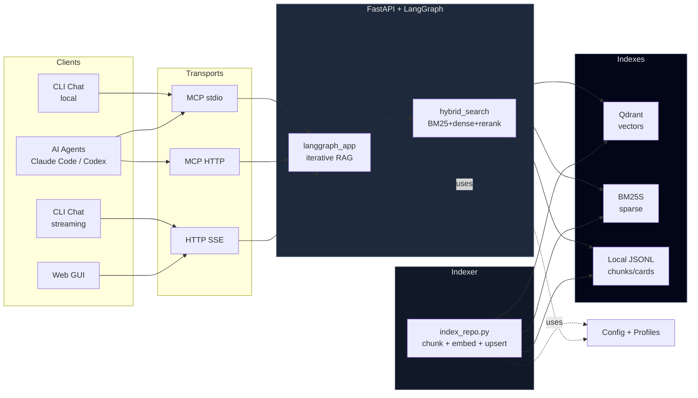

<style>
.md-content__inner h1:first-child { display: none; }
</style>

<figure markdown="span">
  { width="100%" }
</figure>

<p align="center" style="font-size: 1.4em; margin-top: -1em;">
<strong>A local‑first RAG engine workspace for codebases.</strong>
</p>

AGRO is built to answer one question well:

> *“Given this codebase, what’s the smallest, cheapest, most reliable RAG stack that will help me understand and change it?”*

Everything else (MCP servers, GUI, TUI, evals, Grafana, etc.) exists to support that.

---

## What AGRO is

??? info ":material-laptop: Local‑first"
    **Qdrant + Redis + JSONL chunks on disk.** Works with local models (Ollama, vLLM, etc.) or any API model you point it at.
    
    - No cloud dependency required
    - Full control over your data
    - [:octicons-arrow-right-24: Setup guide](./getting-started/installation.md)

??? info ":material-magnify-scan: Hybrid search over code"
    **BM25 + dense embeddings + cross‑encoder rerankers.** Repo isolation, citations, and configurable routing between indexes.
    
    - Sparse + dense + rerank pipeline
    - Per-repo collection isolation
    - [:octicons-arrow-right-24: Retrieval pipeline](./features/rag.md)

??? info ":material-brain: Self‑learning reranker"
    **Transformer model that trains on your feedback and click data.** Full loop: `mine triplets → train → evaluate → promote`
    
    - Hot-reload trained models
    - Continuous improvement from usage
    - [:octicons-arrow-right-24: Learning reranker](./features/learning-reranker.md)

??? info ":material-connection: MCP servers for AI agents"
    **Python and Node MCP implementations.** HTTP, SSE, stdio, WebSocket transports. Per‑transport model + backend config.
    
    - Claude Code / Codex ready
    - Multiple transport options
    - [:octicons-arrow-right-24: MCP integration](./features/mcp.md)

??? info ":material-view-dashboard: Rich GUI + CLI"
    **Onboarding wizard, VSCode-in-GUI, profiles, evals, cost estimates.** TUI / CLI chat for quick local experiments.
    
    - Full-featured web interface
    - Terminal-first workflow support
    - [:octicons-arrow-right-24: Configuration](./configuration/settings.md)

??? info ":material-chart-line: Embedded Grafana dashboards"
    **Qdrant / Redis / RAG metrics with alerts.** See when indexing or retrieval is going sideways before your users do.
    
    - Pre-configured dashboards
    - Alerting on anomalies
    - [:octicons-arrow-right-24: Monitoring](./operations/monitoring.md)

!!! success "Self-documenting"
    AGRO is **MIT-licensed**, modular, and indexed on itself. Open the chat tab and ask *"how do I extend hybrid_search to add X?"* — it will answer using its own source code.

---

## Why another RAG engine?

!!! failure "The problem with generic RAG stacks"

    | | Problem |
    |---|---|
    | :material-close-circle:{ style="color: #ef5350" } | Centered on **unstructured text**, not code |
    | :material-close-circle:{ style="color: #ef5350" } | Tuned for "one big knowledge base," not **many repos with strict isolation** |
    | :material-close-circle:{ style="color: #ef5350" } | **Opaque** about what knobs do and why |
    | :material-close-circle:{ style="color: #ef5350" } | **Evals are an afterthought** — or missing entirely. Good luck knowing if your changes helped or hurt. |

AGRO is opinionated in a few ways:

=== ":material-code-tags: Codebases are first‑class"

    - **Language‑aware chunking** via AST chunker
    - Per‑repo indexes, routing, and **strict isolation**
    - "Local hydration" — read real files near retrieved chunks

    ```python title="Example: AST-aware chunking"
    # AGRO understands code structure, not just text
    chunk = {
        "file_path": "server/app.py",
        "language": "python",
        "start_line": 42,
        "end_line": 78,
        "type": "function",  # Not just "512 tokens"
    }
    ```

=== ":material-tooltip-text: Explainability is built‑in"

    - Every parameter in the GUI has a **detailed tooltip**
    - Tooltips link to official docs, papers, and internal docs
    - All of those are **searchable inside AGRO itself**

    !!! tip "Tooltips everywhere"
        Hover any setting in the GUI. You'll get an explanation, valid ranges, and often a link to the paper or code that explains *why* that knob exists.

=== ":material-tune-vertical: You don't have to use all the knobs"

    - Small repos often perform best with **plain BM25**
    - Semantic bells and whistles are there when you hit scaling limits
    - **Profiles** let you keep a "simple" and a "fancy" setup side‑by‑side

    | Profile | Use case | Complexity |
    |---------|----------|------------|
    | `bm25-fast` | Small repos, quick lookups | :material-signal-cellular-1: Low |
    | `hybrid-balanced` | Medium repos, mixed code + docs | :material-signal-cellular-2: Medium |
    | `full-stack` | Large monorepos, semantic queries | :material-signal-cellular-3: High |

=== ":material-clipboard-check: Evals that actually work"

    - **Golden questions** in a simple JSON file — no PhD required
    - One-click eval runs from the GUI or CLI
    - **Regression tracking** so you know if that config change helped or hurt

    !!! example "Dead simple eval format"
        ```json
        [
          {
            "q": "Where is hybrid_search implemented?",
            "expect_paths": ["retrieval/hybrid_search.py"]
          }
        ]
        ```
        
        Add questions when retrieval fails. Run evals. See if your changes fix it. That's it.

---

## High‑level architecture



---

## Core capabilities

### Hybrid search and retrieval

AGRO’s retrieval pipeline is centered around `retrieval/hybrid_search.py` and `server/langgraph_app.py`.

- :material-text-search: **Sparse search (BM25S)**  
  - Great for small codebases  
  - No embeddings required  
  - Often the right default for “search my repo” workflows

- :material-vector-link: **Dense search (Qdrant)**  
  - Pluggable embeddings (local, OpenAI, Voyage, Gemini, etc.)  
  - Configurable vector sizes and precision (int4 → float32)  
  - Repo‑scoped collections

- :material-layers: **Hybrid search**  
  - Combine BM25, dense, and rerankers  
  - Repo routing and per‑profile weighting  
  - “Local hydration” to pull in nearby code context from disk

- :material-magnify: **Multi‑query expansion**  
  - Generate multiple reformulations of the question  
  - Fan‑out retrieval, then dedupe + rerank  
  - Configurable per profile (`MQ_REWRITES`, `multiquery`)

!!! note "You don’t need to over‑optimize"
    For a single backend repo or small monolith, **BM25‑only** is usually enough.  
    The hybrid / dense stack shines when:
    
    - you have multiple repos
    - code + docs are mixed
    - you’re running agents that ask fuzzy or underspecified questions

---

### Self‑learning reranker

The “learning reranker” is a transformer model that lives **inside** AGRO and is trained on your own usage data.

Pipeline:

```text
click / feedback logs
    ↓
mine triplets (query, positive, negative)
    ↓
train cross-encoder
    ↓
evaluate against baseline
    ↓
promote if better
    ↓
serve in hybrid_search
```

Key pieces:

- `reranker/learning_reranker.py` — training + eval loop
- `models/` — JSON configs for reranker models
- `checkpoints/` — trained model weights
- `gui/js/reranker.js` and web UI — control panel for training/evals

!!! tip "Why this is useful"
    Most RAG setups just swap in a generic reranker from HF or Cohere.  
    AGRO lets you **bootstrap from that**, then specialize on your own codebase and query patterns without leaving the tool.

---

### MCP servers for local and cloud agents

AGRO ships with both Python and Node MCP servers:

- :material-console: **stdio MCP** — for agents that run locally (Claude Code, Codex, etc.)
- :material-web: **HTTP MCP** — for remote agents or custom tooling
- :material-swap-horizontal: **Multiple transports** — HTTP, SSE, stdio, WebSocket

You can configure **per‑transport**:

- which model to use (local vs cloud)
- which retrieval profile to use
- how strict repo routing should be

This is what makes it possible to:

- keep Claude Code / Codex “on a short leash”  
- give them high‑quality, pre‑filtered results  
- offload most “search the repo” work to AGRO instead of the LLM

!!! note "No hard promises about token savings"
    The docs talk about reduced token usage with tools like Claude Code / Codex, but there are **no fixed numbers** here on purpose.  
    Once you wire MCP correctly and point agents at AGRO, the improvement is usually obvious in practice.

---

### Profiles: different stacks for different jobs

Profiles let you configure **end‑to‑end RAG behavior** per task.

=== "Docs-search (fast, local-first)"

    ```yaml linenums="1"
    gen_model: gpt-4o-mini
    embedding: BGE-small-en-v1.5        # local
    vectors: 384-d 
    precision: int4
    rerank_model: BAAI/bge-reranker-v2-m3
    retrieval: BM25                     # Sparse-only
    local_hydration: 2%
    multiquery: 2
    top_k: 3
    ```

=== "Plan_Refactor (full-stack, high quality)"

    ```yaml linenums="1"
    gen_model: gpt-5-high-latest
    embedding: text-embedding-3-large
    vectors: 3072-d
    precision: float32
    rerank_model: cohere/rerank-3.5
    retrieval: BM25+Redis+Qdrant
    multiquery: 10 
    top_k: 20
    max_semantic_cards: 50
    conf_top1: 0.80  # Confidence gating
    conf_avg5: 0.52
    ```

You can:

- bind profiles to **MCP transports**
- switch profiles in the GUI or via API
- run evals per profile and compare regressions

---

### Evals, regression tracking, and cost estimation

AGRO ships with:

- :material-clipboard-check: **Eval harness**  
  - Golden questions in `data/golden.json`  
  - `eval/eval_loop.py`, `eval/eval_rag.py`, `eval/tune_params.py`  
  - Regression tracking over time

- :material-currency-usd: **Cost + storage estimation**  
  - Estimate the impact of a profile (tokens, storage, etc.) *before* running it  
  - Helps answer: “If I crank multiquery and top_k, what happens to cost and latency?”

- :material-monitor-dashboard: **Embedded Grafana**  
  - Dashboards for Qdrant, Redis, and RAG metrics  
  - Alerts when indexing or retrieval misbehave

!!! warning "Eval quality depends on your data"
    The eval system is only as good as the questions and labels you provide.  
    The built‑in examples are a starting point, not a benchmark.

---

### GUI, TUI, and traceability

You can interact with AGRO in multiple ways:

| Interface      | Use case                                      |
|----------------|-----------------------------------------------|
| :material-web: **Web GUI** | Onboarding, profiles, evals, Grafana, embedded VSCode |
| :material-console: **CLI chat** | Quick local experimentation with `/answer`       |
| :material-api: **HTTP API** | Integrations, custom tools, scripting             |
| :material-cog-transfer: **MCP** | Claude Code / Codex / other MCP-aware agents     |

Key backend pieces:

- `server/asgi.py` — ASGI entrypoint  
- `server/routers/` — FastAPI routers (`search`, `chat`, `eval`, `indexing`, `profiles`, `config`, …)  
- `server/tracing.py` — LangSmith + OpenAI Agents SDK integration

!!! note "Legacy entry point"
    `server/app.py` still exists as a **legacy entry point**.  
    The real application factory lives in `server/asgi.py`. Use that for new deployments.

---

## Quick start

AGRO runs best via the included Docker + Makefile setup.

```bash linenums="1"
git clone https://github.com/DMontgomery40/agro.git
cd agro

# Dev stack: Qdrant/Redis, API, MCPs, GUI, etc.
make dev

# Initial CLI walkthrough to set repos, etc.
cd scripts
./.setup.sh

# GUI: http://127.0.0.1:8012/
```

!!! tip "Docker service vs. container names"
    The API runs as the Compose **service** `api` but the container is named `agro-api`.  
    Use the service name with `docker compose` and the container name with `docker`:

    | Task                         | Command                                                                 |
    |------------------------------|-------------------------------------------------------------------------|
    | Build / start via Compose    | `docker compose -f docker-compose.services.yml up -d api`              |
    | Follow logs via Compose      | `docker compose -f docker-compose.services.yml logs -f api`            |
    | Exec inside the container    | `docker exec -it agro-api bash`                                        |
    | Tail runtime logs directly   | `docker logs -f agro-api`                                              |

---

## Minimal from-scratch setup (manual path)

If you don’t want `make dev` and prefer to see each step, the short version is:

1. Start infrastructure (Qdrant + Redis)
2. Create Python venv and install `requirements-rag.txt` + `requirements.txt`
3. Configure `.env` (or use the GUI later)
4. Configure exclusions (`data/exclude_globs.txt`)
5. Index a repo via `indexer/index_repo.py`
6. Call `/answer` or open the GUI

??? collapsible "Show step-by-step shell example"
    ```bash linenums="1"
    # 1. Infra
    mkdir -p /path/to/agro/{infra,data/qdrant,data/redis}
    cd /path/to/agro

    # (Optional) use provided infra/docker-compose.yml instead of writing your own
    cd infra
    docker compose up -d
    cd ..

    # 2. Python environment
    python3 -m venv .venv
    . .venv/bin/activate
    pip install -r requirements-rag.txt
    pip install -r requirements.txt

    # 3. .env (or use GUI)
    cat > .env << 'EOF'
    QDRANT_URL=http://127.0.0.1:6333
    REDIS_URL=redis://127.0.0.1:6379/0
    REPO=agro
    MQ_REWRITES=4
    OLLAMA_URL=http://127.0.0.1:11434/api
    GEN_MODEL=qwen3-coder:30b
    EMBEDDING_TYPE=openai
    EOF

    # 4. Exclusions
    echo "**/.venv/**" >> data/exclude_globs.txt

    # 5. Index
    REPO=agro python indexer/index_repo.py

    # 6. Run API (dev)
    uvicorn server.asgi:create_app --factory --host 0.0.0.0 --port 8012
    ```

---

## Where things live

| Area                   | Purpose                                           | Path / File                             |
|------------------------|---------------------------------------------------|-----------------------------------------|
| Backend server         | FastAPI + LangGraph + routers                    | `server/`                               |
| Retrieval              | Hybrid search, embeddings, AST chunking          | `retrieval/`                            |
| Indexing               | Repo indexing, card building, stats              | `indexer/`                              |
| Reranker               | Config + learning reranker training              | `reranker/`                             |
| Web frontend           | React/Vite GUI                                   | `web/`                                  |
| Legacy GUI             | Older JS dashboard                               | `gui/`                                  |
| CLI                    | Terminal tools and chat                          | `cli/`                                  |
| Eval system            | Evals, parameter tuning, inspection              | `eval/`                                 |
| Infra                  | Docker Compose, infra YAMLs                      | `infra/`                                |
| Data                   | Exclude globs, golden questions, etc.           | `data/`                                 |
| MCP (Python)           | stdio + HTTP servers                             | `server/mcp/`                           |
| MCP (Node)             | Node MCP server                                  | `node_mcp/`                             |
| Config plumbing        | Pydantic models, config registry/store           | `server/models/`, `server/services/`    |

---

## AGRO explains itself

AGRO is **indexed on itself**:

- The docs, source files, and config models are part of the RAG corpus
- The GUI tooltips are long on purpose — they’re meant to be as good as an external explainer
- The chat interface can answer:
  - “What does `max_semantic_cards` do?”
  - “How do I add a new embedding model?”
  - “Where is the MCP HTTP server implemented?”

!!! tip "Look for tooltips"
    In the web UI, every non‑obvious setting has a tooltip.  
    Many tooltips link directly to:
    
    - relevant code files
    - doc pages
    - external references (papers, API docs)

---

## Next steps

Use these as your starting points:

- :material-book-open-page-variant: **Onboarding & setup**  
  - [Setup & Infrastructure](./setup.md){ .md-button }  
  - [Onboarding Wizard Walkthrough](./onboarding.md){ .md-button }

- :material-magnify-scan: **Retrieval & indexing**  
  - [Hybrid Search & Retrieval](./retrieval.md){ .md-button }  
  - [Indexing Code Repos](./indexing.md){ .md-button }

- :material-cog-transfer: **MCP / Agent integration**  
  - [MCP Quickstart (Claude / Codex)](./QUICKSTART_MCP.md){ .md-button }  

- :material-brain: **Learning reranker**  
  - [Learning Reranker Guide](./LEARNING_RERANKER.md){ .md-button }

- :material-chart-line: **Evals, cost, and metrics**  
  - [Performance & Cost](./PERFORMANCE_AND_COST.md){ .md-button }  
  - [Grafana & Telemetry](./grafana.md){ .md-button }

- :material-cog-outline: **Configuration & models**  
  - [Settings UI & API](./API_GUI.md){ .md-button }  
  - [Model Recommendations](./MODEL_RECOMMENDATIONS.md){ .md-button }

If you’re unsure where to start, clone the repo, run `make dev`, open the GUI, and walk through the onboarding wizard. From there, you can decide how deep you want to go into the knobs and levers.