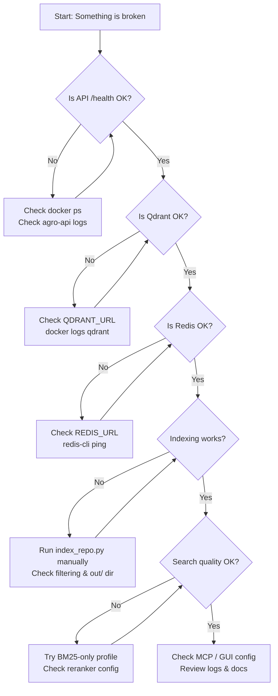

# Troubleshooting Guide

This page collects the most common problems I’ve seen while running AGRO and how to debug them quickly.

Use this as a “first pass” before diving into the code or filing an issue.

---

## Quick Health Checklist

Before going deep, verify the basics:

```bash
# 1. Are you in the repo?
pwd
ls

# 2. Is the right Python env active?
which python
python -V

# 3. Is Docker running?
docker info | head -n 5

# 4. Are core services up? (Qdrant + Redis + API)
docker ps --format 'table {{.Names}}\t{{.Status}}' | sed 1,1d

curl -s http://127.0.0.1:6333/collections | jq .status  # Qdrant
docker exec rag-redis redis-cli ping                     # Redis
curl -s http://127.0.0.1:8012/health | jq .status        # API
```

!!! tip "If several things are broken at once"
    Start from the bottom of the stack (Docker → Qdrant/Redis → API → MCP/GUI) and move upward. Don’t debug MCP or GUI until `/health` passes.

---

## Common Connection Issues

### 1. Docker Not Running or Containers Missing

**Symptoms**

- `docker: Cannot connect to the Docker daemon`
- `curl http://127.0.0.1:6333` fails with `Connection refused`
- `docker ps` shows no `qdrant`, `rag-redis`, or `agro-api` containers

**Checklist**

```bash
# Is Docker up at all?
docker info

# Are AGRO services running?
cd infra
docker compose ps
```

**Fix**

=== "Using helper scripts (recommended)"

```bash
cd scripts

# Full dev stack (Qdrant, Redis, API, MCP, GUI, etc.)
./dev_up.sh

# Or minimal stack (Qdrant + Redis + API)
./up.sh
```

=== "Manual docker-compose"

```bash
cd infra
docker compose up -d

# Or only the API service
docker compose -f docker-compose.services.yml up -d api
```

If you see port conflicts:

```bash
# Who is using 6333 or 6379 or 8012?
lsof -i :6333
lsof -i :6379
lsof -i :8012
```

Stop any other Qdrant/Redis/API processes using those ports.

---

### 2. Qdrant Connection Problems

**Symptoms**

- API logs: `qdrant_client.exceptions.UnexpectedResponse`
- Indexing fails: `Failed to connect to Qdrant` / `Connection refused`
- `/search` returns empty results even after indexing

**Basic checks**

```bash
# Is the container up?
docker ps | grep qdrant

# Does the HTTP endpoint respond?
curl -s http://127.0.0.1:6333/collections | jq

# From inside the api container (network issues)
docker exec -it agro-api bash
curl -s http://qdrant:6333/collections | jq
```

**Config to verify**

```bash
# .env (host-side)
QDRANT_URL=http://127.0.0.1:6333
```

Inside Docker, AGRO usually talks to `http://qdrant:6333`. That mapping is handled by `infra/docker-compose.yml`.

!!! warning "Don’t mix host and container URLs"
    If you set `QDRANT_URL` to `http://127.0.0.1:6333` **inside** the container, it will fail. Inside Docker, use `http://qdrant:6333`. From your host, use `http://127.0.0.1:6333`.

**Resyncing a broken Qdrant instance**

Sometimes the schema or data gets corrupted during heavy tinkering.

```bash
# Stop Qdrant
cd infra
docker compose stop qdrant

# Backup then wipe storage (adjust path to your setup)
cp -r ../data/qdrant ../data/qdrant.bak.$(date +%s)
rm -rf ../data/qdrant/*

# Restart
docker compose up -d qdrant
```

Then re-index your repos (see [Indexing problems](#indexing-problems)).

---

### 3. Redis Connection Problems

**Symptoms**

- LangGraph / chat flows hang or crash
- Logs mention `redis.exceptions.ConnectionError`
- `/answer_stream` never yields tokens

**Basic checks**

```bash
docker ps | grep rag-redis
docker exec rag-redis redis-cli ping        # Expect "PONG"
```

**Config to verify**

```bash
# .env
REDIS_URL=redis://127.0.0.1:6379/0
```

Inside Docker, Redis is usually reachable via `redis://rag-redis:6379/0`.

If Redis is corrupted or low on memory:

```bash
docker exec -it rag-redis redis-cli info memory
docker exec -it rag-redis redis-cli keys '*' | head
```

To flush (this clears LangGraph checkpoints and any cached state):

```bash
docker exec -it rag-redis redis-cli FLUSHALL
```

!!! note
    AGRO uses Redis for LangGraph checkpoints and some cache-like state. Flushing Redis will reset conversation history and some pipeline state, but not your Qdrant index.

---

### 4. API / GUI Not Responding

**Symptoms**

- `curl http://127.0.0.1:8012/health` fails
- Browser shows connection error at `http://127.0.0.1:8012/`
- MCP tools complain that the RAG server is unreachable

**Checklist**

```bash
# Is the api container running?
docker ps | grep agro-api

# Check health endpoint
curl -v http://127.0.0.1:8012/health

# Look at logs
docker logs --tail=200 agro-api
```

Common causes:

| Symptom | Likely Cause | Fix |
|--------|--------------|-----|
| `ModuleNotFoundError` | Python env mismatch | Reinstall deps in `.venv` |
| `pydantic` errors on startup | Invalid `agro_config.json` | Restore from backup or delete broken keys |
| `OSError [Errno 98] Address already in use` | Port 8012 in use | Kill old uvicorn or change port |

To restart the API:

```bash
cd infra
docker compose -f docker-compose.services.yml restart api
```

Or if running bare uvicorn in dev:

```bash
# From repo root
uvicorn server.asgi:app --host 0.0.0.0 --port 8012 --reload
```

---

## Indexing Problems

Indexing is where most “it doesn’t find anything” issues start. The main entrypoint is:

- CLI: `python indexer/index_repo.py`
- API: `/api/index/repo`
- GUI: RAG / Indexing tab

### 1. Indexing Command Fails

**Symptoms**

- CLI exits with stack trace
- GUI indexing job never completes
- API `/api/index/repo` returns 500

**First, run from CLI to see full output:**

```bash
# Example: index the AGRO repo itself
REPO=agro python indexer/index_repo.py
```

Common errors and fixes:

| Error message (truncated) | Likely Cause | Fix |
|---------------------------|-------------|-----|
| `ValueError: REPO path not found` | `REPO` env not set or wrong | `export REPO=/path/to/your/repo` or set in GUI |
| `PermissionError` | No read access to repo | Fix filesystem permissions |
| `qdrant_client.exceptions` | Qdrant down or misconfigured | See [Qdrant issues](#2-qdrant-connection-problems) |
| `bm25s` import error | Missing RAG deps | `pip install -r requirements-rag.txt` |

### 2. Nothing Appears in Search After Indexing

**Symptoms**

- Indexing “succeeds” but `/search` returns 0 results
- GUI shows 0 chunks / 0 cards

**Checklist**

1. **Verify output files**

```bash
ls out
ls out/<repo-name>/

# Expect at least:
# out/<repo-name>/chunks.jsonl
# out/<repo-name>/cards.jsonl (if cards built)
```

2. **Inspect chunks**

```bash
head -n 5 out/<repo-name>/chunks.jsonl | jq .
```

If `chunks.jsonl` is empty or missing, your filtering is probably too aggressive.

3. **Check exclude patterns**

- Built-in filtering in `common/filtering.py`
- Project-specific globs in `data/exclude_globs.txt`

If you excluded `**/*.ts` in a TypeScript repo, you’ll get nothing.

??? collapsible "Debugging filtering with a small sample"
    ```bash
    # Run indexer in "dry run" style by printing file paths
    python - << 'PY'
    from common.filtering import should_index_path
    import pathlib

    root = pathlib.Path("/path/to/your/repo")
    for p in root.rglob("*"):
        if p.is_file() and should_index_path(str(p)):
            print("INDEX:", p)
        else:
            print("SKIP: ", p)
    PY
    ```

4. **Check Qdrant collections**

```bash
curl -s http://127.0.0.1:6333/collections | jq .
```

You should see collections associated with your repo (names depend on profile/config).

If the local `out/` files contain data but Qdrant is empty, the upsert step failed. Check `agro-api` logs while indexing.

---

### 3. Indexing Is Extremely Slow

**Symptoms**

- Indexing takes hours on a modest repo
- CPU pegged at 100% with little progress

Potential causes:

- Very large monorepo
- Using large embedding model with no GPU
- Running heavy reranker or cards-building in the same pass

Mitigations:

- Start with **BM25-only**:

    ```bash
    # In agro_config.json or profile:
    "retrieval": "BM25"
    "embedding": null
    "rerank_model": null
    ```

- Limit the repo scope initially (e.g., only `src/`).
- Use a small local embedding model:

    ```yaml
    embedding: BGE-small-en-v1.5
    vectors: 384
    precision: int4
    ```

- Disable cards building if you’re just validating pipeline:

    ```bash
    REPO=myrepo python indexer/index_repo.py --no-cards
    ```

!!! note
    Smaller codebases + BM25-only often perform surprisingly well. The fancy pipeline is there when you need it, not a requirement.

---

## Search Quality Issues

### 1. “Results Are Irrelevant”

Check **what** is being searched first.

- Is the correct repo selected?
- Are you using a profile that routes to the right backends?

#### Step 1: Sanity-check BM25-only

Switch to a simple profile:

```yaml
gen_model: qwen3-coder:7b
embedding: null
rerank_model: null
retrieval: BM25
top_k: 10
```

Run a few queries:

```bash
curl -s 'http://127.0.0.1:8012/search' \
  -H 'Content-Type: application/json' \
  -d '{
    "query": "how does hybrid search work?",
    "repo": "agro",
    "profile": "bm25_debug"
  }' | jq '.results[0:5]'
```

If BM25 results are good but “fancy” profiles are bad, the issue is likely:

- Embedding model mismatch (e.g., multilingual vs English-only)
- Reranker misconfigured
- Over-aggressive confidence gating

#### Step 2: Check reranker configuration

```bash
# .env
RERANK_BACKEND=cohere     # or hf | local
COHERE_API_KEY=...
COHERE_RERANK_MODEL=rerank-3.5
```

If reranker API is failing, you’ll often see it in `agro-api` logs. Try disabling reranking temporarily:

```yaml
rerank_model: null
```

#### Step 3: Inspect raw retrieval vs reranked

Use the **Evals / Debug** tools or API endpoints that expose pre-rerank scores:

```bash
curl -s 'http://127.0.0.1:8012/api/debug/search' \
  -H 'Content-Type: application/json' \
  -d '{"query": "your question", "repo": "your-repo"}' | jq
```

(See `docs/API_REFERENCE.md` for the exact debug endpoint names; they may evolve.)

---

### 2. “It Keeps Pulling From the Wrong Repo”

AGRO enforces repo isolation by design, but misconfig can still leak.

Checklist:

1. **Verify `REPO` in your request**

    - CLI: `REPO=myrepo python -m cli.chat_cli`
    - API: JSON body includes `"repo": "myrepo"`
    - MCP: Check the MCP server config passed to Claude Code / Codex.

2. **Check Qdrant collection naming**

    - If you reused a collection name across repos, you’ll mix data.
    - Use per-repo collection names (default AGRO behavior).

3. **Check local chunks**

    - Look under `out/<repo>/chunks.jsonl` and ensure they only contain paths from that repo.

---

### 3. “Quality Was Good, Then Got Worse”

You may have:

- Changed profiles
- Retrained the learning reranker with noisy feedback
- Updated exclude patterns and re-indexed

Actions:

1. **Check current profile config in GUI** (RAG / Profiles tab).

2. **Inspect reranker checkpoint**

    - Look under `checkpoints/model/` and `models/` for recently updated configs.
    - Compare with older checkpoint backups if you keep them.

3. **Run regression evals**

    ```bash
    python eval/eval_loop.py \
      --config eval/configs/your_eval_config.json
    ```

    Compare scores vs previous runs (stored in eval logs / Grafana).

4. **Roll back reranker**

    - Point reranker to an older checkpoint in `models/*.json`.
    - Or temporarily disable learning reranker to verify it’s the cause.

---

## How to Check Logs

AGRO is heavily logged. Knowing where to look saves a lot of time.

### 1. Docker Logs

Use container names:

```bash
# API
docker logs -f agro-api

# Qdrant
docker logs -f qdrant

# Redis
docker logs -f rag-redis

# Node MCP (if used)
docker logs -f agro-node-mcp   # adjust to your compose name
```

Use service vs container names correctly:

| Task | Command |
|------|---------|
| Build/start via Compose | `docker compose -f docker-compose.services.yml up -d api` |
| Follow logs via Compose | `docker compose -f docker-compose.services.yml logs -f api` |
| Exec inside container | `docker exec -it agro-api bash` |
| Tail runtime logs | `docker logs -f agro-api` |

!!! tip
    Use `docker logs --tail=200 agro-api` to get just the recent context. Combine with `grep` (e.g. `grep -i error`) to filter.

### 2. FastAPI / Application Logs

Inside the `agro-api` container:

```bash
docker exec -it agro-api bash

# Check uvicorn logs if present
ls -R /app/logs
```

If you run uvicorn manually in dev, logs will be in your terminal.

### 3. LangGraph / Tracing

If you enabled LangSmith:

```bash
# .env
LANGCHAIN_TRACING_V2=true
LANGCHAIN_PROJECT=rag-service
LANGCHAIN_API_KEY=...
```

Go to the LangSmith UI and inspect traces for `/answer` and `/search` calls. This is invaluable for understanding retrieval and tool-calling behavior.

### 4. Grafana & Metrics

AGRO ships with a Grafana dashboard embedded in the GUI.

- Open the Dashboard or Grafana tab in the GUI.
- Look for:
  - Qdrant request latency
  - Redis errors
  - Eval regression charts
  - Cost estimation charts

If Grafana isn’t loading, check the corresponding Docker service logs (often `grafana` or similar in `infra/docker-compose.yml`).

---

## MCP / Tools Troubleshooting

AGRO exposes MCP servers for Claude Code, Codex, and other tools.

### 1. MCP Server Not Reachable

**Symptoms**

- Claude Code shows tool connection error
- Codex says “tool server not responding”

**Checklist**

```bash
# Python MCP stdio
ps aux | grep mcp_server.py

# HTTP MCP
docker ps | grep mcp-http    # adjust to your compose service name

# Logs
docker logs -f agro-api      # MCP HTTP may be integrated here
```

Verify the MCP configuration in your client:

- Correct URL (for HTTP MCP)
- Correct transport (stdio vs HTTP vs WebSocket)
- Correct port (see GUI / Onboarding wizard screenshots for reference)

### 2. Tools Return Empty or Useless Results

Once connectivity is confirmed, this is usually a **profile** or **search** issue, not MCP itself:

- Confirm the MCP is configured to use the right **repo**.
- Confirm **transport-specific profiles** are set (different models per HTTP/STDIO is supported).
- Test the same query directly against AGRO’s `/answer` or `/search` endpoints to isolate whether MCP is at fault.

---

## Where to Get Help

AGRO is self-documented as much as I can reasonably make it.

### 1. Built-In Help & Tooltips

- Almost every parameter in the GUI has a detailed tooltip with links to:
  - Official docs
  - Arxiv papers
  - Implementation details
- Use the search in the GUI to find settings by name or concept (e.g., “multiquery”, “reranker backend”).

!!! tip
    If you don’t understand a parameter, **hover the tooltip first**. The goal is that you shouldn’t need an external LLM to explain AGRO’s own knobs.

### 2. Ask AGRO About AGRO

AGRO is indexed on itself.

- Go to the **Chat** tab.
- Select the **AGRO repo** as your target.
- Ask questions like:
  - “How does hybrid_search.py route between BM25 and Qdrant?”
  - “Show me where MCP servers are configured.”
  - “What does the learning reranker pipeline do?”

You’ll get citations directly into the repo files you can inspect.

### 3. Documentation

- Main README: `README.md`
- Docs index: `docs/README_INDEX.md`
- API reference: `docs/API_REFERENCE.md`
- Learning reranker: `docs/LEARNING_RERANKER.md`
- MCP quickstart: `docs/QUICKSTART_MCP.md`
- Performance & cost: `docs/PERFORMANCE_AND_COST.md`
- CLI chat: `docs/CLI_CHAT.md`
- Model guidance:
  - `docs/MODEL_RECOMMENDATIONS.md`
  - `docs/GEN_MODEL_COMPARISON.md`

The published docs site:

- :material-book-open-page-variant: **Full Documentation**  
  https://dmontgomery40.github.io/agro-rag-engine/

### 4. Filing Issues / Contributing

If you’ve:

- Verified Docker / Qdrant / Redis
- Checked logs
- Confirmed configs and still can’t resolve it

Then:

1. Collect:
   - Output of `pwd` and `git rev-parse --abbrev-ref HEAD`
   - `docker ps`
   - Relevant log snippets (API, Qdrant, Redis)
   - Your `.env` (with secrets redacted)
   - Any non-default changes to `agro_config.json`

2. Open an issue on the GitHub repo (see the README for the current URL).

!!! warning "No stubs, no half-finished fixes"
    If you’re contributing code, do **not** add placeholder endpoints, fake settings, or UI controls that don’t actually work. Everything must be fully wired through Pydantic configs and smoke-tested (Playwright for GUI, smoke tests under `/tests` for backend).

---

## Minimal Debug Flow (Cheat Sheet)



Use this as your mental model: **infra → indexing → retrieval → tools**. Fix lower layers before tweaking the higher ones.